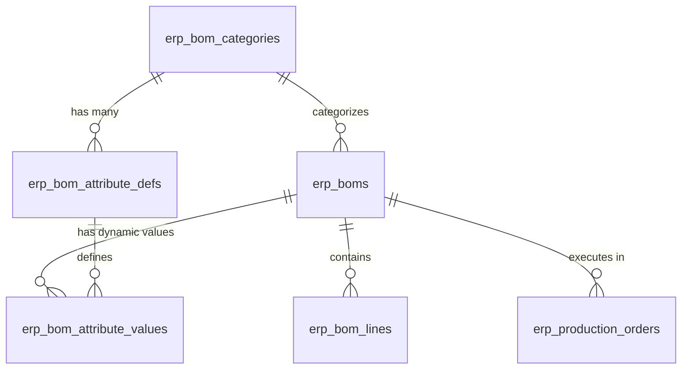

# 📦 Module Tri Thức: Định mức vật tư (BOM - Bill of Materials) - Backend & Frontend

## 1. Tổng quan Nghiệp vụ

Module BOM quản lý cấu trúc định mức nguyên vật liệu (Bill of Materials) cần thiết để sản xuất một đơn vị thành phẩm (Finished Good). BOM hỗ trợ:
- **Cấu hình Danh mục & Thuộc tính động (BOM Config)**:
  - Phân loại BOM theo Danh mục (Category) như Xe điện, Phụ kiện, Bán thành phẩm...
  - Mỗi danh mục có thể định nghĩa tập thuộc tính động riêng biệt (Màu sắc, Phiên bản, Kích thước, Đời xe...).
  - Hỗ trợ đa dạng kiểu dữ liệu: `TEXT` (Văn bản), `NUMBER` (Số), `SELECT` (Combobox với cặp key/value label), `DATE` (Ngày tháng), `CHECKBOX` (Đúng/Sai).
  - Vòng đời **Deactivate an toàn**: Không cho phép xóa hay chỉnh sửa mã nếu đã có BOM sử dụng (`usageCount > 0`), chỉ cho phép vô hiệu hóa (`is_active = false`).
- **Bảo vệ toàn vẹn khi Đã Phát Sinh Sản Xuất (`hasProduction`)**:
  - Khi BOM đã có Lệnh sản xuất (`erp_production_orders`), hệ thống **khóa toàn bộ cấu trúc định mức và thuộc tính** (view-only).
  - Người dùng **chỉ có thể chỉnh sửa 2 trường**: **`effectiveTo`** (Hiệu lực đến) và **`notes`** (Ghi chú).
  - Chặn xóa BOM nếu đã phát sinh sản xuất.
- **Định mức một cấp & đa cấp**: Cây phân rã linh kiện lồng nhau, bán thành phẩm lồng thành phẩm.
- **Tỷ lệ hao hụt (%) & ĐVT (UOM)**: Tỷ lệ hao hụt độc lập trên từng dòng định mức.
- **Xuất / Nhập Excel & CSV**:
  - Xuất dữ liệu đa cấp ra Excel theo mẫu quy chuẩn K LOTUS (`K LOTUS-SX-BM-01-04`) hoặc CSV UTF-8.
  - Tải file mẫu và import danh sách linh kiện từ Excel/CSV.
- **Phân rã định mức đệ quy (`explodeBom`)**: Dành cho Lệnh sản xuất (`production-core`), tự động phát hiện và chặn vòng lặp cấu trúc (Circular Dependency).
- **As-Built BOM Tracking**: Nhận diện linh kiện cần theo dõi serial để tạo lịch sử lắp ráp.

---

## 2. Database Schema & Quan hệ Dữ liệu



### 2.1. Bảng `erp_bom_categories` (Danh mục BOM)

| Cột | Kiểu | Nullable | Mặc định | Ghi chú |
| :--- | :--- | :--- | :--- | :--- |
| `id` | `uuid` | NO | `gen_random_uuid()` | Primary Key |
| `code` | `varchar(100)` | NO | | Mã danh mục duy nhất (Unique Index `IDX_erp_bom_categories_code`) |
| `name` | `varchar(255)` | NO | | Tên danh mục |
| `description` | `text` | YES | `NULL` | Mô tả danh mục |
| `is_active` | `boolean` | NO | `true` | Cờ kích hoạt danh mục |
| `is_deleted` | `boolean` | NO | `false` | Soft delete |
| `created_at` | `timestamptz` | NO | `now()` | Thời gian tạo |
| `updated_at` | `timestamptz` | NO | `now()` | Thời gian cập nhật |

### 2.2. Bảng `erp_bom_attribute_defs` (Định nghĩa thuộc tính động)

| Cột | Kiểu | Nullable | Mặc định | Ghi chú |
| :--- | :--- | :--- | :--- | :--- |
| `id` | `uuid` | NO | `gen_random_uuid()` | Primary Key |
| `category_id` | `uuid` | NO | | FK tham chiếu `erp_bom_categories.id` |
| `code` | `varchar(100)` | NO | | Mã thuộc tính (Unique theo Category `UQ_erp_bom_attr_defs_cat_code`) |
| `name` | `varchar(255)` | NO | | Tên hiển thị của thuộc tính |
| `field_type` | `varchar(50)` | NO | | `TEXT`, `NUMBER`, `SELECT`, `DATE`, `CHECKBOX` |
| `options` | `jsonb` | YES | `NULL` | Danh sách options cho SELECT: `[{"key":"RED","value":"RED","label":"Đỏ"}]` |
| `is_required` | `boolean` | NO | `false` | Bắt buộc nhập khi khai báo BOM |
| `sort_order` | `int` | NO | `0` | Thứ tự hiển thị trên form |
| `is_active` | `boolean` | NO | `true` | Cờ kích hoạt thuộc tính |
| `is_deleted` | `boolean` | NO | `false` | Soft delete |
| `created_at` | `timestamptz` | NO | `now()` | Thời gian tạo |
| `updated_at` | `timestamptz` | NO | `now()` | Thời gian cập nhật |

### 2.3. Bảng `erp_bom_attribute_values` (Giá trị thuộc tính BOM)

| Cột | Kiểu | Nullable | Mặc định | Ghi chú |
| :--- | :--- | :--- | :--- | :--- |
| `id` | `uuid` | NO | `gen_random_uuid()` | Primary Key |
| `bom_id` | `uuid` | NO | | FK tham chiếu `erp_boms.id` (ON DELETE CASCADE) |
| `attr_def_id` | `uuid` | NO | | FK tham chiếu `erp_bom_attribute_defs.id` |
| `value_text` | `text` | NO | | Giá trị lưu trữ dưới dạng text chuẩn |
| `created_at` | `timestamptz` | NO | `now()` | Thời gian tạo |
| `updated_at` | `timestamptz` | NO | `now()` | Thời gian cập nhật |

*Ràng buộc duy nhất*: `UQ_erp_bom_attribute_values_bom_attr` (`bom_id`, `attr_def_id`).

### 2.4. Bảng `erp_boms` (Header)

| Cột | Kiểu | Nullable | Mặc định | Ghi chú |
| :--- | :--- | :--- | :--- | :--- |
| `id` | `uuid` | NO | `gen_random_uuid()` | Primary Key |
| `bom_code` | `varchar(255)` | NO | | Mã BOM duy nhất (Unique Index `IDX_4b5651bad5828ff8baf279728c`) |
| `bom_name` | `varchar(255)` | NO | | Tên định mức |
| `category_id` | `uuid` | YES | `NULL` | FK tham chiếu `erp_bom_categories.id` (ON DELETE SET NULL) |
| `finished_good_item_id` | `uuid` | YES | `NULL` | FK tới `erp_inventory_items.id` (Thành phẩm) |
| `version` | `varchar(255)` | NO | `'1.0'` | Phiên bản định mức (vd: "1.0", "01") |
| `status` | `varchar(255)` | NO | `'ACTIVE'` | Trạng thái (`ACTIVE`, `INACTIVE`, `DRAFT`) |
| `effective_from` | `date` | YES | `NULL` | Ngày bắt đầu áp dụng |
| `effective_to` | `date` | YES | `NULL` | Ngày hết hiệu lực |
| `notes` | `text` | YES | `NULL` | Ghi chú thêm |
| `created_by` | `uuid` | YES | `NULL` | Người tạo |
| `is_deleted` | `boolean` | NO | `false` | Cờ xóa mềm (Soft delete) |
| `created_at` | `timestamptz` | NO | `now()` | Thời gian tạo |
| `updated_at` | `timestamptz` | NO | `now()` | Thời gian cập nhật |

### 2.5. Bảng `erp_bom_lines` (Details)

| Cột | Kiểu | Nullable | Mặc định | Ghi chú |
| :--- | :--- | :--- | :--- | :--- |
| `id` | `uuid` | NO | `gen_random_uuid()` | Primary Key |
| `bom_id` | `uuid` | NO | | FK tham chiếu tới `erp_boms.id` |
| `line_no` | `int` | NO | | Thứ tự dòng trong BOM (1, 2, 3, ...) |
| `component_item_id` | `uuid` | YES | `NULL` | FK tới `erp_inventory_items.id` (Linh kiện) |
| `qty_required` | `numeric(18, 3)`| NO | | Số lượng định mức cho 1 đơn vị thành phẩm |
| `uom_id` | `uuid` | NO | | FK tới `erp_uoms.id` (Đơn vị tính) |
| `scrap_rate` | `numeric(18, 3)`| YES | `NULL` | Tỷ lệ hao hụt (%) (vd: `2.500` = 2.5%) |
| `notes` | `text` | YES | `NULL` | Ghi chú chi tiết dòng |
| `created_at` | `timestamptz` | NO | `now()` | Thời gian tạo |
| `updated_at` | `timestamptz` | NO | `now()` | Thời gian cập nhật |

---

## 3. Cấu trúc Source Code

### 3.1. Backend (`erp-api`)
```text
src/
├── bom-core/
│   ├── entities/
│   │   ├── erp_bom.entity.ts           # Entity BOM (ManyToOne category, OneToMany attributeValues & lines)
│   │   └── erp_bom_line.entity.ts      # Entity dòng linh kiện (ManyToOne uom, componentItem)
│   ├── dto/
│   │   ├── create-bom.dto.ts           # DTO tạo BOM (categoryId, attributes map, lines)
│   │   ├── create-bom-line.dto.ts      # DTO dòng linh kiện
│   │   ├── list-bom.dto.ts             # DTO phân trang & bộ lọc
│   │   └── update-bom.dto.ts           # DTO cập nhật BOM
│   ├── bom-core.controller.ts          # Controller BOM Core API
│   ├── bom-core.service.ts             # Service xử lý transaction, hasProduction lock, import/export
│   └── bom-core.module.ts              # Module đăng ký TypeORM và Service
├── bom-config/
│   ├── entities/
│   │   ├── erp_bom_category.entity.ts  # Entity danh mục BOM
│   │   ├── erp_bom_attribute_def.entity.ts # Entity định nghĩa thuộc tính động
│   │   └── erp_bom_attribute_value.entity.ts # Entity lưu giá trị thuộc tính
│   ├── dto/
│   │   ├── create-bom-category.dto.ts
│   │   ├── update-bom-category.dto.ts
│   │   ├── create-bom-attribute-def.dto.ts
│   │   └── update-bom-attribute-def.dto.ts
│   ├── bom-config.controller.ts        # Controller CRUD danh mục & thuộc tính
│   ├── bom-config.service.ts           # Service validate unique, option keys, usage check & deactivate
│   └── bom-config.module.ts
```

### 3.2. Frontend (`erp-web`)
```text
src/
├── modules/bom-core/
│   ├── api/
│   │   ├── bomCoreApi.ts               # API client BOM Core + types (hasProduction, categoryId, attributes)
│   │   └── bomConfigApi.ts             # API client BOM Config (categories, attributes, deactivate)
│   └── components/
│       ├── BomConfigDrawer.tsx         # Drawer cấu hình Danh mục & Thuộc tính động (chuẩn /standardize-drawer)
│       └── BomFormDrawer.tsx           # Form Drawer tạo/sửa/xem BOM (ActionDropdown, Split layout, Production Lock)
├── pages/
│   └── ErpBomPage.tsx                  # Trang danh sách BOM (SpreadsheetPageTemplate, Split Button Tạo mới)
└── core/locale/manufacturing/bomConfig/ # Từ điển i18n song ngữ (vi.ts & en.ts)
```

---

## 4. Danh sách API Endpoints & RBAC Contract

### 4.1. BOM Core (`/api/v1/bom`)
Guards: `JwtAuthGuard`, `CoreRbacGuard`.

| Method | Endpoint | Quyền yêu cầu | Mô tả |
| :--- | :--- | :--- | :--- |
| `POST` | `/api/v1/bom` | `{ resource: 'bom', action: 'create' }` | Tạo mới BOM, lưu categoryId, attributes và lines trong transaction |
| `GET` | `/api/v1/bom` | `{ resource: 'bom', action: 'read' }` | Lấy danh sách BOM (phân trang, search, lọc theo `finishedGoodItemId`, `categoryId`) |
| `GET` | `/api/v1/bom/column-options` | `{ resource: 'bom', action: 'read' }` | Lấy giá trị distinct cho bộ lọc cột |
| `GET` | `/api/v1/bom/import/template` | `{ resource: 'bom', action: 'read' }` | Tải file Excel mẫu 2 sheet: `Template` và `Danh sách linh kiện` |
| `POST` | `/api/v1/bom/import/parse` | `{ resource: 'bom', action: 'create' }` | Upload file Excel/CSV, validate SKU và trả về danh sách dòng hợp lệ |
| `GET` | `/api/v1/bom/:id/export` | `{ resource: 'bom', action: 'read' }` | Xuất BOM đa cấp đệ quy ra định dạng `xlsx` hoặc `csv` |
| `GET` | `/api/v1/bom/:id` | `{ resource: 'bom', action: 'read' }` | Lấy chi tiết BOM, lines, category, attributes map, `hasProduction`, `productionCount` |
| `PATCH` | `/api/v1/bom/:id` | `{ resource: 'bom', action: 'update' }` | Cập nhật BOM. Nếu `hasProduction=true`, chỉ cho phép sửa `notes` và `effectiveTo` |
| `DELETE`| `/api/v1/bom/:id` | `{ resource: 'bom', action: 'delete' }` | Xóa mềm BOM (`isDeleted = true`). Ném `ConflictException` nếu `hasProduction=true` |

### 4.2. BOM Config (`/api/v1/bom-config`)

| Method | Endpoint | Quyền yêu cầu | Mô tả |
| :--- | :--- | :--- | :--- |
| `GET` | `/api/v1/bom-config/categories` | `{ resource: 'bom', action: 'read' }` | Lấy danh sách danh mục kèm thuộc tính và số lượng BOM sử dụng (`usageCount`) |
| `POST` | `/api/v1/bom-config/categories` | `{ resource: 'bom', action: 'create' }` | Tạo danh mục BOM mới (chặn trùng mã) |
| `PATCH` | `/api/v1/bom-config/categories/:id` | `{ resource: 'bom', action: 'update' }` | Sửa tên/mô tả/trạng thái danh mục |
| `DELETE`| `/api/v1/bom-config/categories/:id` | `{ resource: 'bom', action: 'delete' }` | Xóa danh mục (chặn xóa nếu `usageCount > 0`) |
| `POST` | `/api/v1/bom-config/attributes` | `{ resource: 'bom', action: 'create' }` | Tạo thuộc tính động (validate options unique keys cho SELECT) |
| `PATCH` | `/api/v1/bom-config/attributes/:id` | `{ resource: 'bom', action: 'update' }` | Cập nhật thuộc tính |
| `DELETE`| `/api/v1/bom-config/attributes/:id` | `{ resource: 'bom', action: 'delete' }` | Xóa thuộc tính (chặn xóa nếu đang được sử dụng trong BOM) |

---

## 5. Logic Nghiệp vụ Trọng tâm

### 5.1. Quy tắc Khóa khi Đã Phát Sinh Sản Xuất (`hasProduction`)
- **Kiểm tra**: Query bảng `erp_production_orders` nơi `output_metadata->>'bomId' = $1` (hoặc `finished_good_item_id = $2`).
- **Chặn sửa cấu trúc**:
  - `update`: Khi `hasProduction === true`, hệ thống bỏ qua các thay đổi ở header, category, dynamic attributes, và lines; chỉ lưu `notes` và `effectiveTo`.
  - Frontend: Hiển thị banner thông báo màu amber, chuyển toàn bộ input/combobox sang `disabled / readOnly`, ẩn nút `+ Thêm dòng`, ẩn Dropdown `Thao tác`, ẩn cột xóa dòng.
- **Chặn xóa**: Ném `ConflictException("Định mức (BOM) đã phát sinh lệnh sản xuất, không thể xóa.")`.

### 5.2. Quản lý Thuộc tính Động (Dynamic Attributes)
- Trong `CreateBomDto` & `UpdateBomDto`: `attributes?: Record<string, string>`.
- Lưu trữ trong bảng `erp_bom_attribute_values`. Khi update, xóa các bản ghi cũ của BOM và chèn lại các giá trị mới.
- Khai báo kiểu `SELECT`: Bắt buộc cấu hình cặp Key / Value + Label, validate không được trùng key.

### 5.3. Giao diện Người Dùng Chuẩn Mực (Frontend UX Standards)
- **Split Button "Tạo mới"**: Nút bên trái bấm mở form tạo BOM trực tiếp; Divider ở giữa; Mũi tên bên phải mở dropdown "Cấu hình BOM".
- **Toolbar Section Định mức NVL**: Nút `+ Thêm dòng` đi kèm Dropdown `Thao tác ▾` (phân nhóm EXCEL: Tải file mẫu, Nhập Excel; KHÁC: Xóa tất cả).
- **Icon Xóa Dòng**: Sử dụng icon `<Trash2 className="w-3.5 h-3.5" />` màu xám hover đỏ tinh tế.
- **Fit Chiều Cao & Cuộn Dọc**: Cột trái (`leftPanel`) sử dụng `h-full flex flex-col flex-1 min-h-0`, bảng spreadsheet chiếm trọn chiều cao Drawer body và có vertical scrollbar mượt mà.
- **Thứ tự Cột phải (`rightPanel`)**:
  1. `Thông tin chung`
  2. `Danh mục & Thuộc tính`
  3. `Ghi chú`

---

## 6. Quy tắc Kiểm thử & Báo cáo Chất lượng (QC Mandate)

Khi chỉnh sửa bất kỳ phần nào liên quan đến BOM:
1. **Backend CI**: `bun run format && bun run check:ci` (TypeScript + ESLint + Prettier).
2. **Backend Unit Tests**: `bunx jest src/bom-core/ src/bom-config/ --forceExit` (Đảm bảo 100% tests PASS).
3. **Frontend Type Check**: `bun run type:check` trên `erp-web`.
4. **Git Workflow**: Tuân thủ `/erp-git-workflow` (chạy git trong repo con tương đối, commit trước khi pull rebase).
