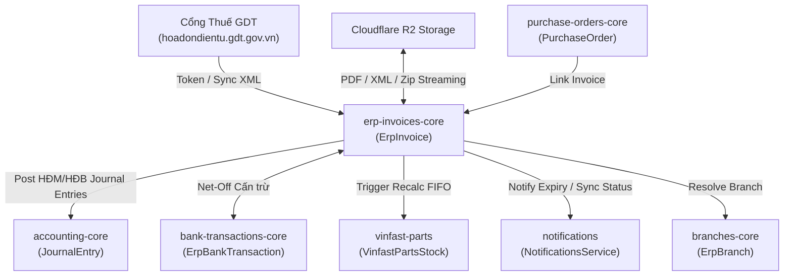

# 📦 Module Tri Thức: Quản Lý Hóa Đơn Điện Tử (ERP Invoices) - Backend (`erp-api`)

## 1. Tổng quan Nghiệp vụ

Phân hệ Quản lý Hóa đơn Điện tử (`erp-invoices-core`) là trung tâm xử lý, lưu trữ, đối soát và hạch toán toàn bộ hóa đơn điện tử đầu vào (hóa đơn mua hàng - `direction = 'IN'`) và hóa đơn đầu ra (hóa đơn bán hàng - `direction = 'OUT'`) của doanh nghiệp.

Các nghiệp vụ trọng tâm:
- **Đồng bộ Hóa đơn Thuế GDT (Tổng cục Thuế)**: Tự động hoặc thủ công kết nối Cổng Thông tin Hóa đơn Điện tử (`hoadondientu.gdt.gov.vn`) qua API token/cookie và giải captcha để tải danh sách hóa đơn và tệp XML gốc.
- **Tiến trình Đồng bộ Tự động Định kỳ (Cron Auto-Sync)**: `ErpInvoicesCronService` tự động đồng bộ hóa đơn trong tháng hiện tại theo chu kỳ ngẫu nhiên (30-45 phút) và gửi thông báo qua `NotificationsService`.
- **Multi-Strategy XML Parser**: Bộ phân tích cú pháp XML đa nguồn tự phát triển (không dùng thư viện ngoài) hỗ trợ chuẩn TT78 (VNPT, Viettel SInvoice v2, VinFast Latin format, Generic fallback) trích xuất chi tiết từng dòng hàng hóa, thuế suất, mã tra cứu.
- **Trích xuất Metadata Tự động & Subscribers**: Tự động nhận diện biển số xe (`license_plate`), số lệnh quyết toán / sửa chữa (`settlement_order`), mã phụ tùng VinFast (`BAT21001011`, `EEP73110011AP`,...) qua `ErpInvoiceItemSubscriber`.
- **Hạch toán Kế toán Kép (Post / Unpost Journal Entries)**: Tích hợp với `AccountingCoreService` để tạo chứng từ sổ cái (`HĐM` cho hóa đơn mua, `HĐB` cho hóa đơn bán), kiểm tra chặt chẽ cân bằng Nợ = Có ($\sum \text{Debit} = \sum \text{Credit}$).
- **Đối soát & Cấn trừ Sổ quỹ/Ngân hàng (Voucher Net-Off)**: Bảng `erp_invoice_voucher_netoff` liên kết hóa đơn với các giao dịch sao kê ngân hàng (`ErpBankTransaction`) và tự động gán chi nhánh nếu hóa đơn chưa có.
- **Lưu trữ & Quản lý Tệp Đa phương tiện trên Cloudflare R2**: Lưu trữ file XML gốc (`xml_file_key`), PDF chính (`pdf_file_key`), nhiều tệp PDF đính kèm (`pdf_files` JSONB) và liên kết tệp chung (`ErpInvoiceAttachment`). Hỗ trợ tạo pre-signed URL, tải trực tiếp hoặc nén tệp ZIP hàng loạt có streaming.
- **Xuất Báo cáo Excel Nền (Background Export & SSE Streaming)**: Hỗ trợ xuất dữ liệu hàng chục nghìn hóa đơn theo tác vụ nền, theo dõi tiến độ thời gian thực qua Server-Sent Events (SSE) `/export/excel/progress/stream`.
- **Báo cáo & Phân tích Dashboard Hóa đơn**: API thống kê dòng tiền/thuế (`cashTrend`), cơ cấu hóa đơn theo đối tác/nhà cung cấp (`getDashboardPartners`) và xuất Excel đối soát.

---

## 2. Database Schema & Quan hệ Dữ liệu

### 2.1. Bảng `erp_invoices` (Hóa Đơn Điện Tử Tổng Hợp)
| Cột | Kiểu dữ liệu | Nullable | Default | Mô tả / Ràng buộc |
| :--- | :--- | :--- | :--- | :--- |
| `id` | `uuid` | NO | `gen_random_uuid()` | Khóa chính (PK) |
| `branch_id` | `uuid` | YES | `NULL` | FK tham chiếu `erp_branches.id` |
| `invoice_no` | `varchar(128)` | NO | — | Số hóa đơn (vd: `0001234`) |
| `invoice_no_normalized` | `varchar(100)` | YES | `NULL` | Số hóa đơn đã bỏ leading zeros (generated/helper) |
| `serial_no` | `varchar(64)` | YES | `NULL` | Ký hiệu hóa đơn (vd: `1C26TGA`) |
| `invoice_date` | `date` | NO | — | Ngày lập hóa đơn |
| `direction` | `varchar(16)` | NO | `'IN'` | Chiều hóa đơn: `IN` (Đầu vào) hoặc `OUT` (Đầu ra) (Index) |
| `status` | `varchar(32)` | NO | `'DRAFT'` | Trạng thái: `DRAFT`, `ACTIVE`, `CANCELLED` |
| `source` | `varchar(64)` | YES | `NULL` | Nguồn: `GDT_PORTAL`, `XML_IMPORT`, `MANUAL`, `SINVOICE` |
| `external_id` | `varchar(255)` | YES | `NULL` | ID định danh từ hệ thống ngoài/GDT |
| `tax_invoice_status` | `int` | YES | `NULL` | Mã trạng thái HĐĐT từ GDT (1: Gốc, 4: Bị thay thế, 5: Bị điều chỉnh,...) |
| `tax_process_status` | `int` | YES | `NULL` | Mã trạng thái xử lý thuế từ GDT |
| `tax_invoice_type` | `varchar(50)` | YES | `NULL` | Loại hóa đơn thuế |
| `related_invoice_no` | `varchar(128)` | YES | `NULL` | Số hóa đơn gốc liên quan (khi là HĐ thay thế/điều chỉnh) |
| `related_serial_no` | `varchar(64)` | YES | `NULL` | Ký hiệu hóa đơn gốc liên quan |
| `is_valid` | `boolean` | NO | `false` | Cờ xác thực hợp lệ / hợp pháp |
| `validated_at` | `timestamptz` | YES | `NULL` | Thời điểm xác thực |
| `validated_by` | `uuid` | YES | `NULL` | ID người xác thực |
| `seller_name` | `varchar(255)` | YES | `NULL` | Tên đơn vị bán hàng |
| `seller_tax_code` | `varchar(64)` | YES | `NULL` | Mã số thuế bên bán |
| `seller_address` | `text` | YES | `NULL` | Địa chỉ bên bán |
| `seller_bank` | `varchar(255)` | YES | `NULL` | Thông tin tài khoản ngân hàng bên bán |
| `buyer_name` | `varchar(255)` | YES | `NULL` | Tên đơn vị mua hàng |
| `buyer_personal_name` | `varchar(255)`| YES | `NULL` | Tên người mua cá nhân |
| `buyer_cccd` | `varchar(64)` | YES | `NULL` | Số CCCD/CMND người mua cá nhân |
| `buyer_tax_code` | `varchar(64)` | YES | `NULL` | Mã số thuế bên mua |
| `buyer_address` | `text` | YES | `NULL` | Địa chỉ bên mua |
| `description` | `text` | YES | `NULL` | Trích yếu / Diễn giải hóa đơn |
| `invoice_type` | `varchar(255)` | YES | `NULL` | Phân loại nghiệp vụ (vd: `VINFAST_PARTS`, `INSURANCE`,...) |
| `invoice_category` | `varchar(255)` | YES | `NULL` | Danh mục hóa đơn (legacy text field) |
| `category_id` | `uuid` | YES | `NULL` | FK tham chiếu `erp_bom_categories.id` (`module_key = 'INVOICE'`) |
| `pre_vat_amount` | `numeric(18,2)`| NO | `0` | Tổng tiền trước thuế (VNĐ) |
| `vat_rate` | `numeric(9,4)` | YES | `NULL` | Thuế suất VAT chung (nếu đồng nhất) |
| `vat_amount` | `numeric(18,2)`| NO | `0` | Tổng tiền thuế GTGT (VNĐ) |
| `discount_amount` | `numeric(18,2)`| NO | `0` | Tổng tiền chiết khấu thương mại |
| `total_amount` | `numeric(18,2)`| NO | `0` | Tổng tiền thanh toán đã gồm thuế |
| `purchase_order_id`| `uuid` | YES | `NULL` | FK tham chiếu `erp_purchase_orders.id` (nếu liên kết PO) |
| `sales_order_id` | `uuid` | YES | `NULL` | FK tham chiếu `erp_sales_orders.id` (nếu liên kết SO) |
| `payment_document_nos`| `varchar(500)`| YES | `NULL` | Danh sách số chứng từ thanh toán |
| `notes` | `text` | YES | `NULL` | Ghi chú nội bộ |
| `created_by` | `uuid` | YES | `NULL` | ID người tạo / import |
| `license_plate` | `varchar(50)` | YES | `NULL` | Biển số xe được trích xuất tự động |
| `settlement_order` | `varchar(100)` | YES | `NULL` | Số quyết toán / số lệnh sửa chữa trích xuất tự động |
| `pdf_file_key` | `varchar(512)` | YES | `NULL` | Đường dẫn R2 file PDF chính |
| `pdf_files` | `jsonb` | YES | `NULL` | Danh sách các file PDF đính kèm: `[{ fileKey, originalName, fileSize, uploadedAt, documentType, ... }]` |
| `xml_file_key` | `varchar(512)` | YES | `NULL` | Đường dẫn R2 file XML gốc |
| `xml_import_id` | `uuid` | YES | `NULL` | Mã batch XML import nếu có |
| `posting_status` | `varchar(20)` | NO | `'UNPOSTED'` | Trạng thái hạch toán: `UNPOSTED`, `POSTED` |
| `posting_date` | `date` | YES | `NULL` | Ngày hạch toán sổ cái |
| `journal_entry_id` | `uuid` | YES | `NULL` | FK tham chiếu `accounting_journal_entries.id` |
| `is_deleted` | `boolean` | NO | `false` | Cờ xóa mềm |
| `created_at` | `timestamptz` | NO | `now()` | Thời điểm tạo |
| `updated_at` | `timestamptz` | NO | `now()` | Thời điểm cập nhật cuối |

### 2.2. Bảng `erp_invoice_items` (Chi Tiết Mặt Hàng Hóa Đơn)
| Cột | Kiểu dữ liệu | Nullable | Default | Mô tả |
| :--- | :--- | :--- | :--- | :--- |
| `id` | `uuid` | NO | `gen_random_uuid()` | Khóa chính (PK) |
| `invoice_id` | `uuid` | NO | — | FK tham chiếu `erp_invoices.id` (ON DELETE CASCADE) |
| `invoice_subcategory`| `varchar(32)`| NO | `'NORMAL'` | Phân loại dòng mặt hàng |
| `description` | `text` | YES | `NULL` | Tên hàng hóa, quy cách, diễn giải chi tiết |
| `item_code` | `varchar(32)` | YES | `NULL` | Mã mặt hàng trích xuất tự động qua subscriber |
| `unit` | `varchar(64)` | YES | `NULL` | Đơn vị tính (vd: `Cái`, `Bộ`, `Lít`) |
| `quantity` | `numeric(18,4)`| YES | `NULL` | Số lượng |
| `unit_price` | `numeric(18,4)`| YES | `NULL` | Đơn giá trước thuế |
| `pre_vat_amount` | `numeric(18,2)`| NO | `0` | Thành tiền trước thuế |
| `vat_rate` | `numeric(9,4)` | YES | `NULL` | Thuế suất VAT của dòng mặt hàng |
| `vat_amount` | `numeric(18,2)`| NO | `0` | Tiền thuế GTGT của dòng |
| `discount_amount` | `numeric(18,2)`| NO | `0` | Tiền chiết khấu của dòng |
| `total_amount` | `numeric(18,2)`| NO | `0` | Tổng tiền thanh toán dòng hàng |
| `created_at` | `timestamptz` | NO | `now()` | Thời điểm tạo |
| `updated_at` | `timestamptz` | NO | `now()` | Thời điểm cập nhật cuối |

### 2.3. Bảng `erp_invoice_voucher_netoff` (Cấn Trừ Hóa Đơn & Giao Dịch Sao Kê / Sổ Quỹ)
| Cột | Kiểu dữ liệu | Nullable | Default | Mô tả |
| :--- | :--- | :--- | :--- | :--- |
| `id` | `uuid` | NO | `gen_random_uuid()` | Khóa chính (PK) |
| `invoice_id` | `uuid` | NO | — | FK tham chiếu `erp_invoices.id` (ON DELETE CASCADE) |
| `bank_transaction_id`| `uuid`| NO | — | FK tham chiếu `erp_bank_transactions.id` (ON DELETE CASCADE) |
| `net_off_amount` | `numeric(18,2)`| NO | `0` | Số tiền đã cấn trừ/đối soát |
| `created_at` | `timestamptz` | NO | `now()` | Thời điểm tạo |
| `updated_at` | `timestamptz` | NO | `now()` | Thời điểm cập nhật cuối |

### 2.4. Bảng `erp_invoice_attachments` (Tệp Đính Kèm Chung)
| Cột | Kiểu dữ liệu | Nullable | Default | Mô tả |
| :--- | :--- | :--- | :--- | :--- |
| `id` | `uuid` | NO | `gen_random_uuid()` | Khóa chính (PK) |
| `invoice_id` | `uuid` | NO | — | FK tham chiếu `erp_invoices.id` (ON DELETE CASCADE) |
| `attachment_id` | `uuid` | NO | — | FK tham chiếu `erp_attachments.id` (ON DELETE CASCADE) |
| `created_at` | `timestamptz` | NO | `now()` | Thời điểm tạo |

---

## 3. Cấu trúc Source Code Backend

```text
src/erp-invoices-core/
├── dto/
│   ├── create-erp-invoice.dto.ts              # DTO tạo hóa đơn + nested items
│   ├── update-erp-invoice.dto.ts              # DTO cập nhật hóa đơn (PartialType)
│   ├── post-invoice.dto.ts                    # DTO hạch toán kế toán kép (posting lines Nợ/Có)
│   ├── portal-invoice.dto.ts                  # DTO kết nối dữ liệu từ cổng thuế GDT
│   └── portal-login.dto.ts                    # DTO đăng nhập GDT kèm captcha
├── entities/
│   ├── erp_invoice.entity.ts                  # TypeORM Entity bảng erp_invoices
│   ├── erp_invoice_item.entity.ts             # TypeORM Entity bảng erp_invoice_items
│   ├── erp_invoice_voucher_netoff.entity.ts   # TypeORM Entity bảng erp_invoice_voucher_netoff
│   └── erp_invoice_attachment.entity.ts       # TypeORM Entity bảng erp_invoice_attachments
├── helpers/
│   ├── gdt-captcha-solver.helper.ts           # Helper giải mã Captcha cổng thuế GDT
│   ├── invoice-branch.helper.ts               # Helper tự động suy diễn Chi nhánh từ MST/cấu hình
│   ├── invoice-gdt.helper.ts                  # Helper gọi HTTP API sang Cổng thuế GDT
│   ├── invoice-mapper.helper.ts               # Helper format/map Entity sang API DTO
│   ├── invoice-metadata.helper.ts             # Helper regex trích xuất Biển số xe & Lệnh sửa chữa
│   └── out-invoice-display.helper.ts          # Helper phân loại nghiệp vụ dòng hóa đơn đầu ra
├── services/
│   ├── invoice-export-background.service.ts   # Quản lý hàng đợi xuất Excel nền + SSE stream
│   ├── invoice-files.service.ts               # Xử lý upload/download PDF/XML trên Cloudflare R2 & nén ZIP
│   ├── invoice-import.service.ts              # Xử lý nhập hàng loạt XML/PDF/ZIP hỗn hợp
│   ├── invoice-lifecycle.service.ts           # CRUD, Post/Unpost Kế toán, Net-Off, Branch/Notes
│   ├── invoice-portal.service.ts              # Xử lý sync GDT, login, captcha, bulk download XML
│   ├── invoice-query.service.ts               # Query phân trang, lọc đa cột, thống kê KPI, export Excel trực tiếp
│   └── invoice-smart-netoff.service.ts        # Thuật toán gợi ý cấn trừ sao kê thông minh (Strict Match Rule & Xếp hạng 6 cấp độ)
├── subscribers/
│   └── erp-invoice-item.subscriber.ts         # TypeORM Subscriber tự nhận diện mã phụ tùng VinFast
├── utils/
│   └── normalize-invoice-no.ts                # Chuẩn hóa chuỗi số hóa đơn
├── xml-parser/
│   └── vietnam-invoice-xml.parser.ts          # Bộ phân tích XML hóa đơn Việt Nam độc lập
├── erp-invoices-core.controller.ts            # REST Controller chính cho CRUD, sync GDT, files, hạch toán
├── erp-invoices-core.service.ts               # Facade Service điều phối các subservices
├── erp-invoices-cron.service.ts               # Background Cron tự động đồng bộ GDT định kỳ
├── erp-invoices-core.module.ts                # NestJS Module đăng ký DI
├── invoice-dashboard.controller.ts            # Controller báo cáo thống kê Dashboard hóa đơn
└── invoice-dashboard.service.ts               # Service tổng hợp số liệu Dashboard và báo cáo đối tác
```

---

## 4. Danh sách API Endpoints & RBAC Contract

### 4.1. Nhóm API Quản trị Hóa đơn (`/api/v1/erp-invoices`)

| Method | Endpoint | Resource | Action | Mô tả chi tiết |
| :--- | :--- | :--- | :--- | :--- |
| `GET` | `/erp-invoices` | `invoices` | `read` | Lấy danh sách hóa đơn phân trang, tìm kiếm đa trường, lọc ngày, lọc chiều (`IN`/`OUT`) |
| `GET` | `/erp-invoices/column-options` | `invoices` | `read` | Lấy danh sách giá trị distinct của cột phục vụ bộ lọc nâng cao trên giao diện |
| `GET` | `/erp-invoices/stats` | `invoices` | `read` | Thống kê số lượng, tổng tiền trước thuế, thuế VAT, chiết khấu và tổng cộng |
| `POST` | `/erp-invoices/bulk-net-offs` | `invoices` | `read` | Lấy thông tin cấn trừ phiếu chi/thu cho danh sách ID hóa đơn |
| `POST` | `/erp-invoices/smart-net-off-suggestions` | `invoices` | `read` | Gợi ý đối soát sao kê thông minh từ DB (Strict match Tiền + Số HĐ + Đối tác, 6 cấp độ) |
| `GET` | `/erp-invoices/:id` | `invoices` | `read` | Lấy chi tiết một hóa đơn kèm items, cấn trừ ngân hàng và tệp đính kèm (hỗ trợ tra cứu theo UUID, `invoiceNo_serialNo`, hoặc `invoiceNo`) |
| `POST` | `/erp-invoices` | `invoices` | `create` | Tạo mới thủ công một hóa đơn |
| `PATCH` | `/erp-invoices/:id` | `invoices` | `update` | Cập nhật thông tin hóa đơn và các dòng chi tiết |
| `DELETE`| `/erp-invoices/:id` | `invoices` | `delete` | Xóa mềm hóa đơn (chỉ cho phép khi trạng thái `DRAFT`) |
| `POST` | `/erp-invoices/:id/cancel` | `invoices` | `update` | Hủy hóa đơn (chuyển trạng thái sang `CANCELLED`) |
| `PATCH` | `/erp-invoices/bulk-set-branch` | `invoices` | `update` | Gán chi nhánh hàng loạt cho danh sách hóa đơn (tự đồng bộ bút toán sổ cái) |
| `PATCH` | `/erp-invoices/bulk-set-notes` | `invoices` | `update` | Cập nhật ghi chú hàng loạt cho danh sách hóa đơn |
| `PATCH` | `/erp-invoices/:id/validate` | `invoices` | `update` | Đánh dấu xác thực hóa đơn hợp lệ/không hợp lệ |
| `GET` | `/erp-invoices/:id/traceability-graph` | `invoices` | `read` | Lấy đồ thị mạng lưới chứng từ liên kết đa tầng (PO/SO, Phiếu kho, Sao kê, Bút toán GL, Vụ việc Garage) kèm Zero-Trust RBAC mask |


### 4.2. Nhóm API Hạch toán Kế toán (`/api/v1/erp-invoices/:id`)

| Method | Endpoint | Resource | Action | Mô tả chi tiết |
| :--- | :--- | :--- | :--- | :--- |
| `POST` | `/erp-invoices/:id/post` | `invoices` | `update` | Hạch toán hóa đơn vào Sổ Cái Kế toán (tạo `JournalEntry` `HĐM`/`HĐB`, kiểm tra Nợ = Có) |
| `POST` | `/erp-invoices/:id/unpost` | `invoices` | `update` | Hủy hạch toán hóa đơn (xóa bút toán `JournalEntry` và cấn trừ Net-Off) |
| `POST` | `/erp-invoices/:id/net-off-vouchers` | `invoices` | `update` | Gán liên kết cấn trừ giao dịch sao kê ngân hàng / sổ quỹ vào hóa đơn |
| `DELETE`| `/erp-invoices/:id/net-off-vouchers/:voucherId`| `invoices` | `update` | Hủy liên kết cấn trừ giao dịch ngân hàng khỏi hóa đơn |

### 4.3. Nhóm API Đồng bộ Cổng Thuế GDT (`/api/v1/erp-invoices/portal`)

| Method | Endpoint | Resource | Action | Mô tả chi tiết |
| :--- | :--- | :--- | :--- | :--- |
| `GET` | `/erp-invoices/portal/captcha` | `invoices` | `update` | Lấy hình ảnh và key Captcha từ Cổng thuế GDT |
| `POST` | `/erp-invoices/portal/login` | `invoices` | `update` | Đăng nhập Cổng thuế GDT với username, password, captcha |
| `GET` | `/erp-invoices/portal/token` | `invoices` | `update` | Lấy cấu hình Token/Cookie Cổng thuế đã lưu |
| `POST` | `/erp-invoices/portal/token` | `invoices` | `update` | Lưu cấu hình Token/Cookie/Tài khoản Cổng thuế vào Company Profile |
| `POST` | `/erp-invoices/portal/sync` | `invoices` | `update` | Kích hoạt đồng bộ hóa đơn từ GDT theo khoảng ngày (tự đọc Token/Cookie từ DB), tự tải XML ngầm |
| `POST` | `/erp-invoices/portal/bulk-download-xml` | `invoices` | `update` | Tải bổ sung tệp XML gốc từ GDT cho các hóa đơn chưa có XML trong DB (tự đọc Token/Cookie từ DB) |
| `POST` | `/erp-invoices/:id/sync-detail` | — | — | Đồng bộ chi tiết dòng mặt hàng từ XML/GDT cho 1 hóa đơn cụ thể (tự đọc Token/Cookie từ DB) |
| `GET (SSE)` | `/erp-invoices/portal/progress` | — | — | Stream SSE tiến độ đồng bộ hóa đơn GDT thời gian thực |

### 4.4. Nhóm API Tệp Đính Kèm, File R2 & Import/Export

| Method | Endpoint | Resource | Action | Mô tả chi tiết |
| :--- | :--- | :--- | :--- | :--- |
| `POST` | `/erp-invoices/preview-pdf-match` | — | — | Xem trước kết quả ghép nối các file PDF mồ côi với hóa đơn trong DB |
| `POST` | `/erp-invoices/bulk-import-xml/buyer` | — | — | Tải lên hàng loạt file XML/PDF/ZIP hóa đơn đầu vào (`IN`) |
| `POST` | `/erp-invoices/bulk-import-xml/seller` | — | — | Tải lên hàng loạt file XML/PDF/ZIP hóa đơn đầu ra (`OUT`) |
| `GET` | `/erp-invoices/:id/download-url` | — | — | Lấy Pre-signed URL tải file PDF hoặc XML chính từ R2 |
| `POST` | `/erp-invoices/:id/upload-url` | — | — | Lấy Pre-signed URL để upload file PDF hoặc XML lên R2 |
| `POST` | `/erp-invoices/:id/pdfs` | — | — | Upload tệp PDF đính kèm (hỗ trợ nhiều file, phân loại chứng từ) |
| `POST` | `/erp-invoices/:id/attachments/link`| `invoices` | `update` | Liên kết file đính kèm từ kho chung (`erp_attachments`) |
| `DELETE`| `/erp-invoices/:id/attachments/:attachmentId`| `invoices` | `update` | Hủy liên kết file đính kèm chung |
| `GET` | `/erp-invoices/:id/pdfs/zip` | — | — | Tải gói ZIP chứa toàn bộ file PDF đính kèm của 1 hóa đơn |
| `POST` | `/erp-invoices/bulk-download-files` | — | — | Nén ZIP và tải về toàn bộ file PDF/XML theo bộ lọc query |
| `POST` | `/erp-invoices/bulk-download-selected`| — | — | Nén ZIP và tải về các file PDF/XML của danh sách hóa đơn được chọn |
| `GET` | `/erp-invoices/:id/pdfs/:key/content` | — | — | Stream trực tiếp nội dung PDF để xem trước inline |
| `GET` | `/erp-invoices/:id/pdfs/:key/download-url`| — | — | Lấy URL tải xuống file PDF đính kèm cụ thể |
| `DELETE`| `/erp-invoices/:id/pdfs/:key` | — | — | Xóa 1 file PDF đính kèm trong danh sách `pdf_files` |
| `GET` | `/erp-invoices/export/excel` | `invoices` | `read` | Xuất file Excel hóa đơn đồng bộ trực tiếp |
| `POST` | `/erp-invoices/export/excel/background` | `invoices` | `read` | Khởi chạy tác vụ xuất file Excel nền cho tập dữ liệu lớn |
| `GET` | `/erp-invoices/export/excel/background/history`| `invoices` | `read` | Lấy lịch sử các tác vụ xuất Excel nền của người dùng |
| `GET` | `/erp-invoices/export/excel/background/:jobId/download` | `invoices` | `read` | Tải về file kết quả xuất Excel nền theo Job ID |
| `GET (SSE)` | `/erp-invoices/export/excel/progress/stream`| — | — | Stream SSE tiến độ xuất Excel nền thời gian thực |

### 4.5. Nhóm API Dashboard Hóa đơn (`/api/v1/erp-invoices/dashboard`)

| Method | Endpoint | Resource | Action | Mô tả chi tiết |
| :--- | :--- | :--- | :--- | :--- |
| `GET` | `/erp-invoices/dashboard/stats` | `invoices` | `read` | Biểu đồ xu hướng dòng tiền (`cashTrend`) theo tháng (Tiền vào/ra, Thuế vào/ra) |
| `GET` | `/erp-invoices/dashboard/partners` | `invoices` | `read` | Bảng kê tổng hợp doanh số mua/bán theo từng đối tác/MST |
| `GET` | `/erp-invoices/dashboard/partners/:taxCode/stats` | `invoices` | `read` | Chi tiết số liệu hóa đơn của một đối tác cụ thể theo MST |
| `GET` | `/erp-invoices/dashboard/export` | `invoices` | `read` | Xuất báo cáo Excel tổng hợp Dashboard hóa đơn |

---

## 5. Logic Nghiệp vụ Trọng tâm

### 5.1. Multi-Strategy XML Parser (`vietnam-invoice-xml.parser.ts`)
- Bộ parser thuần Node.js (`DOMParser`) tối ưu hóa tốc độ và không phụ thuộc thư viện nặng.
- **Chiến lược phân tích đa định dạng**:
  1. `TT78`: Chuẩn Thông tư 78 của Tổng cục Thuế (thẻ `<HDon>`, `<DLHDon>`, `<NDHDon>`, `<TTChung>`, `<NBan>`, `<NMua>`, `<DSHHDVu>`).
  2. `SINVOICE_V2`: Chuẩn Viettel SInvoice 2.0 (thẻ `<Invoice>`, `<BuyerInfo>`, `<SellerInfo>`, `<ItemInfo>`).
  3. `VINFAST`: Hóa đơn VinFast với ký tự mã hóa Latin/Tiếng Việt đặc thù.
  4. `GENERIC`: Fallback tự động quét mọi cấu trúc thẻ XML tìm kiếm trường tương đương.
- Tự động trích xuất thông tin người bán, người mua (MST, tên, địa chỉ, CCCD đối với cá nhân), diễn giải, số tiền trước thuế, thuế suất, tiền thuế, tiền chiết khấu và mảng chi tiết từng dòng mặt hàng.
- Trích xuất mã tra cứu (`lookupCode`) và đường dẫn tra cứu (`providerLink`) từ khối `<TTKhac>` / `<TTin>`.

### 5.2. Đồng bộ Cổng Thuế GDT & Tự động Đăng nhập lại (Auto Re-login & Captcha Solving)
- **Lưu trữ Cấu hình Bảo mật (`company_profile`)**:
  - Tên đăng nhập / MST (`gdt_portal_username`), Token JWT (`gdt_portal_token`), Cookie phiên (`gdt_portal_cookies`).
  - Mật khẩu Cổng Thuế (`gdt_portal_password`) được mã hóa an toàn qua thuật toán AES-256-CBC với tiền tố `enc:<iv_hex>:<cipher_hex>` sử dụng secret key từ `GDT_ENCRYPT_SECRET` hoặc `JWT_SECRET`.
- **Giải mã Captcha SVG Tự động (`gdt-captcha-solver.helper.ts`)**:
  - Tải mã Captcha SVG từ `https://hoadondientu.gdt.gov.vn/api/captcha`.
  - Bộ giải `solveGdtSvgCaptcha` bóc tách các thẻ `<path>`, loại bỏ đường nhiễu (`stroke` không có `fill`), trích xuất chuỗi lệnh đường vẽ (`d` attribute command patterns) và đối chiếu với từ điển mô hình `GDT_CAPTCHA_MODEL` để giải chuỗi 6 ký tự chính xác.
- **Kiểm tra Tính hợp lệ của Token (`checkTokenValid`)**:
  - Gọi trực tiếp endpoint `https://hoadondientu.gdt.gov.vn/api/security-taxpayer/profile`.
  - Trả về `true` khi `res.ok && res.status !== 401 && res.status !== 403`, tránh gọi các endpoint tra cứu hóa đơn rỗng tham số gây lỗi HTTP 500.
- **Quy trình Tự động Đăng nhập lại (`autoReloginWithRetry`)**:
  - Tự động lấy cấu hình username/password giải mã từ DB.
  - Lấy Captcha và tự giải mã qua `solveGdtSvgCaptcha`.
  - Gửi POST `/security-taxpayer/authenticate` tối đa 3 lần (`maxRetries = 3`, khoảng cách `retryDelayMs = 60s`).
  - Khi thành công, tự động lưu Token mới và Cookie vào `company_profile` và tiếp tục luồng xử lý.
- **Cơ chế Tự phục hồi trong Tiến trình Cron (`ErpInvoicesCronService`)**:
  - Khi tiến trình cron chạy định kỳ: nếu token chưa có hoặc `checkTokenValid` trả về `false`, Cron Job chủ động gọi `autoReloginWithRetry()` để tự lấy token mới.
  - Chỉ khi cả 3 lần tự đăng nhập lại đều thất bại, hệ thống mới gửi thông báo lỗi `Token GDT hóa đơn hết hạn` tới người dùng qua `NotificationsService`.
- **Kiểm tra Hồ sơ Người nộp thuế (`validatePortalTaxpayer`)**:
  - Đối chiếu danh sách mã số thuế trả về từ hồ sơ GDT (`username`, `id`, `groupId`, `tinInfoTT86.mst`,...) với MST doanh nghiệp trong `company_profile` để chặn nguy cơ kéo nhầm dữ liệu đơn vị khác (`GDT_TAXPAYER_MISMATCH`).
- **Phân trang & Giới hạn Tốc độ (Rate-Limit)**:
  - Kéo danh sách hóa đơn theo từng trang từ GDT (size tối đa 50 theo ngày), có khoảng trễ ngẫu nhiên 4-7 giây giữa các request tải XML để tránh bị chặn IP/tài khoản.
- **Cập nhật Trạng thái Hóa đơn Gốc Liên quan**:
  - Khi gặp hóa đơn thay thế hoặc điều chỉnh (mã trạng thái 4 hoặc 5), tự động tìm và cập nhật trạng thái của hóa đơn gốc trong DB (`tax_invoice_status`).

### 5.3. Hạch toán Kế toán Kép (Double-Entry Posting)
- Khi gọi `postInvoice`, hệ thống kiểm tra:
  1. Hóa đơn chưa bị xóa và đang ở trạng thái `UNPOSTED`.
  2. Hóa đơn bắt buộc phải có `branchId` (Chi nhánh).
  3. Kiểm tra tính cân bằng sổ cái: $|\sum \text{Debit} - \sum \text{Credit}| \le 0.01$.
- Tạo bút toán `JournalEntry` trong `AccountingCoreModule` với tiền tố số chứng từ:
  - `HĐM` đối với hóa đơn đầu vào (`direction = 'IN'`).
  - `HĐB` đối với hóa đơn đầu ra (`direction = 'OUT'`).
- Tự động gắn tiền tố mã hóa đơn (`invoiceNo-serialNo_...`) vào diễn giải từng dòng định khoản.
- Khi gọi `unpostInvoice`: Tự động xóa bút toán `JournalEntry` tương ứng và xóa sạch các bản ghi cấn trừ `erp_invoice_voucher_netoff`.

### 5.4. Trích xuất Metadata Tự động & Subscribers
- **Biển số xe (`license_plate`)**: Helper `invoice-metadata.helper.ts` nhận diện các định dạng biển số xe Việt Nam (vd: `51G-123.45`, `30H 987.65`, `BS: 29A-11223`) trong nội dung diễn giải.
- **Lệnh sửa chữa / Quyết toán (`settlement_order`)**: Nhận diện các mẫu mã sửa chữa như `RO-...`, `QTO-...`, `Lệnh SC...`.
- **Subscriber Phụ tùng VinFast (`ErpInvoiceItemSubscriber`)**: Tự động bắt sự kiện `beforeInsert` và `beforeUpdate` trên `ErpInvoiceItem` để trích xuất mã linh kiện chuẩn (3 chữ cái in hoa + 8 chữ số + 0-2 ký tự) hoặc các trường hợp đặc thù như pin cao áp (`BAT21001011`, `EEP73110011AP`) và động cơ điện bảo hành.

### 5.5. Tự động Định khoản Kế toán theo Mã Số Thuế & Phụ tùng VinFast (`invoice-tax-code-accounting.helper.ts`)
- **Nguyên tắc phân loại tài khoản Nợ khi hạch toán Hóa đơn mua vào (`direction = 'IN'`)**:
  1. **Tài khoản `632` (Giá vốn hàng bán / Giá vốn dịch vụ)**:
     - Các mã số thuế phụ tùng VinFast hoặc mã chỉ định: `3703030236`, `0304980826`, `0313189917`, `0315735600`.
     - Hóa đơn có chứa mã linh kiện phụ tùng VinFast trong mô tả hoặc chi tiết mặt hàng.
     - Fallback mặc định cho tất cả các nhà cung cấp/mã số thuế khác chưa được phân loại cụ thể.
  2. **Tài khoản `642` (Chi phí quản lý doanh nghiệp)**:
     - Các mã số thuế chi phí quản lý chỉ định: `0100686209-002`, `0312650437`, `0318880490`, `0104093672`, `0318115309`, `0317121966`.
- **Cơ chế Tự động sinh Định khoản**: Khi hóa đơn có liên kết chứng từ hoặc khi mở drawer nội bộ, hệ thống tự động sinh cấu trúc bút toán Nợ (`632`/`642`), Nợ VAT (`1331`), Có (`331`/`1121`/`1111`) mà không ép buộc thao tác bật thủ công.

### 5.6. Tự động Phân loại Chi nhánh & Quét trước DB Cache (`invoice-branch.helper.ts`, `out-invoice-display.helper.ts`)
- **Cơ chế Quét trước DB (Pre-scan Branch Cache)**:
  - `InvoicePortalService.preloadBranchCache()` tự động quét toàn bộ chi nhánh active từ `erp_branches` nạp vào RAM cache khi khởi động và trước mỗi lượt sync, hỗ trợ tra cứu $O(1)$ an toàn và loại bỏ log warning lặp lại.
- **Quy tắc phân loại Hóa đơn Bán ra (`direction = 'OUT'`)**:
  - Khớp MST người mua trong `DAO_TRI_OUT_TAX_CODES` (`0110269067-001`, `0110269067`, `0202357718`, `0108926276`) hoặc tiền tố lệnh quyết toán (`S52801`, `S52802`, `S64701`) $\to$ Chi nhánh **Đào Trí** (`ĐT`).
  - Các trường hợp còn lại $\to$ Fallback về chi nhánh **Phổ Quang** (`PQ`).
- **Quy tắc phân loại Hóa đơn Mua vào (`direction = 'IN'`)**:
  - Khớp MST người bán/người mua trong `DAO_TRI_IN_TAX_CODES` (`0202357718` - VinFast) $\to$ Chi nhánh **Đào Trí** (`ĐT`).
  - Nếu không khớp rule cứng $\to$ Fallback tìm theo lịch sử chi nhánh của các hóa đơn IN trước đó cùng `sellerTaxCode` (`resolveHistoricalBranchForIn`).
- **Kiểm soát Cron Job theo môi trường (`isCronEnabled()`)**:
  - `ErpInvoicesCronService` tự động kiểm tra `isCronEnabled()`: mặc định tắt tự động đồng bộ trên localhost/development, chỉ kích hoạt khi ở `production` hoặc khi đặt `ENABLE_CRON=true` trong file `.env`.

### 5.7. Bộ lọc & Tìm kiếm Đa trường Hóa đơn (Multi-field Column Search & Dynamic Options)
- **`InvoiceQueryService.getColumnOptions`**:
  - Đối với cột `invoiceNo`: Truy vấn distinct các cặp `(invoice_no, serial_no)`, hỗ trợ tìm kiếm kết hợp đa từ khóa trên cả 2 trường `['inv.invoice_no', 'inv.serial_no']` qua `applyMultiKeywordMultiFieldFilter`, format label trả về dạng `Số HĐ (Ký hiệu)` (vd: `0001234 (1C26TGA)`).
  - Đối với cột `partner`: Truy vấn distinct các cặp Tên đối tác và MST theo chiều (`IN` $\to$ `seller_name`, `seller_tax_code`; `OUT` $\to$ `buyer_name`, `buyer_tax_code`), hỗ trợ tìm kiếm đa từ khóa trên cả tên và mã số thuế đồng thời, format label trả về dạng `Tên đối tác (MST)`.
- **`InvoiceQueryService._applyColumnSearch` & `_applyColumnFilters`**:
  - `invoiceNo`: Tìm kiếm và lọc mảng đồng thời trên cả `inv.invoice_no` và `inv.serial_no`.
  - `partner`: Tìm kiếm và lọc mảng đồng thời trên cả Tên đơn vị và Mã số thuế (MST/CCCD).

---

## 6. Tích hợp Liên Module



1. **`accounting-core`**: Hạch toán sổ cái kế toán kép, đồng bộ chi nhánh cho chứng từ kế toán khi gán lại chi nhánh hóa đơn (`updateJournalEntryBranch`).
2. **`bank-transactions-core`**: Quản lý cấn trừ giữa hóa đơn và giao dịch sao kê/sổ quỹ (`erp_invoice_voucher_netoff`).
3. **`r2`**: Lưu trữ và phục vụ tải xuống tệp PDF, XML, đính kèm nhiều tệp dạng JSONB và nén ZIP trực tiếp.
4. **`vinfast-parts`**: Tự động kích hoạt tính toán lại sổ cái phụ tùng FIFO khi có hóa đơn phụ tùng mới được đồng bộ.
5. **`notifications`**: Gửi thông báo hệ thống khi token GDT hết hạn hoặc khi tác vụ đồng bộ/xuất file nền hoàn tất.
6. **`purchase-orders-core`**: Liên kết số hóa đơn nhà cung cấp (`supplier_invoice_no`) và ID hóa đơn vào đơn mua hàng.
7. **`module-config`**: Quản lý danh mục phân loại (`category_id`) và các trường thuộc tính tùy chỉnh động (`erp_entity_attribute_values` với `entity_type = 'INVOICE'`). Được cấu hình qua Action Dropdown trang Hóa đơn / menu Thiết lập chung và hiển thị/chọn tại cột phải trong Drawer Hóa đơn.

---

## 7. Quy tắc Kiểm thử & Báo cáo Chất lượng

### 7.1. Lệnh Kiểm thử Chuyên biệt
Khi có bất kỳ thay đổi nào liên quan đến module `erp-invoices-core`, luôn chạy bộ test suite chuyên biệt:

```bash
# Chạy toàn bộ test suites của module Hóa đơn
bunx jest src/erp-invoices-core

# Chạy test độc lập từng phần
bunx jest src/erp-invoices-core/services/invoice-lifecycle.service.spec.ts
bunx jest src/erp-invoices-core/services/invoice-portal.service.spec.ts
bunx jest src/erp-invoices-core/services/invoice-import.service.spec.ts
bunx jest src/erp-invoices-core/services/invoice-files.service.spec.ts
bunx jest src/erp-invoices-core/services/invoice-query.service.spec.ts
bunx jest src/erp-invoices-core/helpers/gdt-captcha-solver.helper.spec.ts
bunx jest src/erp-invoices-core/helpers/invoice-branch.helper.spec.ts
```

### 7.2. Kiểm tra Kiểu dữ liệu & CI
```bash
# Kiểm tra TypeScript typecheck toàn dự án
bun run check:ci
```

---

## 8. Kiến trúc Frontend & Cấu trúc Atomic (`erp-web`)

Thư mục: `src/modules/erp-invoices-core/components/ErpInvoicesTab/`

Toàn bộ UI và Logic của tab hóa đơn được module hóa theo chuẩn **`erp-atomic-refactor`** đảm bảo tách biệt rõ ràng giữa View, Logic, Sub-hooks, và Atomic Cells:

```
src/modules/erp-invoices-core/components/ErpInvoicesTab/
├── index.tsx                                    # Entry export backward-compatible
├── ErpInvoicesTab.tsx                           # Main View: SpreadsheetPageTemplate + Drawers + Modals
├── useErpInvoicesTabLogic.tsx                   # Orchestrator Hook kết hợp các sub-hooks chuyên biệt
├── utils.ts                                     # Pure functions, formatters & constants
├── hooks/
│   ├── useInvoiceBulkActions.tsx                # Quản lý selection, bulk download ZIP, bulk edit/posting/netoff
│   ├── useInvoiceTableHandlers.ts               # Sort state, column search/filter, dynamic column options
│   ├── useInvoiceSummary.tsx                    # Tính toán dòng tổng cộng Footer Summary Row
│   └── useInvoiceModals.ts                      # Quản lý state mở/đóng 12 Drawers, Preview PDF, Export, Sync
└── components/
    ├── InvoiceColumns.tsx                       # Orchestrator Hook ghép nối và định vị thứ tự 14+ cột bảng dữ liệu
    ├── InvoiceDrawers.tsx                       # Gom cụm 10 Drawer/Modal xem & xử lý hóa đơn
    ├── InvoiceBulkModals.tsx                    # Gom cụm các Modal/Drawer thao tác hàng loạt
    ├── cells/
    │   ├── InvoiceNoCell.tsx                    # Cột Số HĐ (120px) 2 tầng: Số HĐ (11px bold) + Ký hiệu (11px mono), Eye icon căn giữa & copy độc lập
    │   ├── InvoicePartnerCell.tsx               # Cột Đối tác (250px) 2 tầng: Tên đối tác (11px bold) + MST (11px mono), Drawer icon căn giữa & copy độc lập
    │   ├── InvoiceAttachmentsCell.tsx           # Icon XML + Popover quản lý danh sách file PDF
    │   ├── InvoiceItemsPopover.tsx              # Popover bảng chi tiết mặt hàng 15 cột trong ô Diễn giải
    │   └── InvoiceStatusBadge.tsx               # Reusable Badges (Trạng thái GDT, KQ Kiểm tra, Hạch toán, Hợp lệ)
    └── columns/
        ├── generalColumns.tsx                   # Nhóm cột chung (Ngày HĐ, Số/Ký hiệu HĐ, Bên bán/mua & MST, Chi nhánh,...)
        ├── taxColumns.tsx                       # Nhóm cột thuế (Loại HĐ, Trạng thái GDT, KQ Kiểm tra, HĐ hợp lệ)
        └── amountColumns.tsx                    # Nhóm cột số tiền (Diễn giải 2 dòng 250px, Chiết khấu, Tiền trước VAT, VAT, Tổng tiền, Thuế suất, Cấn trừ,...)
```

### 8.1. Thứ tự & Bố cục Cột Chuẩn Hóa
Bảng hóa đơn được tối ưu hóa hiển thị với thứ tự trực quan:
`Ngày HĐ` $\to$ `Số / Ký hiệu HĐ` (120px) $\to$ `Bên bán / MST` (250px) $\to$ `Loại HĐ` $\to$ `Diễn giải` (250px, 2 dòng) $\to$ `Trước GTGT` $\to$ `Thuế GTGT` $\to$ `Thành tiền` $\to$ **`Chiết khấu`** $\to$ **`Thuế suất GTGT`** $\to$ **`Trạng thái (GDT)`** $\to$ **`KQ Kiểm tra`** $\to$ `Cấn trừ` $\to$ `Còn lại` $\to$ `Hạch toán` $\to$ `Chi nhánh` $\to$ `Chứng từ`.

