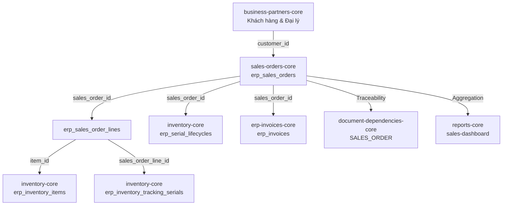

# 📦 Module Tri Thức: Quản Lý Đơn Bán Hàng - Backend (`erp-api`)

## 1. Tổng quan Nghiệp vụ

Module `sales-orders-core` chịu trách nhiệm quản lý toàn bộ vòng đời của Đơn bán hàng (Sales Orders - SO) trong hệ thống Liouni ERP. Đây là mắt xích trung tâm kết nối giữa hoạt động thương mại bán xe/phụ tùng với phân hệ Kho (`inventory-core`), Sản xuất (`production-core`), Hóa đơn thuế (`erp-invoices-core`) và Báo cáo quản trị (`reports-core`).

### 1.1. Các tính năng cốt lõi:
- **Quản lý Đơn Bán Hàng (SO Lifecycle)**:
  - Sinh mã đơn tự động theo cấu trúc định dạng tháng: `SO-YYYYMM-xxx` (ví dụ: `SO-202608-001`).
  - Quản lý trạng thái đơn hàng theo máy trạng thái (State Machine):
    - `DRAFT`: Đơn nháp, cho phép chỉnh sửa và xóa mềm.
    - `CONFIRMED`: Đã xác nhận đơn hàng, sẵn sàng giữ chỗ tồn kho.
    - `PARTIAL_RESERVED`: Đã giữ chỗ một phần số lượng hoặc một số linh kiện/xe.
    - `RESERVED`: Đã giữ chỗ đầy đủ toàn bộ mặt hàng trong đơn.
    - `PARTIAL_DELIVERING`: Đang giao hàng một phần.
    - `DELIVERING`: Đang trong quá trình giao hàng toàn bộ.
    - `DELIVERED`: Đã hoàn tất giao hàng đến khách hàng / đại lý.
    - `CANCELLED`: Đơn hàng đã bị hủy, hoàn trả toàn bộ số lượng giữ chỗ và Serial về kho.
- **Cơ chế Giữ chỗ Tồn kho & Khóa Serial (`reserve` / `unreserve`)**:
  - Đối với hàng thông thường: Tăng trường `qty_reserved` trên bảng `erp_inventory_balances` dựa trên lượng khả dụng $\text{available} = \text{qtyOnHand} - \text{qtyReserved}$.
  - Đối với hàng quản lý định danh (Serial/VIN): Khóa trạng thái Serial sang `RESERVED`, gán `sales_order_line_id` tương ứng trên bảng `erp_inventory_tracking_serials`.
  - Hủy giữ chỗ (`unreserve`): Giải phóng `qty_reserved` trong kho và chuyển trạng thái Serial trở lại `IN_STOCK`.
- **Xác nhận Giao hàng Toàn bộ (`confirmAllDelivery`)**:
  - Kiểm tra trạng thái đơn (`DELIVERING` / `PARTIAL_DELIVERING`).
  - Ngăn chặn bypass: Bắt buộc xác nhận qua tracking serial nếu đơn hàng có thiết bị tracking đang giao.
- **Xuất Phiếu Bán Hàng Excel (`exportXlsx`)**:
  - Tạo file Excel chuẩn nhận diện thương hiệu Liouni/Klotus sử dụng `exceljs`.
  - Bao gồm thông tin công ty từ `CompanyProfileService`, chi tiết người mua, danh sách sản phẩm và các Serial đính kèm.

---

## 2. Database Schema & Quan hệ Dữ liệu

### 2.1. Bảng `erp_sales_orders` (Đơn Bán Hàng Header)

| Cột | Kiểu | Nullable | Mặc định | Ghi chú |
| :--- | :--- | :--- | :--- | :--- |
| `id` | `uuid` | NO | `gen_random_uuid()` | Khóa chính (PK) |
| `so_no` | `varchar(255)` | NO | | Mã đơn bán hàng (Unique Index, vd: `SO-202608-001`) |
| `customer_id` | `uuid` | YES | `NULL` | FK tham chiếu `erp_business_partners.id` |
| `order_date` | `date` | NO | | Ngày đặt hàng |
| `expected_delivery_date` | `date` | YES | `NULL` | Ngày dự kiến giao hàng |
| `status` | `varchar(255)` | NO | `'ACTIVE'` / `'DRAFT'` | Trạng thái vòng đời SO |
| `remarks` | `text` | YES | `NULL` | Ghi chú đơn hàng |
| `created_by` | `uuid` | YES | `NULL` | FK tham chiếu `directus_users.id` / User ID tạo đơn |
| `is_deleted` | `boolean` | NO | `false` | Cờ xóa mềm (Soft Delete) |
| `created_at` | `timestamptz` | NO | `now()` | Thời điểm tạo |
| `updated_at` | `timestamptz` | NO | `now()` | Thời điểm cập nhật |

### 2.2. Bảng `erp_sales_order_lines` (Dòng Chi Tiết Mặt Hàng SO)

| Cột | Kiểu | Nullable | Mặc định | Ghi chú |
| :--- | :--- | :--- | :--- | :--- |
| `id` | `uuid` | NO | `gen_random_uuid()` | Khóa chính (PK) |
| `sales_order_id` | `uuid` | NO | | FK tham chiếu `erp_sales_orders.id` |
| `line_no` | `int` | NO | | Số thứ tự dòng (1, 2, 3...) |
| `item_id` | `uuid` | YES | `NULL` | FK tham chiếu `erp_inventory_items.id` |
| `item_name` | `varchar(255)` | YES | `NULL` | Tên mặt hàng snapshot tại thời điểm bán |
| `qty_ordered` | `numeric(18,3)` | NO | | Số lượng đặt mua |
| `qty_reserved` | `numeric(18,3)` | NO | `0` | Số lượng đã giữ chỗ thành công trong kho |
| `qty_delivered` | `numeric(18,3)` | NO | `0` | Số lượng thực tế đã xuất giao |
| `unit_price` | `numeric(18,3)` | YES | `NULL` | Đơn giá bán chưa VAT |
| `amount` | `numeric(18,3)` | YES | `NULL` | Thành tiền dòng hàng ($\text{qtyOrdered} \times \text{unitPrice}$) |
| `selected_serial_ids` | `jsonb` | YES | `NULL` | Mảng UUID các Serial được chỉ định cho dòng |
| `created_at` | `timestamptz` | NO | `now()` | Thời điểm tạo |
| `updated_at` | `timestamptz` | NO | `now()` | Thời điểm cập nhật |

---

## 3. Cấu trúc Source Code Backend

```text
src/sales-orders-core/
├── dto/
│   ├── create-sales-order.dto.ts      # DTO tạo đơn bán hàng & danh sách dòng hàng
│   ├── create-sales-order-line.dto.ts # DTO chi tiết dòng mặt hàng trong SO
│   ├── update-sales-order.dto.ts      # DTO cập nhật đơn bán hàng
│   ├── reserve-sales-order.dto.ts     # DTO thực hiện giữ chỗ hàng & serial
│   └── unreserve-sales-order.dto.ts   # DTO hủy giữ chỗ hàng & serial
├── entities/
│   ├── erp_sales_order.entity.ts      # TypeORM Entity erp_sales_orders
│   └── erp_sales_order_line.entity.ts # TypeORM Entity erp_sales_order_lines
├── sales-orders-core.controller.ts    # REST Controller định tuyến API /api/v1/sales-orders
├── sales-orders-core.service.ts       # Service xử lý nghiệp vụ, transaction, Excel export
├── sales-orders-core.service.spec.ts  # Unit tests cho logic service
└── sales-orders-core.module.ts        # Module NestJS đăng ký TypeORM repositories
```

---

## 4. Danh sách API Endpoints & RBAC Contract

Controller Base Route: `/api/v1/sales-orders`  
Bảo vệ: `@UseGuards(JwtAuthGuard, CoreRbacGuard)`

| Method | Endpoint | DTO / Params | RBAC Permission | Mô tả |
| :--- | :--- | :--- | :--- | :--- |
| `POST` | `/api/v1/sales-orders` | `CreateSalesOrderDto` | `sales_orders:create` | Tạo mới đơn bán hàng (kèm sinh mã `SO-YYYYMM-xxx` tự động và giữ chỗ serial ban đầu nếu có) |
| `GET` | `/api/v1/sales-orders` | `PaginationDto` (`page, pageSize, search, sort, filtersStr`) | `sales_orders:read` | Lấy danh sách đơn bán hàng phân trang, hỗ trợ tìm kiếm đa trường và faceted filter |
| `GET` | `/api/v1/sales-orders/column-options` | `column, search, page, pageSize, filtersStr` | `sales_orders:read` | Lấy danh sách giá trị filter động theo từng cột cho bảng DataTable |
| `GET` | `/api/v1/sales-orders/next-no` | `date` (`YYYY-MM-DD` optional) | `sales_orders:read` | Lấy trước số đơn bán hàng kế tiếp dự kiến trong tháng |
| `GET` | `/api/v1/sales-orders/:id` | `id: UUID` | `sales_orders:read` | Lấy chi tiết đơn bán hàng bao gồm header, lines, serials, thông tin khách hàng và chứng từ liên kết |
| `PATCH` | `/api/v1/sales-orders/:id` | `id: UUID`, `UpdateSalesOrderDto` | `sales_orders:update` | Cập nhật thông tin đơn bán hàng (chỉ cho phép khi chưa hoàn tất giao) |
| `POST` | `/api/v1/sales-orders/:id/reserve` | `id: UUID`, `ReserveSalesOrderDto` (`warehouseCode, serialIds`) | `sales_orders:update` | Thực hiện khóa giữ chỗ tồn kho và gán serial cho dòng đơn |
| `POST` | `/api/v1/sales-orders/:id/unreserve` | `id: UUID`, `UnreserveSalesOrderDto` (`warehouseCode`) | `sales_orders:update` | Giải phóng số lượng giữ chỗ và mở khóa serial trở lại kho |
| `POST` | `/api/v1/sales-orders/:id/confirm-all-delivery` | `id: UUID` | `sales_orders:update` | Xác nhận hoàn thành giao toàn bộ cho đơn hàng đang ở trạng thái `DELIVERING` |
| `DELETE` | `/api/v1/sales-orders/:id` | `id: UUID` | `sales_orders:delete` | Xóa mềm đơn bán hàng nháp (`DRAFT`), tự động nhả serial nếu có |
| `POST` | `/api/v1/sales-orders/:id/cancel` | `id: UUID` | `sales_orders:update` | Hủy đơn hàng, giải phóng toàn bộ số lượng giữ chỗ tồn kho và trả serial về `IN_STOCK` |
| `GET` | `/api/v1/sales-orders/:id/export/xlsx` | `id: UUID` | `sales_orders:read` | Xuất phiếu đơn bán hàng ra định dạng file Excel `.xlsx` |

---

## 5. Logic Nghiệp vụ Trọng tâm

### 5.1. Thuật toán Sinh Mã Đơn Hàng (`generateMonthlySoNo`)
```typescript
const prefix = `SO-${year}${month}-`;
// Tìm số lớn nhất hiện tại có tiền tố SO-YYYYMM-
const latest = await manager
  .getRepository(ErpSalesOrder)
  .createQueryBuilder('so')
  .where('so.soNo LIKE :prefix', { prefix: `${prefix}%` })
  .orderBy('so.soNo', 'DESC')
  .getOne();
const latestSeq = latest?.soNo?.slice(prefix.length) ?? '000';
const nextSeq = String(Number(latestSeq || '0') + 1).padStart(3, '0');
return `${prefix}${nextSeq}`;
```

### 5.2. Luồng Giữ Chỗ & Khóa Serial (`reserve`)
1. Duyệt qua từng dòng trong đơn hàng, tính toán $\text{qtyNeedReserve} = \text{qtyOrdered} - \text{qtyDelivered} - \text{qtyReserved}$.
2. Kiểm tra tồn kho khả dụng tại `erp_inventory_balances`: $\text{available} = \text{qtyOnHand} - \text{qtyReserved}$.
3. Nếu mặt hàng có chính sách tracking định danh (`trackingPolicyId !== 'NONE'`):
   - Lọc các serial trong danh sách `selectedSerialIds` đang có trạng thái `IN_STOCK`.
   - Cập nhật serial sang `status = 'RESERVED'` và gán `sales_order_line_id = line.id`.
4. Cập nhật số lượng `balance.qtyReserved += qtyToReserve` và `line.qtyReserved += qtyToReserve`.
5. Đánh giá lại toàn bộ đơn: Nếu tất cả các dòng đã đủ lượng giữ chỗ $\to$ cập nhật `so.status = 'RESERVED'`; nếu đủ 1 phần $\to$ `so.status = 'PARTIAL_RESERVED'`.

### 5.3. Luồng Hủy Giữ Chỗ (`unreserve`)
1. Giảm `balance.qtyReserved` tương ứng với lượng đang giữ của dòng hàng.
2. Cập nhật các serial liên kết với dòng hàng từ `RESERVED` về `IN_STOCK`, gỡ bỏ `sales_order_line_id = null`.
3. Cập nhật lại trạng thái đơn hàng (`CONFIRMED`, `PARTIAL_RESERVED`, `PARTIAL_DELIVERING`, hoặc `DELIVERING`).

---

## 6. Tích hợp Liên Module (Cross-module Integration)



- **`inventory-core`**:
  - Đồng bộ số dư giữ chỗ trên `erp_inventory_balances`.
  - Khóa và mở khóa Serial trên `erp_inventory_tracking_serials`.
  - Kích hoạt vòng đời và bảo hành trên `erp_serial_lifecycles`.
- **`business-partners-core`**: Liên kết thông tin khách hàng, đại lý, địa chỉ giao hàng và công nợ.
- **`erp-invoices-core`**: Hóa đơn GTGT tham chiếu đến đơn bán hàng gốc qua `sales_order_id`.
- **`document-dependencies-core`**: Đăng ký nút chứng từ `SALES_ORDER` trong đồ thị truy xuất nguồn gốc (Multi-hop Traceability Graph).

---

## 7. Quy tắc Kiểm thử & Báo cáo Chất lượng

Khi sửa đổi code trong module `sales-orders-core`, luôn thực hiện các bước kiểm tra:

```bash
# 1. Chạy typecheck và lint
bun run check:ci

# 2. Chạy Unit Tests cho sales-orders-core
bunx jest src/sales-orders-core/sales-orders-core.service.spec.ts --forceExit

# 3. Build kiểm tra runtime artifact
bun run build
```
