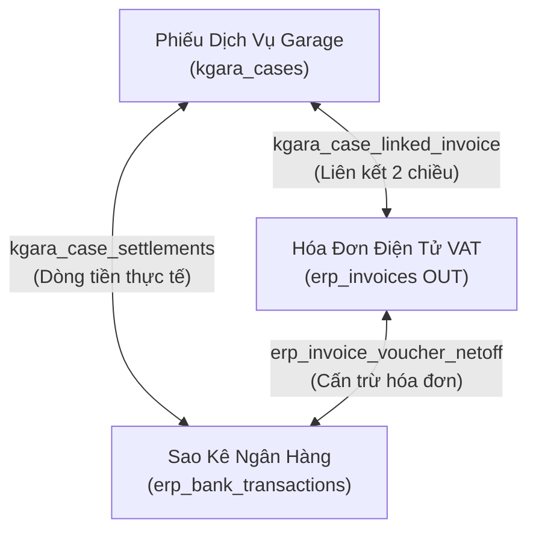
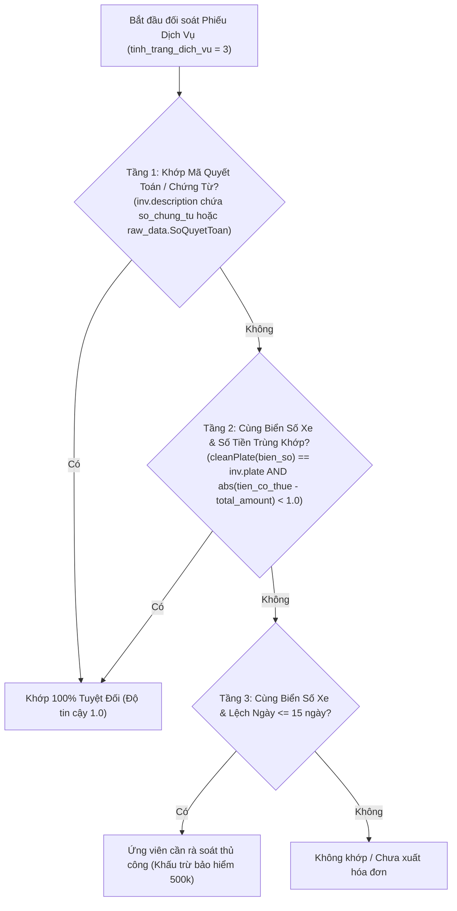

# 📦 Module Tri Thức: Đối Soát & Cấn Trừ Garage — Hóa Đơn VAT — Sao Kê Ngân Hàng (`garage-invoice-reconciliation`)

## 1. Tổng Quan Nghiệp Vụ

Phân hệ Đối soát & Cấn trừ Garage (`kgara-api-core` $\leftrightarrow$ `erp-invoices-core` $\leftrightarrow$ `bank-transactions-core`) chịu trách nhiệm liên kết và cấn trừ dữ liệu 3 chiều:
1. **Phiếu Dịch Vụ Garage (`kgara_cases`)**: Lưu trữ hồ sơ sửa chữa/bảo dưỡng tại xưởng, số chứng từ (`so_chung_tu`), biển số (`bien_so_xe`), doanh thu, chi phí, tiền đã thanh toán và công nợ còn lại (`tien_con_phai_thanh_toan`).
2. **Hóa Đơn Điện Tử Bán Ra (`erp_invoices` OUT)**: Hóa đơn GTGT xuất cho khách hàng doanh nghiệp B2B, công ty bảo hiểm, hãng xe hoặc khách lẻ cá nhân.
3. **Sao Kê Dòng Tiền Ngân Hàng (`erp_bank_transactions` / `kgara_case_settlements`)**: Giao dịch tiền về thực tế từ chuyển khoản, bồi thường bảo hiểm hoặc quẹt thẻ SmartPay POS.



---

## 2. Database Schema & Quan Hệ Dữ Liệu

### 2.1. Bảng `kgara_case_linked_invoice` (Liên Kết Chứng Từ 2 Chiều)
* **`id`** (`uuid`, PK): Khóa chính bản ghi liên kết.
* **`caseDbId`** (`uuid`, FK -> `kgara_cases.id`, ON DELETE CASCADE): Mã định danh phiếu dịch vụ nội bộ ERP.
* **`invoiceId`** (`uuid`, FK -> `erp_invoices.id`): Mã hóa đơn điện tử VAT.
* **`linkType`** (`varchar`, `'OUT'` | `'IN'`): Chiều hóa đơn (`OUT`: Hóa đơn bán ra / Doanh thu; `IN`: Hóa đơn mua vào / Chi phí vật tư).
* **`note`** (`varchar`): Lý do hoặc căn cứ đối soát liên kết.
* **Ràng buộc duy nhất**: `UNIQUE ("caseDbId", "invoiceId")`.

### 2.2. Bảng `kgara_case_settlements` (Sổ Dòng Tiền Thực Tế Của Phiếu)
* **`id`** (`uuid`, PK): Khóa chính bản ghi thanh toán.
* **`case_id`** (`uuid`, FK -> `kgara_cases.id`): Tham chiếu phiếu dịch vụ.
* **`bank_transaction_id`** (`uuid`, FK -> `erp_bank_transactions.id`, nullable): Tham chiếu giao dịch sao kê ngân hàng nếu thu qua ngân hàng (`source_channel = 'ON_SYSTEM'`).
* **`settlement_type`** (`varchar`): `'RECEIPT'` (Thu tiền khách/bảo hiểm) hoặc `'PAYMENT'` (Chi tiền xưởng/gia công ngoài).
* **`source_channel`** (`varchar`): `'ON_SYSTEM'` (Sao kê ngân hàng / Sổ quỹ ERP) hoặc `'OFF_SYSTEM_MANUAL'` (Tiền mặt ngoài sổ).
* **`amount`** (`numeric(18,2)`): Số tiền thanh toán thực tế.
* **`trans_date`** (`date`): Ngày phát sinh giao dịch.

### 2.3. Công thức Tính Công Nợ & Tiến Độ Thanh Toán Phiếu Dịch Vụ
* **Mục tiêu thu (`targetRevenue`)**: `tien_co_thue` (tổng tiền phiếu có thuế).
* **Đã thanh toán (`tien_da_thanh_toan`)**:
  $$\text{tien\_da\_thanh\_toan} = \sum_{\text{settlement\_type} = \text{'RECEIPT'}} \text{amount}$$
* **Công nợ còn phải thu (`tien_con_phai_thanh_toan`)**:
  $$\text{tien\_con\_phai\_thanh\_toan} = \max(0, \text{tien\_co\_thue} - \text{tien\_da\_thanh\_toan})$$

---

## 3. Phân Biệt Mã Định Danh & Cơ Cấu Chi Nhánh

### 3.1. Phân Biệt Mã Phiếu `GR-PDV...` vs Mã Lệnh `-WO-` GSM
* **Mã dạng `GR-PDV26xx-xxxx`** *(ví dụ: `GR-PDV2608-0028`, `GR-PDV2606-0038`)*:
  * Là mã phiếu dịch vụ chuẩn phát sinh trên phần mềm xưởng Garage (`kgara_cases`).
  * Áp dụng cho: Doanh nghiệp B2B, Công ty Bảo hiểm, Khách lẻ cá nhân.
  * **Cấn trừ trực tiếp 1-1** với Hóa đơn bán ra thông qua mã quyết toán hoặc biển số xe + số tiền.
* **Mã dạng `-WO-`** *(ví dụ: `S52801-WO-260905-0001`, `S52802-WO-26-05-05-001`)*:
  * Là mã Work Order bốc số nội bộ của hãng **GSM (Taxi Xanh)**.
  * Xuất hiện trên hơn 1.200 Hóa đơn xuất theo kỳ cho GSM.
  * Các lệnh này do cổng portal của GSM quản lý riêng, **không tạo thành phiếu `GR-PDV`** trong `kgara_cases`. Cấn trừ GSM phải dựa trên file Excel *Bảng Kê Đối Soát Kỳ Thanh Toán GSM*.

### 3.2. Cơ Cấu Chi Nhánh Nam Sài Gòn vs Xưởng Đào Trí
* **Pháp nhân & Đăng ký thuế trên Hóa đơn**:
  * Toàn bộ Hóa đơn bán ra (`C25TGA`, `C26TGA`) đều mang tên bên bán là: **"CÔNG TY CỔ PHẦN GREENWAY AUTOMOTIVES - CHI NHÁNH NAM SÀI GÒN"** *(Địa chỉ: 554 Lê Văn Lương, Phường Tân Hưng, Quận 7)*.
* **Xưởng Đào Trí**:
  * Địa chỉ: **111 Đào Trí, Phường Phú Thuận, Quận 7**.
  * Là cơ sở xưởng vật lý trực thuộc Chi nhánh Nam Sài Gòn (thể hiện trên các chi phí đầu vào như cứu hộ chở xe về Đào Trí, rác thải Lê Mai tại Đào Trí).
  * **Không có hóa đơn bán ra nào mang tên độc lập "Chi nhánh Đào Trí"** — tất cả doanh thu đều hạch toán dưới Chi nhánh Nam Sài Gòn.

---

## 4. Thuật Toán Đối Soát Đa Chiều (Reconciliation Engine)

Quy trình tự động tìm cặp khớp 100% giữa Phiếu Dịch Vụ và Hóa Đơn Bán Ra gồm 4 tầng bộ lọc:



---

## 5. Cơ Chế Đồng Bộ 2 Chiều (Bidirectional Net-Off & Settlement Sync)

Khi ghi nhận liên kết `kgara_case_linked_invoice`:
1. **Hóa Đơn $\rightarrow$ Phiếu Dịch Vụ**:
   * Quét bảng `erp_invoice_voucher_netoff` lấy toàn bộ giao dịch sao kê đã thanh toán cho Hóa đơn.
   * Tự động thêm bản ghi tương ứng vào `kgara_case_settlements` (`settlement_type = 'RECEIPT'`, `source_channel = 'ON_SYSTEM'`).
   * Tự động tính lại `tien_da_thanh_toan` và giảm trừ `tien_con_phai_thanh_toan` trên `kgara_cases`.
2. **Phiếu Dịch Vụ $\rightarrow$ Hóa Đơn**:
   * Nếu Phiếu dịch vụ được thêm giao dịch sao kê trước, hệ thống tự động sinh bản ghi `erp_invoice_voucher_netoff` cho các Hóa đơn liên kết tương ứng.
3. **Khi Gỡ Liên Kết**:
   * Tự động dọn dẹp các bản ghi settlement kế thừa và hoàn nguyên số dư công nợ của phiếu dịch vụ.

---

## 6. Runbook Đối Soát Định Kỳ (Step-by-Step)

Mỗi khi phát sinh kỳ quyết toán mới hoặc sau khi cấn trừ sao kê ngân hàng:

### Bước 1: Trích xuất danh sách khớp 100%
Chạy script đối soát đa chiều:
```bash
bun /home/dev/repos/erp/erp-api/scripts/reconcile-cases-invoices.ts
```

### Bước 2: Kiểm tra Pre-flight
* Xác thực các Hóa đơn có trạng thái hợp lệ (`tax_invoice_status IN (1, 2)` và `status != 'CANCELLED'`).
* Kiểm tra không có liên kết trùng lặp.

### Bước 3: Thực thi Transaction liên kết & đồng bộ
```bash
bun /home/dev/repos/erp/erp-api/scripts/execute-case-invoice-links.ts
```

### Bước 4: Kiểm toán số dư sau thực thi
```sql
-- Kiểm toán không có phiếu dịch vụ nào bị âm công nợ
SELECT id, so_chung_tu, tien_co_thue, tien_da_thanh_toan, tien_con_phai_thanh_toan
FROM kgara_cases
WHERE tien_con_phai_thanh_toan < -0.01;
```
