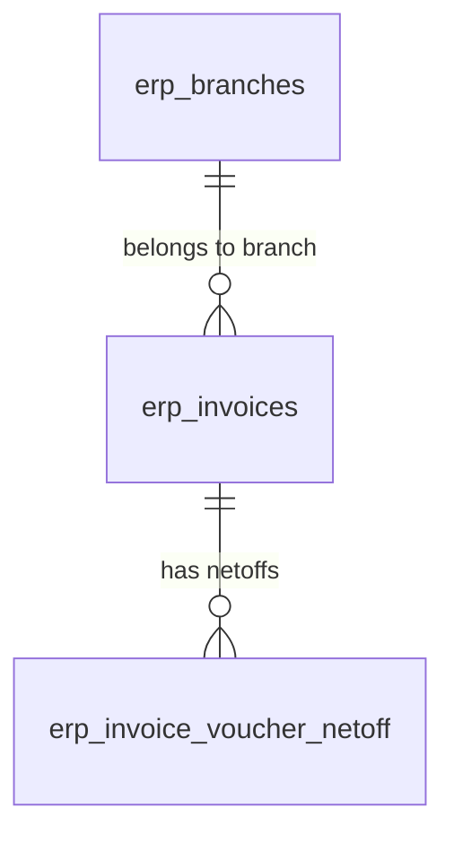

# 📦 Module Tri Thức: Báo Cáo Công Nợ Khách Hàng & Nhà Cung Cấp (Invoice Debts) - Backend & Frontend

## 1. Tổng quan Nghiệp vụ

Module Báo cáo Công nợ (`invoice-debts`) là phân hệ thuộc nhóm Kế toán & Dòng tiền, cung cấp khả năng theo dõi, đối soát và phân tích tuổi nợ thời gian thực cho cả hai luồng đối tác:
- **Công nợ Khách hàng (Phải thu - `CUSTOMER` / Hóa đơn bán ra `OUT`)**: Tổng hợp doanh thu hóa đơn bán ra, số tiền khách hàng đã thanh toán qua cấn trừ sổ quỹ/ngân hàng (`erp_invoice_voucher_netoff`), số dư còn phải thu và tuổi nợ tối đa (`maxAgingDays`).
- **Công nợ Nhà cung cấp (Phải trả - `SUPPLIER` / Hóa đơn mua vào `IN`)**: Tổng hợp chi phí hóa đơn mua vào, số tiền doanh nghiệp đã thanh toán cho nhà cung cấp, số dư còn phải trả và cảnh báo nợ quá hạn.

### Các đặc điểm nghiệp vụ trọng tâm:
1. **Tổng hợp thời gian thực (Zero-Lag Real-Time Aggregation)**: Không duy trì bảng số dư tĩnh gây lệch số liệu; dữ liệu được tổng hợp trực tiếp từ bảng hóa đơn gốc `erp_invoices` kết hợp `LEFT JOIN` với bảng cấn trừ thanh toán `erp_invoice_voucher_netoff`.
2. **Loại trừ Hóa đơn Bị Thay Thế**: Tự động loại trừ các hóa đơn có `tax_invoice_status = 4` (hóa đơn bị thay thế từ Cổng thuế GDT) để số liệu công nợ không bị tính trùng lặp.
3. **Phân tích Tuổi nợ Động (Aging Buckets)**: Tự động tính số ngày quá hạn `CURRENT_DATE - inv.invoice_date::date` cho các hóa đơn còn số dư (`balanceAmount > 0`). Phân loại thành các tầng: Trong hạn (< 30 ngày), Cảnh báo (30 - 90 ngày), Quá hạn nghiêm trọng (> 90 ngày).
4. **Tiến độ Thanh toán Fintech**: Tính tỷ lệ `%` thanh toán `(paidAmount / totalAmount) * 100`, hiển thị thanh tiến độ với màu sắc trực quan (Xanh lá / Cam / Xám) tuân thủ quy tắc No-Blue Mandate.
5. **Dòng Tổng phụ & Popover Tỷ lệ Hero (Subtotal Summary)**: Tính toán song song tổng lũy kế trên trang hiện tại và tổng toàn bộ hệ thống (`grandTotalAmount`, `grandTotalPaid`, `grandTotalBalance`, `totalPartners`, `totalInvoiceCount`).

---

## 2. Database Schema & Quan hệ Dữ liệu



### 2.1. Nguồn Dữ liệu Truy vấn
Dữ liệu công nợ được truy vấn trực tiếp từ 2 bảng cốt lõi:
- **`erp_invoices`**: Chứa toàn bộ thông tin định danh bên bán (`seller_tax_code`, `seller_name`, `seller_address`), bên mua (`buyer_tax_code`, `buyer_name`, `buyer_personal_name`, `buyer_cccd`, `buyer_address`), ngày lập (`invoice_date`), tổng tiền (`total_amount`), chiều (`direction = 'IN' | 'OUT'`), chi nhánh (`branch_id`), trạng thái xóa mềm (`is_deleted = false`) và trạng thái thuế (`tax_invoice_status != 4`).
- **`erp_invoice_voucher_netoff`**: Chứa số tiền đã cấn trừ thanh toán qua ngân hàng/sổ quỹ (`net_off_amount`) theo từng `invoice_id`.

### 2.2. Công thức Tổng hợp SQL
```sql
SELECT 
  COALESCE(NULLIF(TRIM(inv.seller_tax_code), ''), 'KHONG_MST') as "taxCode", -- Hoặc buyer_tax_code / buyer_cccd
  MAX(COALESCE(NULLIF(TRIM(inv.seller_name), ''), 'Nhà cung cấp')) as "partnerName",
  MAX(inv.seller_address) as "address",
  COUNT(DISTINCT inv.id) as "invoiceCount",
  SUM(CAST(inv.total_amount AS NUMERIC)) as "totalAmount",
  SUM(COALESCE(netoff.net_off_amount, 0)) as "paidAmount",
  SUM(GREATEST(0, CAST(inv.total_amount AS NUMERIC) - COALESCE(netoff.net_off_amount, 0))) as "balanceAmount",
  MAX(
    CASE 
      WHEN (CAST(inv.total_amount AS NUMERIC) - COALESCE(netoff.net_off_amount, 0)) > 0 
      THEN GREATEST(0, (CURRENT_DATE - inv.invoice_date::date))
      ELSE 0 
    END
  ) as "maxAgingDays",
  TO_CHAR(MAX(inv.invoice_date), 'YYYY-MM-DD') as "latestInvoiceDate",
  MAX(inv.branch_id::text) as "branchId"
FROM erp_invoices inv
LEFT JOIN (
  SELECT invoice_id, SUM(net_off_amount) as net_off_amount
  FROM erp_invoice_voucher_netoff
  GROUP BY invoice_id
) netoff ON netoff.invoice_id = inv.id
WHERE inv.is_deleted = false 
  AND (inv.tax_invoice_status IS NULL OR inv.tax_invoice_status != 4)
  AND inv.direction = :direction
GROUP BY ...
```

---

## 3. Cấu trúc Source Code

### 3.1. Backend (`erp/erp-api`)
```text
erp-api/src/
├── rbac-core/
│   └── enums/
│       └── erp-resource.enum.ts       # Định nghĩa ErpResource.INVOICE_DEBTS = 'invoice_debts'
├── erp-invoices-core/
│   ├── dto/
│   │   └── get-invoice-debts.dto.ts   # GetInvoiceDebtsQueryDto, GetInvoiceDebtColumnOptionsQueryDto
│   ├── controllers/
│   │   └── invoice-debts.controller.ts# REST API endpoints (/api/v1/erp-invoices/debts...)
│   ├── services/
│   │   ├── invoice-debts.service.ts   # Aggregation engine, Aging buckets, Keyword search, Grand totals
│   │   └── invoice-debts.service.spec.ts # Jest unit test suite (100% PASS)
│   └── erp-invoices-core.module.ts    # Đăng ký Controller & Service (InvoiceDebtsController xếp trước)
```

### 3.2. Frontend (`erp/erp-web`)
```text
erp-web/src/
├── modules/
│   ├── system/
│   │   └── types/rbac.ts              # ErpResource.INVOICE_DEBTS, RBAC_COLLECTIONS, PERMISSION_RESOURCE_GROUPS
│   └── accounting/
│       ├── api/
│       │   └── invoiceDebtsApi.ts     # Axios API client
│       ├── hooks/
│       │   └── useInvoiceDebtsList.ts # React Query list hook với stale cache & isolation
│       ├── components/
│       │   └── InvoicePartnerDebtDetailDrawer.tsx # Drawer XL chi tiết công nợ, KPI, Bar chart, Invoice list
│       └── pages/
│           └── InvoiceDebtsPage.tsx   # Trang SpreadsheetPageTemplate 2 tab, Header Filter, Subtotal Popover
├── core/
│   ├── locale/
│   │   └── accounting/debts/
│   │       ├── vi.ts                  # Từ điển tiếng Việt 100%
│   │       └── en.ts                  # Từ điển tiếng Anh 100%
│   └── components/layout/
│       ├── sidebar/components/SidebarNav.tsx # Navigation item "Công nợ"
│       └── hooks/useNavItems.tsx      # Command search bar item
└── pages/
    └── InvoiceDebtsPage.tsx           # Page wrapper định tuyến trong App.tsx
```

---

## 4. Danh sách API Endpoints & RBAC Contract

Tất cả các endpoint dưới đây được bảo vệ bởi `JwtAuthGuard`, `CoreRbacGuard` và yêu cầu quyền `@RequireAnyPermissions({ resource: ErpResource.INVOICE_DEBTS, action: ErpAction.READ }, { resource: ErpResource.INVOICES, action: ErpAction.READ })`:

| Phương thức | Endpoint | Params / Query | Mô tả |
| :--- | :--- | :--- | :--- |
| `GET` | `/api/v1/erp-invoices/debts` | `partner_type`, `page`, `pageSize`, `search`, `date_from`, `date_to`, `branch_id`, `sortBy`, `sortOrder`, `column_search`, `column_filters` | Lấy danh sách tổng hợp công nợ đối tác có phân trang, lọc đa chiều và tính Grand Totals |
| `GET` | `/api/v1/erp-invoices/debts/column-options` | `column_key`, `partner_type`, `search`, `page`, `pageSize`, `filters`, `date_from`, `date_to`, `branch_id` | Lấy danh sách options lọc động cho từng cột trên Header Filter |
| `GET` | `/api/v1/erp-invoices/debts/:taxCode/invoices` | `:taxCode`, `partner_type`, `date_from`, `date_to` | Lấy danh sách chi tiết các hóa đơn phát sinh của một đối tác cụ thể |

---

## 5. Logic Nghiệp vụ Trọng tâm

### 5.1. Thứ tự Định tuyến Controller (Router Matching Guard)
Trong NestJS/Express, route wildcard `@Get(':id')` trên `@Controller('erp-invoices')` có thể chiếm quyền của `@Controller('erp-invoices/debts')`. Vì vậy `InvoiceDebtsController` **BẮT BUỘC** phải được khai báo trước `ErpInvoicesCoreController` trong mảng `controllers` của `ErpInvoicesCoreModule`.

### 5.2. Công cụ Tìm kiếm Nâng cao (Header Filter Engine)
Hàm `buildKeywordSqlClause` hỗ trợ cú pháp tìm kiếm chuẩn hóa:
- **Tìm kiếm chính xác**: Cặp dấu ngoặc kép `"<từ_khóa>"` $\to$ `sqlField ILIKE '<từ_khóa>'`.
- **Tìm kiếm nhiều từ khóa**: Dấu chấm phẩy `<kw1>; <kw2>` $\to$ `(sqlField ILIKE '%<kw1>%' OR sqlField ILIKE '%<kw2>%')`.
- **Lọc trống (`__BLANK__`)**: `(sqlField IS NULL OR sqlField = '')`.
- **Lọc có dữ liệu (`__ALL_MATCHING__`)**: `(sqlField IS NOT NULL AND sqlField != '')`.

### 5.3. Drawer Chi Tiết Công Nợ (`InvoicePartnerDebtDetailDrawer`)
- Sử dụng chuẩn `StandardFormDrawer` layout `1-column` với kích thước `size="xl"`.
- Hiển thị 4 thẻ KPI tóm tắt tài chính (Tổng giá trị, Đã thanh toán, Còn lại, Tuổi nợ tối đa).
- Tích hợp biểu đồ Bar Chart phân tích xu hướng công nợ 6 tháng gần nhất (Recharts).
- Bảng DataTable danh sách các hóa đơn phát sinh chi tiết kèm số tiền cấn trừ và trạng thái.

---

## 6. Tích hợp Liên Module

- **`erp-invoices-core`**: Sử dụng dữ liệu hóa đơn gốc và bảng cấn trừ `erp_invoice_voucher_netoff`.
- **`bank-transactions-core`**: Đồng bộ gián tiếp số liệu thanh toán sao kê ngân hàng qua các bản ghi netoff.
- **`rbac-core`**: Tích hợp kiểm soát quyền truy cập tài nguyên `invoice_debts` và `invoices`.
- **`erp-web (SpreadsheetPageTemplate)`**: Cung cấp trải nghiệm bảng tính chuyên nghiệp với phân trang server-side, header filters, và subtotal popovers.

---

## 7. Quy tắc Kiểm thử & Báo cáo Chất lượng

### Unit Test Backend
```bash
cd /home/dev/repos-dev/erp/erp-api
bunx jest src/erp-invoices-core/services/invoice-debts.service.spec.ts --forceExit
```

### TypeScript & Production Build Frontend
```bash
cd /home/dev/repos-dev/erp/erp-web
bun run build
```
