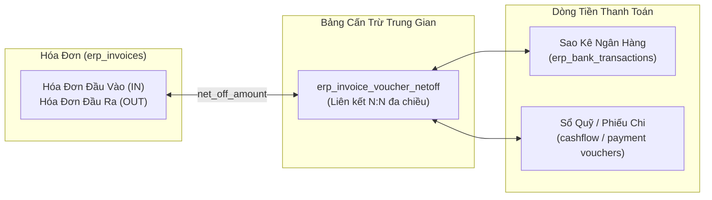
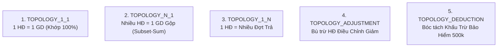

# 📦 Module Tri Thức: Quản Lý Cấn Trừ Hóa Đơn & Chứng Từ Thanh Toán (Smart Net-Off Engine) - Backend (`erp-api`)

## 1. Tổng quan Nghiệp vụ

Hệ thống **Cấn Trừ Hóa Đơn & Chứng Từ Thanh Toán (Smart Net-Off Engine)** trong Liouni ERP là hạt nhân quản lý vòng đời thanh toán và quyết toán công nợ giữa:
- **Hóa đơn đầu ra (`direction = 'OUT'`)** $\leftrightarrow$ **Giao dịch ngân hàng thu tiền (`credit_amount > 0`)** hoặc **Sổ quỹ tiền mặt thu (`cashflow_vouchers`)**.
- **Hóa đơn đầu vào (`direction = 'IN'`)** $\leftrightarrow$ **Giao dịch ngân hàng chi tiền (`debit_amount > 0` / Ủy nhiệm chi UNC)** hoặc **Phiếu chi tiền mặt (`payment_vouchers`)**.



---

## 2. Database Schema & Quan hệ Dữ liệu

### 2.1. Bảng Cấn Trừ Trung Gian: `erp_invoice_voucher_netoff`

| Tên Cột | Kiểu Dữ Liệu | Nullable | Default | Ràng Buộc / Mô Tả |
| :--- | :--- | :---: | :---: | :--- |
| `id` | `uuid` | NO | `gen_random_uuid()` | Khóa chính (PK) |
| `invoice_id` | `uuid` | NO | — | **FK** tham chiếu `erp_invoices.id` (`ON DELETE CASCADE`) |
| `bank_transaction_id` | `uuid` | NO | — | **FK** tham chiếu `erp_bank_transactions.id` (`ON DELETE CASCADE`) |
| `net_off_amount` | `numeric(18,2)` | NO | `0` | Số tiền cấn trừ (VNĐ). Luôn dương ($> 0$). |
| `created_at` | `timestamptz` | NO | `now()` | Thời điểm tạo bản ghi |
| `updated_at` | `timestamptz` | NO | `now()` | Thời điểm cập nhật cuối |

### 2.2. Quan Hệ Với Bảng Hóa Đơn (`erp_invoices`)
- **Dư nợ còn lại của Hóa đơn**:
  $$\text{invoice\_remaining} = \text{total\_amount} - \sum(\text{net\_off\_amount})$$
- **Ràng buộc an toàn số dư**: Luôn bảo đảm $\text{invoice\_remaining} \ge 0$.
- **Trường bù trừ hóa đơn gốc**:
  + `related_invoice_no`: Số hóa đơn gốc liên quan (khi là HĐ Điều chỉnh giảm hoặc Thay thế).
  + `related_serial_no`: Ký hiệu hóa đơn gốc liên quan.
  + `tax_invoice_status`: Trạng thái thuế từ GDT:
    * `1`: Hóa đơn gốc hợp lệ.
    * `2`: Hóa đơn thay thế mới.
    * `3`: Hóa đơn điều chỉnh giảm (âm tiền).
    * `4`: Hóa đơn đã bị thay thế (vô hiệu).
    * `5`: Hóa đơn đã bị điều chỉnh.

### 2.3. Quan Hệ Với Bảng Sao Kê Ngân Hàng (`erp_bank_transactions`)
- **Dư tiền còn lại của Giao dịch**:
  + **Đối với Giao dịch Thu tiền (`credit_amount > 0`)**:
    $$\text{txn\_credit\_remaining} = \text{credit\_amount} - \sum(\text{net\_off\_amount})$$
  + **Đối với Giao dịch Chi tiền (`debit_amount > 0`)**:
    $$\text{txn\_debit\_remaining} = \text{debit\_amount} - \sum(\text{net\_off\_amount})$$
- **Ràng buộc an toàn**: Luôn bảo đảm $\text{txn\_remaining} \ge 0$.

---

## 3. Topologies Đối Soát & Thuật Toán Cấn Trừ Chuẩn Mực



### 🔹 Topology 1: `TOPOLOGY_1_1` (Khớp 1-1 Tuyệt Đối)
- **Điều kiện**:
  1. $|\text{invoice\_remaining} - \text{txn\_remaining}| < 1.0\text{ VNĐ}$.
  2. Khớp ít nhất 1 thông tin định danh: Biển số xe (`license_plate`), Số HĐ (`invoice_no` trong trích yếu), Lệnh sửa chữa (`settlement_order` / RO), hoặc Mã số thuế (`buyer_tax_code` / `seller_tax_code`).
- **Hành động**: Insert 1 bản ghi vào `erp_invoice_voucher_netoff` với `net_off_amount = invoice_remaining`.

### 🔹 Topology 2: `TOPOLOGY_N_1` (Lô Gộp Nhiều Hóa Đơn = 1 Giao Dịch)
- **Áp dụng cho**:
  + Các hãng bảo hiểm chuyển tiền theo Bảng kê bồi thường (PJICO Hà Nội/Bến Thành, Bảo Việt, BSH, DBV, MIC,...).
  + Khách hàng doanh nghiệp B2B thanh toán gộp nhiều xe / nhiều hóa đơn trong kỳ.
  + Giao dịch POS quẹt thẻ gộp nhiều hóa đơn của cùng một chủ xe.
- **Thuật toán giải quyết (Subset-Sum Algorithm)**:
  ```typescript
  function findSubsetSum(candidates: InvoiceRecord[], targetAmount: number): InvoiceRecord[] | null {
    const n = candidates.length;
    if (n === 0) return null;
    for (let r = 1; r <= Math.min(n, 12); r++) {
      const combos = getCombinations(candidates, r);
      for (const combo of combos) {
        const sum = combo.reduce((acc, inv) => acc + inv.remaining_amount, 0);
        if (Math.abs(sum - targetAmount) < 1.0) {
          return combo;
        }
      }
    }
    return null;
  }
  ```
- **Hành động**: Lần lượt insert $N$ bản ghi vào `erp_invoice_voucher_netoff` với số tiền tương ứng từng HĐ.

### 🔹 Topology 3: `TOPOLOGY_1_N` (1 Hóa Đơn Thanh Toán Làm Nhiều Đợt)
- **Áp dụng cho**: Khách hàng đặt cọc trước và thanh toán nốt phần còn lại, hoặc doanh nghiệp trả góp/trả chậm nhiều đợt.
- **Hành động**: Mỗi lần nhận được giao dịch sao kê, cấn trừ dần theo số tiền thực nhận cho đến khi $\text{invoice\_remaining} = 0$.

### 🔹 Topology 4: `TOPOLOGY_ADJUSTMENT` (Bù Trừ Hóa Đơn Điều Chỉnh Giảm)
- **Nguyên tắc kỹ thuật cốt lõi**:
  + Bảng `erp_invoice_voucher_netoff` có ràng buộc `bank_transaction_id NOT NULL`, chỉ dùng cho cấn trừ giữa Hóa đơn và Ngân hàng/Sổ quỹ.
  + **Hóa đơn Điều chỉnh Giảm (`tax_invoice_status = 3`, tổng tiền âm)** được quản lý bù trừ trực tiếp qua các trường quan hệ:
    * `related_invoice_no` / `related_serial_no`.
    * Hoặc cùng `license_plate` và $|\text{total\_amount\_adj} + \text{total\_amount\_orig}| < 1.0$.
  + Hệ thống Invoice Dashboard và Drawer Traceability Graph tự động tính toán bù trừ hiển thị mạng lưới chứng từ.

### 🔹 Topology 5: `TOPOLOGY_DEDUCTION` (Bóc Tách Mức Miễn Thường Bảo Hiểm 500k/Vụ)
- **Nghiệp vụ**:
  + Hãng bảo hiểm khấu trừ 500,000 đ mức miễn thường theo quy định (chủ xe phải trả trực tiếp cho garage qua POS hoặc tiền mặt).
  + Hóa đơn xuất cho Bảo hiểm: Tổng tiền = $X$ đ.
  + Bảo hiểm chuyển khoản: $X - 500,000$ đ.
  + Chủ xe trả POS/Tiền mặt: $500,000$ đ.
- **Cơ chế cấn trừ**:
  + Cấn trừ 1: Gán giao dịch POS/Sổ quỹ 500,000 đ vào HĐ $\to$ Dư nợ còn $X - 500,000$ đ.
  + Cấn trừ 2: Gán giao dịch sao kê Bảo hiểm $X - 500,000$ đ vào HĐ $\to$ Hóa đơn tất toán $100\%$.

---

## 4. Năm Nguyên Tắc An Toàn Cốt Tử (Safety Guardrails)

> [!CAUTION]
> Bất kỳ Agent hoặc Developer nào thực thi cấn trừ đều bắt buộc tuân thủ 5 nguyên tắc sau:

1. **Tuyệt đối KHÔNG cấn trừ HĐ Bị Thay Thế (`status = 4`) hoặc Bị Hủy (`status = 'CANCELLED'`)**:
   - Trước khi insert/update netoff, luôn kiểm tra:
     ```sql
     SELECT tax_invoice_status, status FROM erp_invoices WHERE id = $1;
     -- Bắt buộc: tax_invoice_status IN (1, 2) AND status != 'CANCELLED' AND is_deleted = false
     ```
2. **Dọn dẹp & Chuyển đổi HĐ Bị Thay Thế Sang HĐ Mới**:
   - Khi phát hiện HĐ cũ bị thay thế (`status = 4`) có bản ghi trong `erp_invoice_voucher_netoff`, phải dò tìm HĐ thay thế hợp lệ mới (`related_invoice_no` hoặc cùng biển số + số tiền + `status = 2`) và UPDATE `invoice_id` sang HĐ mới.
3. **Kiểm toán Số dư Không Âm (Zero Over-Allocation Audit)**:
   - Sau mỗi đợt commit, bắt buộc chạy query audit:
     ```sql
     -- 1. Kiểm tra Hóa đơn bị âm:
     SELECT id, invoice_no, total_amount, SUM(net_off_amount)
     FROM erp_invoices JOIN erp_invoice_voucher_netoff ON invoice_id = id
     GROUP BY id HAVING (total_amount - SUM(net_off_amount)) < -0.01;

     -- 2. Kiểm tra Sao kê bị âm:
     SELECT id, credit_amount, SUM(net_off_amount)
     FROM erp_bank_transactions JOIN erp_invoice_voucher_netoff ON bank_transaction_id = id
     GROUP BY id HAVING (credit_amount - SUM(net_off_amount)) < -0.01;
     ```
4. **Cấu Hình `SET synchronous_commit = off` Khi Chạy Batch Lớn**:
   - Khi kết nối qua PgBouncer/Neon Pooler hoặc remote server có độ trễ I/O, lệnh `COMMIT` dễ bị kẹt `LWLock: WALWrite`. Khắc phục bằng cách chạy `SET synchronous_commit = off;` ngay trước `BEGIN`.
5. **Không Tự Động Đổi `posting_status` hoặc Sinh `JournalEntry`**:
   - Chỉ tạo bản ghi cấn trừ trong `erp_invoice_voucher_netoff`. Giữ nguyên trạng thái `posting_status = 'UNPOSTED'` trừ khi có chỉ đạo tường minh từ Kế toán trưởng/User.

---

## 5. Quy Trình Cấn Trừ Cho Hóa Đơn Mua Vào (Chi Tiền - `direction = 'IN'`)

Quy trình cấn trừ hóa đơn đầu vào (`direction = 'IN'`) tuân theo cùng một kiến trúc đối soát đối ứng:

| Tiêu Chí | Hóa Đơn Đầu Ra (`OUT`) | Hóa Đơn Đầu Vào (`IN`) |
| :--- | :--- | :--- |
| **Chiều hóa đơn** | `direction = 'OUT'` | `direction = 'IN'` |
| **Bên đối tác** | `buyer_name`, `buyer_tax_code` (Khách hàng) | `seller_name`, `seller_tax_code` (Nhà cung cấp) |
| **Giao dịch ngân hàng** | `credit_amount > 0` (Tiền về) | `debit_amount > 0` (Ủy nhiệm chi UNC / Tiền đi) |
| **Sổ quỹ tiền mặt** | `cashflow_vouchers` (Phiếu thu) | `payment_vouchers` (Phiếu chi) |
| **Đối tác trọng tâm** | GSM, Bảo hiểm (PJICO, BV,...), B2B, Khách lẻ | VinFast, NCC Phụ tùng, Thuê mặt bằng, Dịch vụ ngoài |
| **Bảng kê cấn trừ** | `erp_invoice_voucher_netoff` | `erp_invoice_voucher_netoff` |

---

## 6. Bộ Công Cụ & Scripts Tái Sử Dụng Chuẩn Mực

### 6.1. Helper Chuẩn Hóa Biển Số Xe (Xử lý Wrap-Text Ngân Hàng)
```typescript
export function cleanPlate(p: string | null | undefined): string {
  if (!p) return '';
  return p.replace(/[^A-Za-z0-9]/g, '').toUpperCase();
}

export function extractPlatesFromText(text: string): string[] {
  if (!text) return [];
  // Xử lý lỗi ngân hàng ngắt dòng chèn khoảng trắng giữa các chữ số: "50H-410.4 7" -> "50H-410.47"
  const normalized = text.replace(/([0-9]{2}[A-Z]{1,2}[-.\s]?[0-9]{3}[-.]?[0-9])\s+([0-9])\b/gi, '$1$2');
  const results: string[] = [];
  const tokens = normalized.split(/[\s,;:\/|()\-]+/);
  for (const token of tokens) {
    const cleaned = cleanPlate(token);
    if (/^[0-9]{2}[A-Z]{1,2}[0-9]{4,5}$/.test(cleaned)) {
      results.push(cleaned);
    }
  }
  for (let i = 0; i < tokens.length - 1; i++) {
    const combined = cleanPlate(tokens[i] + tokens[i+1]);
    if (/^[0-9]{2}[A-Z]{1,2}[0-9]{4,5}$/.test(combined)) {
      results.push(combined);
    }
  }
  return Array.from(new Set(results));
}
```

### 6.2. Quy Trình Thực Thi Chuẩn 4 Bước
1. **Bước 1 (Research & Dry-Run)**: Quét dữ liệu DB $\to$ Tìm kiếm các ứng viên khớp theo Topology $\to$ Xuất file CSV Preview vào `brain/<conv-id>/scratch/`.
2. **Bước 2 (Lập Plan & Chờ Duyệt)**: Cập nhật `implementation_plan.md` $\to$ Đính kèm danh sách bảng kê $\to$ Dừng chờ User phê duyệt (`OK` / `Confirm`).
3. **Bước 3 (Thực Thi Atomic Commit)**: Mở DB Transaction $\to$ `SET synchronous_commit = off;` $\to$ `BEGIN` $\to$ Validate $\to$ Insert `erp_invoice_voucher_netoff` $\to$ `COMMIT`.
4. **Bước 4 (Kiểm Toán Toàn Diện)**: Chạy script verify kiểm tra 0 over-allocation $\to$ Cập nhật `walkthrough.md`.

---

## 7. Tích Hợp API & Frontend UI

### 7.1. API Endpoints Backend
- `POST /api/v1/erp-invoices/smart-net-off-suggestions`: Gợi ý cấn trừ sao kê ngân hàng thông minh (6 cấp độ xếp hạng).
- `POST /api/v1/erp-invoices/:id/net-off-vouchers`: Gán liên kết cấn trừ giữa HĐ và giao dịch ngân hàng.
- `DELETE /api/v1/erp-invoices/:id/net-off-vouchers/:voucherId`: Hủy liên kết cấn trừ.
- `POST /api/v1/erp-invoices/bulk-net-offs`: Lấy thông tin cấn trừ hàng loạt cho danh sách HĐ.

### 7.2. Frontend Components (`erp-web`)
- **`DrawerDocumentTraceability`**: Hiển thị đồ thị đa tầng liên kết giữa Hóa đơn $\leftrightarrow$ Sao kê ngân hàng $\leftrightarrow$ Phiếu kho $\leftrightarrow$ Sổ cái kế toán $\leftrightarrow$ Vụ việc Garage.
- **`DrawerNetOffVoucher`**: Drawer thao tác ghép nối và gỡ liên kết cấn trừ trực quan.
- **`InvoiceColumns`**: Cột hiển thị trạng thái thanh toán, số tiền đã cấn trừ và số dư nợ còn lại.
