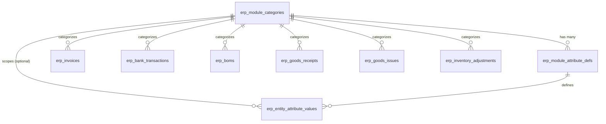

# 📦 Module Tri Thức: Quản lý Cấu hình Danh mục & Trường tùy chỉnh Đa Module (`module-config`)

## 1. Tổng quan Nghiệp vụ & Kiến trúc Hệ thống

Module `module-config` cung cấp nền tảng **Dynamic Custom Fields Engine (EAV - Entity-Attribute-Value)** thống nhất, tinh gọn và có khả năng scale vô hạn cho toàn bộ hệ sinh thái Liouni ERP:
1. **Thuộc tính Mặc định Hệ thống (`is_system = true`)**:
   - Khởi tạo sẵn các trường cốt lõi của từng phân hệ (VD: `type_invoice_in`, `type_invoice_out`, `type_inventory_receipt`, `type_inventory_issue`, `type_inventory_adjustment`, `color`, `version`, `type_production_order`).
   - Cố định trường `code` và `fieldType`, được bảo vệ an toàn chống xóa nhầm (`is_system = true`). Admin chỉ có thể đổi nhãn hiển thị (`name`, `name_en`), bật/tắt bắt buộc (`isRequired`), hoặc chỉnh sửa danh sách tùy chọn (`options`).
2. **Thuộc tính Tùy chỉnh Linh hoạt (`is_system = false`)**:
   - Cho phép Quản trị viên tự do tạo thêm các trường động mới theo nhu cầu doanh nghiệp (hỗ trợ kiểu `TEXT`, `NUMBER`, `SELECT`, `DATE`, `CHECKBOX`).
3. **Phân loại Phạm vi (Scope)**:
   - **Thuộc tính Chung Toàn Phân hệ (Global Attributes)**: `is_global = true`, `module_key_global = '<MODULE_KEY>'`, `category_id = NULL`. Tự động xuất hiện ngay trên form/drawer của phân hệ đó.
   - **Thuộc tính Theo Danh mục (Category-specific Attributes)**: `is_global = false`, gắn với `category_id`. Chỉ xuất hiện khi người dùng chọn Danh mục tương ứng.
4. **Cơ chế Dual-Key Access Pattern**:
   - Hỗ trợ truy cập giá trị bằng cả **UUID (`attrDefId`)** lẫn **Mã code (`attrCode`)** trong cùng một object `customAttributes`.
5. **Đồng nhất API Response 3 trường**:
   - Mọi entity có custom fields (Hóa đơn, Chứng từ kho, BOM, Sản xuất, Giao dịch ngân hàng...) đều trả về đồng nhất 3 trường: `attributeValues`, `customAttributes`, và `attributes`.

---

## 2. Giải thích Chi tiết Cấu trúc Response 3 Trường

Khi truy vấn chi tiết một bản ghi thực thể (VD: Phiếu nhập kho, Hóa đơn, BOM), API Backend tự động nhúng 3 trường:

```json
{
  "id": "b74a6ab7-9704-4074-920d-736639db7419",
  "receiptNo": "NK-202609005",
  "attributeValues": [
    {
      "id": "dd2bc650-649b-4da8-b9d4-782c393ba297",
      "attrDefId": "a8e8f377-fd59-48e8-8818-a75bc3171613",
      "attrCode": "type_inventory_receipt",
      "attrName": "Loại nhập kho",
      "nameEn": "Goods Receipt Type",
      "fieldType": "SELECT",
      "isSystem": true,
      "valueText": "PRODUCTION"
    }
  ],
  "customAttributes": {
    "a8e8f377-fd59-48e8-8818-a75bc3171613": "PRODUCTION",
    "type_inventory_receipt": "PRODUCTION"
  },
  "attributes": {
    "a8e8f377-fd59-48e8-8818-a75bc3171613": "PRODUCTION",
    "type_inventory_receipt": "PRODUCTION"
  }
}
```

### So sánh & Mục đích sử dụng:

| Trường | Kiểu dữ liệu | Mục đích cốt lõi | Khi nào sử dụng ở Frontend? |
| :--- | :--- | :--- | :--- |
| **`attributeValues`** | `Array<AttributeValueDetail>` *(Full Metadata)* | Chứa **toàn bộ định nghĩa + giá trị thực tế**: `attrDefId`, `attrCode`, `attrName`, `nameEn`, `fieldType`, `isSystem`, `valueText`. | Dùng khi cần **render UI động** trên Drawer/Modal (tự động render nhãn Việt/Anh, kiểu input Text/Select/Date/Checkbox mà không cần gọi thêm API config). |
| **`customAttributes`** | `Record<string, any>` *(Key-Value Map)* | Chứa **cặp Key - Value phẳng** rút gọn đại diện cho dữ liệu form của thực thể. | Dùng để **Binding Form State** (React Hook Form / Antd Form) hoặc đọc giá trị nhanh trong code (VD: `if (rec.customAttributes.type_inventory_receipt === 'PRODUCTION')`) mà không cần duyệt mảng `attributeValues.find()`. |
| **`attributes`** | `Record<string, any>` *(Alias)* | **Bí danh tương thích ngược** trỏ thẳng đến cùng đối tượng `customAttributes`. | Đảm bảo các component hoặc hook legacy trước đây đọc `record.attributes` tiếp tục hoạt động 100% không bị vỡ. |

---

## 3. Database Schema & Quan hệ Dữ liệu



### A. Bảng Danh mục Module: `erp_module_categories`
| Tên cột | Kiểu dữ liệu | Nullable | Ràng buộc / Mặc định | Mô tả |
| :--- | :--- | :--- | :--- | :--- |
| `id` | `uuid` | NO | `PK`, `gen_random_uuid()` | Khóa chính |
| `module_key` | `varchar(50)` | NO | Default `'BOM'` | Phân hệ nghiệp vụ (`'BOM'`, `'INVOICE'`, `'BANK_TXN'`, `'GOODS_RECEIPT'`, `'GOODS_ISSUE'`, `'INVENTORY_ADJUSTMENT'`) |
| `code` | `varchar(50)` | NO | Composite Unique `(module_key, code)` | Mã danh mục viết hoa (vd: `EXPENSE`, `INTERNAL`, `MOTORCYCLE`) |
| `name` | `varchar(255)` | NO | | Tên hiển thị danh mục (Fallback Tiếng Việt) |
| `name_en` | `varchar(255)` | YES | | Tên hiển thị tiếng Anh |
| `description` | `text` | YES | | Mô tả chi tiết danh mục |
| `is_active` | `boolean` | NO | Default `true` | Trạng thái kích hoạt |
| `is_deleted` | `boolean` | NO | Default `false` | Cờ xóa mềm |
| `created_at` | `timestamptz` | NO | Default `now()` | Thời điểm tạo |
| `updated_at` | `timestamptz` | NO | Default `now()` | Thời điểm cập nhật |

### B. Bảng Định nghĩa Thuộc tính: `erp_module_attribute_defs`
| Tên cột | Kiểu dữ liệu | Nullable | Ràng buộc / Mặc định | Mô tả |
| :--- | :--- | :--- | :--- | :--- |
| `id` | `uuid` | NO | `PK`, `gen_random_uuid()` | Khóa chính |
| `category_id` | `uuid` | YES | `FK -> erp_module_categories(id) ON DELETE CASCADE` | Danh mục sở hữu (NULL nếu `is_global = true`) |
| `is_global` | `boolean` | NO | Default `false` | Cờ xác định thuộc tính chung toàn module |
| `module_key_global` | `varchar(50)` | YES | Index `(module_key_global, code)` | Phân hệ của thuộc tính chung khi `is_global = true` |
| `code` | `varchar(100)` | NO | | Mã thuộc tính viết thường / snake_case |
| `name` | `varchar(255)` | NO | | Tên thuộc tính hiển thị (Fallback Tiếng Việt) |
| `name_en` | `varchar(255)` | YES | | Tên thuộc tính Tiếng Anh |
| `field_type` | `varchar(50)` | NO | `'TEXT'`, `'NUMBER'`, `'SELECT'`, `'DATE'`, `'CHECKBOX'` | Kiểu dữ liệu thuộc tính |
| `options` | `jsonb` | YES | Array of `{ value: string, label: string, labelEn?: string, labels?: Record<string, string> }` | Danh sách options khi `field_type = 'SELECT'` (hỗ trợ đa ngôn ngữ) |
| `sort_order` | `int` | NO | Default `0` | Thứ tự sắp xếp trên giao diện |
| `is_system` | `boolean` | NO | Default `false` | Cờ thuộc tính mặc định hệ thống (không thể xóa) |
| `is_required` | `boolean` | NO | Default `false` | Bắt buộc nhập liệu trước khi lưu (hiển thị `*`) |
| `is_active` | `boolean` | NO | Default `true` | Trạng thái hoạt động |
| `is_deleted` | `boolean` | NO | Default `false` | Cờ xóa mềm |
| `created_at` | `timestamptz` | NO | Default `now()` | Thời điểm tạo |
| `updated_at` | `timestamptz` | NO | Default `now()` | Thời điểm cập nhật |

### C. Bảng Lưu trữ Giá trị Thực tế: `erp_entity_attribute_values`
| Tên cột | Kiểu dữ liệu | Nullable | Ràng buộc / Mặc định | Mô tả |
| :--- | :--- | :--- | :--- | :--- |
| `id` | `uuid` | NO | `PK`, `gen_random_uuid()` | Khóa chính |
| `entity_type` | `varchar(50)` | NO | Index | Phân loại module (`'INVOICE_IN'`, `'INVOICE_OUT'`, `'GOODS_RECEIPT'`, `'GOODS_ISSUE'`, `'INVENTORY_ADJUSTMENT'`, `'BOM'`, `'PRODUCTION'`, `'BANK_TXN'`) |
| `entity_id` | `uuid` | NO | Index `(entity_type, entity_id)` | Khóa chính của bản ghi thực thể |
| `category_id` | `uuid` | YES | `FK -> erp_module_categories(id) ON DELETE SET NULL` | ID Danh mục (NULL đối với Global Attributes) |
| `attr_def_id` | `uuid` | NO | `FK -> erp_module_attribute_defs(id) ON DELETE CASCADE` | ID Định nghĩa thuộc tính |
| `value_text` | `text` | YES | | Giá trị thực tế đã nhập |
| `created_at` | `timestamptz` | NO | Default `now()` | Thời điểm tạo |
| `updated_at` | `timestamptz` | NO | Default `now()` | Thời điểm cập nhật |

> **Ràng buộc duy nhất**: `UNIQUE (entity_type, entity_id, attr_def_id)`.

---

## 4. Cấu trúc Source Code Backend (`erp-api`)

```
src/module-config/
├── dto/
│   ├── base-entity-custom-fields.dto.ts   # Base DTO chuẩn cho mọi module kế thừa
│   ├── create-module-category.dto.ts
│   ├── update-module-category.dto.ts
│   ├── create-module-attr-def.dto.ts      # Hỗ trợ isGlobal, moduleKeyGlobal, optional categoryId
│   ├── update-module-attr-def.dto.ts
│   └── save-entity-values.dto.ts
├── entities/
│   ├── erp_module_category.entity.ts      # Entity ErpModuleCategory (erp_module_categories)
│   ├── erp_module_attribute_def.entity.ts # Entity ErpModuleAttributeDef (erp_module_attribute_defs)
│   └── erp_entity_attribute_value.entity.ts # Entity ErpEntityAttributeValue (erp_entity_attribute_values)
├── helpers/
│   ├── entity-custom-fields.helper.ts     # Shared Helper saveInTx & enrichOne/enrichMany
│   └── entity-custom-fields.helper.spec.ts
├── module-config.controller.ts            # Alias router ['module-config', 'bom-config']
├── module-config.service.ts
├── module-config.service.spec.ts
└── module-config.module.ts
```

---

## 5. Danh sách API Endpoints & RBAC Contract

Base URL: `/api/v1/module-config` (Hỗ trợ alias `/api/v1/bom-config`, yêu cầu `JwtAuthGuard`)

| Method | Endpoint | Payload / Params | Mô tả |
| :--- | :--- | :--- | :--- |
| `GET` | `/categories` | `query: { moduleKey?: string }` | Lấy danh sách danh mục theo module (kèm thuộc tính & usageCount) |
| `POST` | `/categories` | `CreateModuleCategoryDto` | Tạo mới danh mục thuộc module (`moduleKey`, `code`, `name`, `description`) |
| `PATCH` | `/categories/:id` | `UpdateModuleCategoryDto` | Cập nhật thông tin danh mục |
| `DELETE` | `/categories/:id` | `id: UUID` | Xóa mềm danh mục (chặn xóa nếu đang có dữ liệu thực thể liên kết) |
| `GET` | `/global-attribute-defs` | `query: { moduleKey: string }` | Lấy danh sách thuộc tính chung (Global) của 1 module |
| `GET` | `/attribute-defs` | `query: { categoryId?: string, isGlobal?: boolean, moduleKey?: string }` | Lấy danh sách thuộc tính |
| `POST` | `/attribute-defs` | `CreateModuleAttrDefDto` | Tạo thuộc tính (`isGlobal`, `moduleKeyGlobal`, `categoryId`, `code`, `name`, `fieldType`, `options`, `isRequired`) |
| `PATCH` | `/attribute-defs/:id` | `UpdateModuleAttrDefDto` | Cập nhật thuộc tính (chặn đổi `fieldType` nếu đã có dữ liệu, chặn xóa option đang dùng) |
| `GET` | `/attribute-defs/:id/options-usage` | `id: UUID` | Lấy thống kê số lượng bản ghi đang dùng theo từng option value (`Record<string, number>`) |
| `DELETE` | `/attribute-defs/:id` | `id: UUID` | Xóa mềm thuộc tính (chặn xóa nếu thuộc tính đang được sử dụng hoặc là `is_system`) |
| `GET` | `/values/:entityType/:entityId` | `params: { entityType, entityId }` | Lấy danh mục, category attributes, global attributes và danh sách global defs của 1 thực thể |
| `PUT` | `/values/:entityType/:entityId` | `SaveEntityValuesDto` | Validate các trường `isRequired`, cập nhật `category_id` và upsert giá trị thuộc tính |

---

## 6. Shared Helper: `EntityCustomFieldsHelper`

Mọi module backend chỉ cần sử dụng [EntityCustomFieldsHelper](file:///home/dev/repos/erp/erp-api/src/module-config/helpers/entity-custom-fields.helper.ts) để lưu và đọc dữ liệu:

### 6.1. Lưu dữ liệu trong Transaction (`saveInTx`)
```typescript
await EntityCustomFieldsHelper.saveInTx(
  manager,
  'GOODS_RECEIPT',
  receiptId,
  dto.customAttributes, // Nhận Record<string, any> với key là attrDefId hoặc attrCode
  categoryId,           // Optional category_id
);
```

### 6.2. Nhúng dữ liệu cho 1 bản ghi (`enrichOne`)
```typescript
const receipt = await this.repo.findOne({ where: { id } });
await EntityCustomFieldsHelper.enrichOne(this.dataSource, 'GOODS_RECEIPT', receipt);
// receipt sẽ được nhúng: receipt.customAttributes, receipt.attributes, receipt.attributeValues
```

### 6.3. Batch Load hiệu năng cao cho danh sách (`enrichMany`)
```typescript
const items = await queryBuilder.getMany();
await EntityCustomFieldsHelper.enrichMany(this.dataSource, 'GOODS_RECEIPT', items);
// Chạy đúng 1 SQL query duy nhất cho toàn bộ danh sách items
```

---

## 7. Scalability Blueprint: Quy trình 3 Bước Tích hợp Module Mới

Khi tạo thêm bất kỳ module mới nào (`SALES_ORDER`, `PURCHASE_ORDER`, `GARAGE_CASE`...):

### Bước 1: Kế thừa Base DTO (`erp-api`)
```typescript
import { BaseEntityCustomFieldsDto } from '../module-config/dto/base-entity-custom-fields.dto';

export class CreateSalesOrderDto extends BaseEntityCustomFieldsDto {
  // các trường nghiệp vụ khác...
}
```

### Bước 2: Tích hợp trong Service (`erp-api`)
```typescript
// Trong hàm create / update:
await EntityCustomFieldsHelper.saveInTx(manager, 'SALES_ORDER', order.id, dto.customAttributes, dto.categoryId);

// Trong hàm findOne / findAll:
await EntityCustomFieldsHelper.enrichOne(this.dataSource, 'SALES_ORDER', order);
```

### Bước 3: Đặt Component vào Drawer (`erp-web`)
```tsx
<ModuleEntityCustomFieldsSection
  moduleKey="SALES_ORDER"
  attributes={form.customAttributes}
  onAttributesChange={(attrs) => setForm(prev => ({ ...prev, customAttributes: attrs }))}
/>
```

---

## 8. Quality Control & Testing Commands

```bash
# 1. Backend tests
cd /home/dev/repos/erp/erp-api && bun test src/module-config

# 2. Backend CI checks (Type, Lint, Prettier)
cd /home/dev/repos/erp/erp-api && bun run check:ci

# 3. Frontend Type check & Tests
cd /home/dev/repos/erp/erp-web && bun run type:check && bun run test
```
