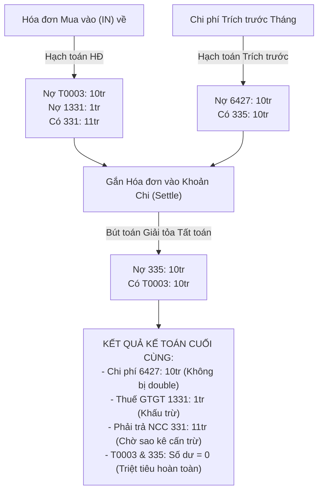

# 📦 Module Tri Thức: Chi Phí Vận Hành & Hạch Toán Tự Động (Operating Expenses Core)

## 1. Tổng quan Nghiệp vụ

Module `operating-expenses-core` chịu trách nhiệm quản lý, phân bổ và hạch toán toàn bộ các khoản chi phí vận hành, chi phí định kỳ và giá vốn toàn công ty:
- **Zero-Accounting UX**: Người dùng thông thường chỉ cần nhập số tiền, kỳ phát sinh (tháng/năm), nội dung, đối tác/loại chi phí (tiền thuê văn phòng, điện nước viễn thông, nhân sự & tiền lương, BHXH & BHYT, phần mềm IT, bảo trì, khấu hao...). Không cần am hiểu hay can thiệp vào tài khoản kế toán.
- **Cơ chế Hạch toán Trích trước (Accrual Accounting)**:
  - Cho phép trích trước chi phí theo kỳ: ghi nhận chi phí `642` và treo công nợ phải trả `335` (hoặc `334` cho lương, `3383` cho BHXH).
- **Cơ chế Tất toán Hóa đơn & Chống Double Chi phí (Anti-Double Counting Guard)**:
  - Hóa đơn mua hàng (IN) khi vào hệ thống mặc định được hạch toán vào tài khoản treo trung gian: `Nợ T0003 (tiền hàng)` + `Nợ 1331 (thuế)` / `Có 331 (tổng tiền)`.
  - Khi hóa đơn được gắn kết nối với khoản chi phí trích trước (`settleExpenseWithInvoice`), hệ thống tự động sinh bút toán giải tỏa: `Nợ 335` / `Có T0003`.
  - **Kết quả**: Chi phí `642` chỉ phát sinh duy nhất 1 lần ở kỳ trích trước, công nợ `331` phát sinh ở hóa đơn, tài khoản treo `T0003` và `335` triệt tiêu lẫn nhau, đảm bảo chính xác 100% theo nguyên lý hạch toán kép.

---

## 2. Database Schema & Quan hệ Dữ liệu

### A. Bảng Chi phí Vận hành (`erp_operating_expenses`)
- **Entity**: `ErpOperatingExpense` (`src/operating-expenses-core/entities/erp_operating_expense.entity.ts`)

| Tên Cột | Kiểu Dữ Liệu | Ràng buộc | Mô tả |
| :--- | :--- | :---: | :--- |
| `id` | `uuid` | PK | Khóa chính (gen_random_uuid) |
| `expense_no` | `varchar(255)` | NOT NULL | Mã định danh khoản chi (VD: `EXP-202608-001`) |
| `branch_id` | `uuid` | NULL | Khóa ngoại trỏ đến chi nhánh (`erp_branches`) |
| `supplier_id` | `uuid` | NULL | Khóa ngoại trỏ đến đối tác (`erp_business_partners`) |
| `supplier_name_snapshot` | `varchar(255)` | NULL | Tên đối tác thời điểm lập |
| `category_key` | `varchar(100)` | INDEX | Mã phân loại chuẩn (VD: `NHAN_SU_LUONG`, `THUE_MAT_BANG`,...) |
| `expense_category` | `varchar(255)` | NULL | Tên hiển thị danh mục chi phí |
| `cost_group` | `varchar(50)` | INDEX | Nhóm chi phí: `OPEX`, `COGS`, `COMMISSION` |
| `title` | `text` | NULL | Tiêu đề / Nội dung / Diễn giải chi phí |
| `period_year` | `smallint` | INDEX | Năm phát sinh chi phí (VD: `2026`) |
| `period_month` | `smallint` | INDEX | Tháng phát sinh chi phí (`1` - `12`) |
| `document_date` | `date` | NULL | Ngày chứng từ / phát sinh |
| `due_date` | `date` | NULL | Hạn thanh toán |
| `total_amount` | `numeric(18,2)` | NOT NULL | Số tiền chi phí (VNĐ) |
| `invoice_status` | `varchar(50)` | NULL | Trạng thái hóa đơn (`REQUIRED`, `NOT_REQUIRED`, `ATTACHED`) |
| `status` | `varchar(50)` | NOT NULL | Trạng thái khoản chi (`DRAFT`, `CONFIRMED`, `CANCELLED`) |
| `payment_status` | `varchar(50)` | NOT NULL | Trạng thái thanh toán (`UNPAID`, `PARTIAL`, `PAID`) |
| `posting_status` | `varchar(20)` | INDEX | Trạng thái hạch toán: `UNPOSTED`, `POSTED` (default `UNPOSTED`) |
| `journal_entry_id`| `uuid` | FK | Khóa ngoại trỏ đến bút toán trích trước (`erp_journal_entries`) |
| `accrual_mode` | `varchar(20)` | INDEX | Chế độ trích trước: `NONE`, `ACCRUED`, `DIRECT` |
| `linked_invoice_id`| `uuid` | FK, INDEX | Khóa ngoại trỏ đến hóa đơn gắn kèm (`erp_invoices`) |
| `settled_at` | `timestamptz` | NULL | Thời điểm tất toán giải tỏa tài khoản treo |
| `recurrence_type`| `varchar(50)` | NULL | Chu kỳ: `ONE_TIME`, `MONTHLY`, `QUARTERLY`, `YEARLY` |
| `recurrence_interval`| `int` | NULL | Bước nhảy chu kỳ (VD: `1` tháng) |
| `recurrence_anchor_id`| `uuid` | INDEX | Khóa ngoại trỏ đến bản ghi gốc khởi tạo chuỗi định kỳ |
| `is_deleted` | `boolean` | NOT NULL | Cờ xóa mềm (default `false`) |

### B. Bảng Quy tắc Định khoản Thông minh (`erp_expense_account_rules`)
- **Entity**: `ErpExpenseAccountRule` (`src/operating-expenses-core/entities/erp_expense_account_rule.entity.ts`)

| Tên Cột | Kiểu Dữ Liệu | Ràng buộc | Mô tả |
| :--- | :--- | :---: | :--- |
| `id` | `uuid` | PK | Khóa chính |
| `category_key` | `varchar(100)` | NOT NULL | Mã phân loại chuẩn (VD: `NHAN_SU_LUONG`, `THUE_MAT_BANG`) |
| `category_label` | `varchar(255)` | NOT NULL | Tên diễn giải danh mục |
| `accrual_mode` | `varchar(20)` | NOT NULL | Chế độ: `NONE`, `ACCRUED`, `DIRECT` |
| `direct_debit_account_code` | `varchar(20)` | NULL | Tài khoản Nợ khi chi trực tiếp (mặc định `6422`) |
| `direct_credit_account_code`| `varchar(20)` | NULL | Tài khoản Có khi chi trực tiếp (mặc định `1121` hoặc `1111`) |
| `accrual_debit_account_code`| `varchar(20)` | NULL | Tài khoản Nợ khi trích trước (VD: `6422` cho lương, `6427` cho thuê nhà) |
| `accrual_credit_account_code`| `varchar(20)` | NULL | Tài khoản Có khi trích trước (`334` cho lương, `3383` cho BHXH, `335` cho thuê nhà) |
| `settle_debit_account_code` | `varchar(20)` | NULL | Tài khoản Nợ giải tỏa khi HĐ về (`335`, `334`, `3383`) |
| `settle_credit_account_code`| `varchar(20)` | NULL | Tài khoản Có đối ứng giải tỏa (`T0003`) |
| `settle_vat_account_code` | `varchar(20)` | NULL | Tài khoản thuế khấu trừ (`1331`) |
| `is_active` | `boolean` | NOT NULL | Cờ hoạt động (default `true`) |

> **Unique Constraint**: `CONSTRAINT uq_expense_account_rule UNIQUE (category_key, accrual_mode)`

---

## 3. Cấu trúc Source Code Backend

```text
src/operating-expenses-core/
├── entities/
│   ├── erp_operating_expense.entity.ts      # Entity chính chi phí vận hành
│   └── erp_expense_account_rule.entity.ts    # Entity quy tắc định khoản thông minh
├── dto/
│   ├── create-operating-expense.dto.ts       # DTO tạo khoản chi
│   ├── update-operating-expense.dto.ts       # DTO cập nhật khoản chi
│   └── post-operating-expense.dto.ts         # DTO hạch toán / tất toán
├── services/
│   └── smart-account-mapping.service.ts     # Service tra cứu quy tắc định khoản & fallback COA
├── operating-expenses-core.service.ts        # Business logic CRUD, Recurrence, Post, Settle
├── operating-expenses-core.controller.ts     # REST API Controller & RBAC
├── operating-expenses-core.module.ts         # Module wiring & dependency injection
└── operating-expenses-core.service.spec.ts   # Unit tests kiểm thử toàn diện
```

---

## 4. Danh sách API Endpoints & RBAC Contract

Base Route: `/api/v1/operating-expenses`

| Method | Endpoint | RBAC Permission | Mô tả Chức Năng |
| :--- | :--- | :--- | :--- |
| `GET` | `/column-options` | `operating_expenses:read` | Lấy danh sách options distinct cho bộ lọc Header Filter |
| `GET` | `/` | `operating_expenses:read` | Lấy danh sách phân trang, lọc đa cột, lọc kỳ (MM/YYYY), sort, tổng tiền |
| `GET` | `/:id` | `operating_expenses:read` | Xem chi tiết 1 khoản chi |
| `POST` | `/` | `operating_expenses:create` | Tạo mới khoản chi (tự động phát sinh chuỗi định kỳ nếu là `MONTHLY`) |
| `PATCH` | `/:id` | `operating_expenses:update` | Cập nhật thông tin khoản chi đơn lẻ |
| `POST` | `/:id/apply-recurring` | `operating_expenses:update` | Áp dụng sửa đổi chuỗi định kỳ (`this` hoặc `this_and_future`) |
| `DELETE`| `/:id` | `operating_expenses:delete` | Xóa mềm khoản chi (`this` hoặc `this_and_future`) |
| `POST` | `/:id/post` | `operating_expenses:post` | Hạch toán khoản chi (Trích trước `ACCRUED` hoặc Chi trực tiếp `DIRECT`) |
| `POST` | `/:id/unpost` | `operating_expenses:post` | Hủy hạch toán khoản chi (thu hồi bút toán Nhật ký chung) |
| `POST` | `/:id/settle-invoice`| `operating_expenses:post` | Tất toán khoản chi với hóa đơn mua vào (giải tỏa tài khoản treo `T0003`) |
| `POST` | `/:id/unsettle-invoice`| `operating_expenses:post`| Gỡ liên kết tất toán hóa đơn |
| `GET` | `/rules/account-mapping` | `operating_expenses:read` | Lấy danh sách các quy tắc định khoản mẫu của hệ thống |

---

## 5. Logic Nghiệp vụ Trọng tâm

### A. Luồng Hạch toán Trích trước (`postExpense`)
1. Kiểm tra trạng thái: Nếu `posting_status === 'POSTED'`, throw `BadRequestException`.
2. Xác định chi nhánh: Bắt buộc phải có `branch_id`.
3. Tra cứu quy tắc định khoản qua `SmartAccountMappingService`:
   - Nếu `NHAN_SU_LUONG` $\to$ Nợ `6422` / Có `334`.
   - Nếu `BHXH_BHYT` $\to$ Nợ `6422` / Có `3383`.
   - Nếu `THUE_MAT_BANG` $\to$ Nợ `6427` / Có `335`.
   - Các chi phí khác $\to$ Nợ `6422`/`6427` / Có `335` (hoặc `1121`/`1111` nếu chi trực tiếp).
4. Tạo bút toán trong `erp_journal_entries` qua `AccountingCoreService.createJournalEntry`:
   - Mã bút toán: `PKT-YYYYMMDD-xxx` (Phiếu kế toán).
   - Ngày chứng từ: `document_date` (hoặc ngày đầu tháng của kỳ `period_year`/`period_month`).
5. Cập nhật `posting_status = 'POSTED'`, `journal_entry_id = je.id`.

### B. Luồng Tất toán Hóa đơn Chống Trùng Chi phí (`settleExpenseWithInvoice`)


### C. Động cơ Phát sinh Định kỳ (Recurrence Engine)
- Hỗ trợ 2 phạm vi áp dụng (Google Calendar pattern):
  - `this`: Chỉ cập nhật hoặc xóa bản ghi tháng hiện tại.
  - `this_and_future`: Áp dụng cho tháng hiện tại và cập nhật hàng loạt các bản ghi tương lai có cùng `recurrence_anchor_id` và `(period_year > currentYear OR (period_year = currentYear AND period_month >= currentMonth))`.

---

## 6. Tích hợp Liên Module Toàn Hệ thống

1. **Với `accounting-core` (`erp_journal_entries`)**:
   - Tự động sinh và hủy các cặp định khoản kép, đảm bảo `Tổng Nợ = Tổng Có` tuyệt đối.
2. **Với `erp-invoices-core` (`erp_invoices`)**:
   - Hóa đơn mua vào sử dụng tài khoản treo `T0003` thay cho việc phỏng đoán tài khoản chi phí 642.
   - Khi cấn trừ hóa đơn vào khoản chi, trường `linked_invoice_id` được liên kết hai chiều.
3. **Với `bank-transactions-core` (`erp_bank_transactions`)**:
   - Sao kê ngân hàng và sổ quỹ sử dụng tài khoản treo `T0001` làm đối ứng mặc định.
   - Khi sao kê được cấn trừ (Net-Off) với hóa đơn mua vào $\to$ đối ứng tự động chuyển sang `331`.
   - Khi sao kê được cấn trừ với hóa đơn bán ra $\to$ đối ứng tự động chuyển sang `131`.
   - Khi gỡ cấn trừ $\to$ tự động hoàn nguyên về `T0001`.

---

## 7. Quy tắc Kiểm thử & Scripts Vận hành

### Lệnh Kiểm tra Code & Chạy Test
```bash
# Type check toàn diện backend
cd /home/dev/repos-dev/erp/erp-api && bun run type:check

# Chạy unit tests cho module chi phí vận hành
bun test src/operating-expenses-core/operating-expenses-core.service.spec.ts
bun test src/operating-expenses-core/services/smart-account-mapping.service.spec.ts

# Chạy unit tests cho hạch toán sao kê & hóa đơn
bun test src/bank-transactions-core/services/transaction-accounting.service.spec.ts
bun test src/erp-invoices-core/services/invoice-lifecycle.service.spec.ts
```

### Script Hạch toán Hàng loạt Dữ liệu Lịch sử (2025 - Nay)
- Script: [`scripts/batch-post-historical.ts`](file:///home/dev/repos-dev/erp/erp-api/scripts/batch-post-historical.ts)
- **Chế độ Dry-Run (Kiểm toán, không ghi DB)**:
  ```bash
  bun scripts/batch-post-historical.ts --dry-run
  ```
- **Chế độ Thực thi Ghi DB (Chỉ chạy khi có phê duyệt)**:
  ```bash
  bun scripts/batch-post-historical.ts --execute
  ```
- **Biến môi trường kích hoạt Live Auto-Posting**:
  ```ini
  ENABLE_LIVE_AUTO_POSTING=true
  ```
