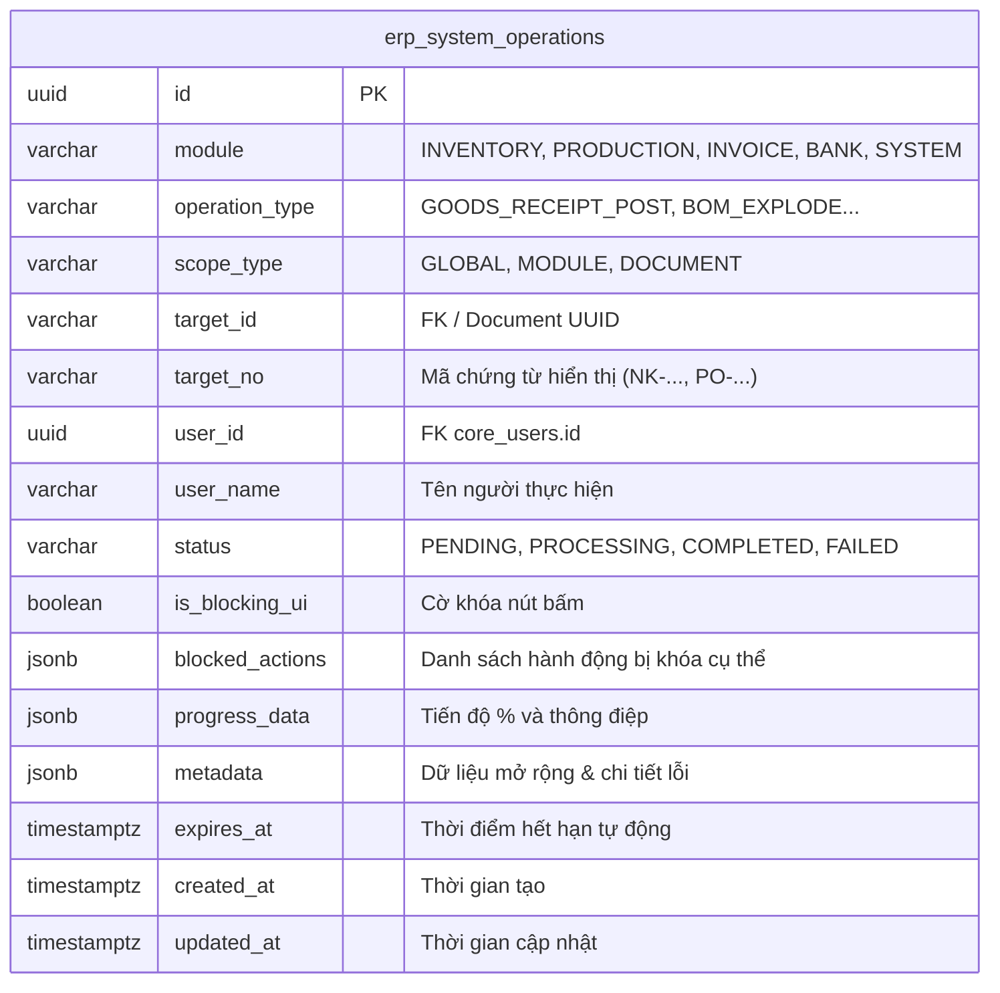
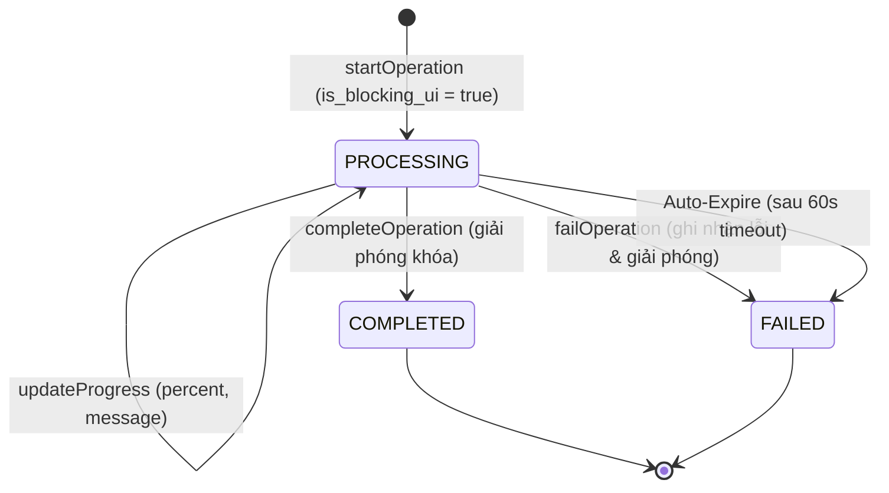

# 📦 Module Tri Thức: Quản Lý Tác Vụ Toàn Cục & Khóa Giao Dịch (System Operations Core)

## 1. Tổng quan Nghiệp vụ

Module Tác vụ Hệ thống (`system-operations-core`) là hạ tầng kiểm soát xung đột và đồng bộ trạng thái giao dịch nặng trên toàn hệ thống Liouni ERP:
- **Chống Submit Trùng Lặp & Race Condition**: Khi người dùng thực hiện các nghiệp vụ tính toán lớn (nhập kho theo PO, chạy BOM đa cấp, phân bổ giá vốn FIFO, kết chuyển số dư), hệ thống tự động đăng ký một bản ghi khóa (`is_blocking_ui = true`).
- **Đồng bộ Tiến độ & Khóa Giao diện Đa Thiết bị (Multi-Device & Tab Resilience)**: Dù người dùng F5 reload trang, chuyển tab hoặc đăng nhập từ máy tính khác, trạng thái tác vụ đang chạy vẫn được bảo tồn và hiển thị minh bạch.
- **Tối ưu Hiệu năng Cực Hạn (Zero-Cost Polling)**:
  - **Backend In-Memory Micro-Cache (TTL 2s)**: Giảm 100% câu query DB khi hàng trăm client cùng poll trạng thái.
  - **Instant Cache Invalidation**: Mọi thay đổi trạng thái tác vụ (Start / Progress / Complete / Fail) ngay lập tức xóa cache bộ nhớ để phản hồi độ trễ < 5ms.
  - **Frontend Adaptive Dynamic Polling**: Tự động giãn nhịp ping về **15 giây** khi nhàn rỗi và tăng tốc lên **2 giây** khi có tác vụ đang chạy.
  - **Server-Sent Events (SSE Stream)**: Cung cấp endpoint `/api/v1/system-operations/stream` cho luồng đẩy sự kiện realtime.
- **Tự động Giải phóng (Auto-Expiration / Stale Purge)**: Cron job ngầm quét mỗi 30s để tự động chuyển các tác vụ quá hạn (`expires_at <= now()`) sang `FAILED` kèm flag `expired = true`, đảm bảo không bao giờ bị kẹt khóa vĩnh viễn.

---

## 2. Database Schema & Quan hệ Dữ liệu



### 2.1. Chi tiết Bảng `erp_system_operations`

| Cột | Kiểu | Nullable | Mặc định | Ghi chú |
| :--- | :--- | :--- | :--- | :--- |
| `id` | `uuid` | NO | `gen_random_uuid()` | Khóa chính (PK) |
| `module` | `varchar(64)` | NO | `'SYSTEM'` | Phân hệ nghiệp vụ (`INVENTORY`, `PRODUCTION`, etc.) |
| `operation_type` | `varchar(128)` | NO | — | Loại tác vụ (`GOODS_RECEIPT_POST`, `BOM_RUN`, etc.) |
| `scope_type` | `varchar(32)` | NO | `'MODULE'` | Phạm vi khóa: `GLOBAL`, `MODULE`, `DOCUMENT` |
| `target_id` | `varchar(128)` | YES | `NULL` | ID chứng từ hoặc tài nguyên mục tiêu |
| `target_no` | `varchar(128)` | YES | `NULL` | Mã chứng từ hiển thị cho người dùng (`NK-20260914-001`) |
| `user_id` | `uuid` | YES | `NULL` | ID người dùng khởi tạo |
| `user_name` | `varchar(255)` | YES | `NULL` | Tên người dùng hiển thị trên Tooltip |
| `status` | `varchar(32)` | NO | `'PROCESSING'` | Trạng thái: `PENDING`, `PROCESSING`, `COMPLETED`, `FAILED` |
| `is_blocking_ui` | `boolean` | NO | `true` | Cờ khóa các nút hành động trên UI |
| `blocked_actions` | `jsonb` | YES | `NULL` | Danh sách actions cụ thể bị block (vd: `["CREATE_RECEIPT"]`) |
| `progress_data` | `jsonb` | YES | `NULL` | Chứa `{ "percent": 65, "message": "Đang phân bổ FIFO..." }` |
| `metadata` | `jsonb` | YES | `NULL` | Chứa thông tin ngữ cảnh, lỗi `{ "error": "..." }` |
| `expires_at` | `timestamptz` | NO | — | Mốc thời gian timeout tự hủy lock |
| `created_at` | `timestamptz` | NO | `now()` | Thời gian tạo |
| `updated_at` | `timestamptz` | NO | `now()` | Thời gian cập nhật |

> **Chỉ mục Hiệu Năng (Composite Indexes)**:
> 1. `IDX_erp_system_operations_status_module_blocking` (`status`, `module`, `is_blocking_ui`, `expires_at`)
> 2. `IDX_erp_system_operations_target` (`target_id`, `status`)

---

## 3. Cấu trúc Source Code

### 3.1. Backend (`erp-api/src/system-operations-core/`)
```text
erp-api/src/system-operations-core/
├── dto/
│   └── query-operation.dto.ts               # QuerySystemOperationDto (module, scopeType, targetId, blockingOnly)
├── entities/
│   └── erp_system_operation.entity.ts       # TypeORM Entity & Enums (SystemOperationModule, SystemOperationScope)
├── system-operations-core.controller.ts     # REST endpoints & SSE Stream
├── system-operations-core.module.ts         # NestJS Module đăng ký TypeORM Entity & Service
├── system-operations-core.service.ts        # Business logic, Micro-cache 2s, Invalidation & Purge Timer
└── system-operations-core.service.spec.ts   # Unit Test Suite bao phủ 100% kịch bản
```

### 3.2. Frontend (`erp-web`)
```text
erp-web/src/
├── core/api/
│   └── systemOperationsApi.ts               # Axios API client (getActiveSystemOperationsApi, checkActionBlockedApi)
├── core/components/
│   └── GlobalSystemOperationIndicator.tsx   # Badge toàn cục góc trên Header kèm Tooltip chi tiết
└── shared/hooks/
    └── useSystemOperationLock.ts            # Custom Hook Adaptive Polling (15s idle / 2s active), isActionBlocked
```

---

## 4. Danh sách API Endpoints & RBAC Contract

Base path: `/api/v1/system-operations`

| Phương thức | Endpoint | Phân quyền (RBAC) | Mô tả |
| :--- | :--- | :--- | :--- |
| `GET` | `/active` | Authenticated (JWT) | Lấy danh sách tác vụ đang chạy kèm trạng thái khóa `{ isLocked, total, items, primaryLock }` |
| `GET` | `/check-action` | Authenticated (JWT) | Kiểm tra nhanh một hành động trên module/chứng từ có đang bị block không |
| `GET (SSE)` | `/stream` | Authenticated (JWT) | Luồng đẩy sự kiện Server-Sent Events realtime (`START`, `PROGRESS`, `COMPLETE`, `FAIL`) |
| `POST` | `/admin/release/:id` | `SUPER_ADMIN:ALL` | Mở khóa cưỡng bức một tác vụ bị treo bởi Quản trị viên cấp cao |

---

## 5. Logic Nghiệp vụ & Thuật toán Cốt lõi

### 5.1. Vòng đời Khóa Tác vụ (Operation Lock Lifecycle)



1. **Khởi tạo (`startOperation`)**:
   - Kiểm tra xung đột (`ConflictException`): Nếu đã có tác vụ cùng target hoặc cùng module scope đang chạy ➔ chặn thao tác mới.
   - Lưu DB + Gọi `invalidateCache()` + Phát event `START` qua RxJS Subject.
2. **Cập nhật Tiến độ (`updateProgress`)**:
   - Cập nhật `%` và message + Gia hạn thêm `expiresAt` (tránh bị timeout khi xử lý dữ liệu lớn) + `invalidateCache()` + Phát event `PROGRESS`.
3. **Hoàn tất (`completeOperation`) / Thất bại (`failOperation`)**:
   - Đánh dấu `status = 'COMPLETED'` hoặc `'FAILED'` + `invalidateCache()` + Phát event `COMPLETE`/`FAIL`.

### 5.2. Cơ chế Adaptive Polling tại Client
- Hook `useSystemOperationLock` tự động tính toán chu kỳ fetch:
  - Khi không có tác vụ (`isBlocked = false`): Chu kỳ **15,000ms** (15s).
  - Khi có tác vụ đang chạy hoặc user vừa kích hoạt submit (`triggerFastCheck`): Chu kỳ tăng tốc lên **2,000ms** (2s).
  - Khi tab trình duyệt bị ẩn (chuyển sang tab khác): Tự động tạm ngưng poll 100% (`refetchIntervalInBackground: false`).

---

## 6. Hướng dẫn Tích hợp Liên Module

### Cách dùng trong Backend Service (Ví dụ: Nhập kho `GoodsReceiptsCoreService`):
```typescript
// 1. Đăng ký Lock
const op = await this.systemOpsService.startOperation({
  module: 'INVENTORY',
  operationType: 'GOODS_RECEIPT_POST',
  scopeType: 'MODULE',
  targetNo: receipt.receiptNo,
  userName: currentUser.name,
  timeoutSeconds: 120,
});

try {
  // 2. Cập nhật tiến độ
  await this.systemOpsService.updateProgress(op.id, {
    percent: 50,
    message: 'Đang gán mã định danh ngầm và tính giá vốn FIFO...',
  });

  // ... Xử lý nghiệp vụ ...

  // 3. Hoàn tất
  await this.systemOpsService.completeOperation(op.id);
} catch (err) {
  // 4. Báo lỗi nếu thất bại
  await this.systemOpsService.failOperation(op.id, err.message);
  throw err;
}
```

### Cách dùng trong Frontend Table / Drawer:
```tsx
const { isActionBlocked } = useSystemOperationLock({ module: "INVENTORY" });

<Button
  disabled={isActionBlocked("CREATE_RECEIPT").isBlocked}
  title={isActionBlocked("CREATE_RECEIPT").reason}
  onClick={handleSubmitReceipt}
>
  Xác nhận Nhập kho
</Button>
```

---

## 7. Quy tắc Kiểm thử & Báo cáo Chất lượng

Khi sửa đổi module `system-operations-core`, bắt buộc thực thi:
```bash
# 1. Chạy Unit Test Backend
cd /home/dev/repos/erp/erp-api && bunx jest src/system-operations-core/system-operations-core.service.spec.ts --verbose

# 2. Chạy CI Quality Gate Backend & Frontend
cd /home/dev/repos/erp/erp-api && bun run check:ci
cd /home/dev/repos/erp/erp-web && bun run check:ci
```
