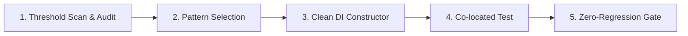

# ⚙️ NestJS API Service & Controller Refactoring Workflow (`/api-service-refactor`)

Workflow này hướng dẫn Developer và Agent quy trình chuẩn 5 giai đoạn khi **phân rã (refactor)** các Controller (`> 300` LoC), Service (`> 500` LoC) hoặc Engines (`> 800` LoC) quá lớn trong `erp-api` nhằm tuân thủ nguyên lý **Single Responsibility Principle (SRP)**, đảm bảo khả năng mở rộng, dễ viết unit test và tránh xung đột mã nguồn.

---

## 🎯 4 Nguyên Tắc Sống Còn (Core Directives)



1. **Tuân Thủ Ngưỡng Kích Thước File**:
   | Loại File | Cảnh Báo (WARNING) | Nghiêm Trọng (CRITICAL) | Pattern Đề Xuất |
   | :--- | :---: | :---: | :--- |
   | **Controller** (`*.controller.ts`) | **> 300 dòng** | **>= 1,000 dòng** | **Pattern A** (Sub-Controllers) |
   | **Service** (`*.service.ts`) | **> 500 dòng** | **>= 1,000 dòng** | **Pattern B** (Sub-Services & Facade) |
   | **Handler** (`*.handler.ts`, vd `ai-hub-core`) | **> 400 dòng** | **>= 1,000 dòng** | **Pattern E/C**: tách prompt, parser, hằng số thành module thuần; giữ nguyên constructor |
   | **Logic / Helper / Engine** | **> 800 dòng** | **>= 1,000 dòng** | **Pattern C** (Pure Engine / Query Builder) |
   | **Script** (`scripts/`, `src/**/scripts/`) | **> 800 dòng** | **>= 1,000 dòng** | Gọi lại service/handler của app, không nhân đôi logic (xem mục *Script độc lập*) |

   > File dữ liệu thuần (`*.data.ts`), `*.spec.ts`, `*.d.ts` **không** tính vào ngưỡng.
   > Prompt AI dài hơn ~80 dòng phải nằm trong file `*.prompt.ts` riêng (hằng số thuần), không nằm trong handler/service.

2. **Bảo Toàn REST Contract & Backward Compatibility**:
   - Tuyệt đối **KHÔNG** làm thay đổi endpoint route path (`@Get`, `@Post`), query parameters, HTTP status, headers hoặc cấu trúc DTO response.
   - Khi chia nhỏ Service, file Service gốc đóng vai trò **Facade**, delegate sang các Sub-Services để không làm gãy các Controller hoặc Module khác đang gọi tới.

3. **Clean Constructor Mandate (TUYỆT ĐỐI CẤM Constructor Overload / Union Types)**:
   - Trong mọi class NestJS `@Injectable()`, **TUYỆT ĐỐI CẤM** dùng TypeScript Constructor Overloading hoặc Union Types (`arg: SubService | Repository<Entity>`).
   - **Lý do**: TypeScript `emitDecoratorMetadata` sinh `design:paramtypes` dựa trên signature thực thi. Union types làm metadata bị gán `undefined` / `Object`, gây crash NestJS runtime (`UnknownDependenciesException`) dù `tsc` và `build` đều pass.
   - **Quy chuẩn**: Luôn dùng Clean DI Constructor với 1 signature duy nhất và cập nhật unit tests (`*.spec.ts`) để truyền mock sub-services.

4. **Co-located Testing & Zero-Entity Leaking**:
   - Unit test `.spec.ts` nằm ngay cạnh file được test (co-located).
   - Controller chỉ trả về DTOs đã qua sanitize/mapping, tuyệt đối không trả TypeORM Entities trực tiếp ra client.

5. **Script độc lập (backfill, seed, netoff...) phải theo cùng chuẩn với app** — chi tiết ở mục *Script độc lập* bên dưới: dùng lại service/handler, env qua loader chuẩn, mặc định dry-run, không đường dẫn tuyệt đối.

---

## 🧭 Quy Trình 5 Giai Đoạn Chuẩn (5-Phase SOP)

### 🔹 GIAI ĐOẠN 1: Quét Ngưỡng & Phân Tích Hiện Trạng (Scan & Audit)

Trước khi can thiệp mã nguồn:
1. Chạy script quét (read-only, chạy trong `erp-api`) để nắm file vượt ngưỡng, vi phạm Clean DI và script chưa theo chuẩn:
   ```bash
   bun .agents/skills/api-service-refactor/scripts/scan-oversized-files.ts                 # toàn repo (src + scripts)
   bun .agents/skills/api-service-refactor/scripts/scan-oversized-files.ts --path=src/ai-hub-core
   bun .agents/skills/api-service-refactor/scripts/scan-oversized-files.ts --json          # cho CI/agent
   bun .agents/skills/api-service-refactor/scripts/scan-oversized-files.ts --strict        # exit 1 nếu vi phạm Clean DI
   ```
   Báo cáo gồm 3 phần: file vượt ngưỡng · vi phạm constructor (overload/union, kể cả khi viết nhiều dòng) · vệ sinh script.
   **Chỉ refactor file thuộc phạm vi task**; danh sách tồn đọng của cả repo chỉ để tham khảo, không tự ý mở rộng phạm vi.
2. Đọc file mục tiêu, liệt kê:
   - Danh sách các public methods và private helpers.
   - Danh sách các dependency được inject vào constructor hiện tại (`DataSource`, repositories, other services).
   - Các controller / service khác đang phụ thuộc vào service này.

---

### 🔹 GIAI ĐOẠN 2: Lựa Chọn Pattern Kiến Trúc Phù Hợp

```
File cần refactor là gì?
├── 1. Controller > 300 dòng gom nhiều sub-resource?
│   └── 👉 Pattern A: Phân rã thành Sub-Controllers trong thư mục `controllers/`
│
├── 2. Service > 500 dòng ôm đồm nhiều nghiệp vụ/báo cáo?
│   └── 👉 Pattern B: Phân rã thành Sub-Services trong `services/` + Service gốc làm Facade Delegate
│
├── 3. Thuật toán tính toán nặng (FIFO, BOM explosion, P&L aggregation, Aging)?
│   └── 👉 Pattern C: Trích xuất Pure Engine / Query Builder trong `engines/` hoặc `helpers/`
│
├── 4. Controller/Service trả thẳng TypeORM Entity?
│   └── 👉 Pattern D: Chuẩn hóa Response DTOs & Mapping Engine (Zero-Entity Leaking)
│
├── 5. Module Gateway tích hợp đa phân hệ (AI Hub, Integrations)?
│   └── 👉 Pattern E: Phân rã theo Domain Handlers trong `handlers/` + Clients trong `clients/`
│       Handler lớn: giữ `InvoiceAiHandler` làm facade (constructor KHÔNG đổi, để script/spec cũ không gãy)
│       và tách phần thuần ra `handlers/<domain>/` (`*.prompt.ts`, `*.parsers.ts`, `*.constants.ts`, `*.types.ts`).
│       Ví dụ chuẩn: `src/ai-hub-core/handlers/invoice/`.
│
└── 6. Service gần ngưỡng (> 80% = 400 dòng) cần thêm logic mới?
    └── 👉 KHÔNG thêm vào file đó. Tạo sub-service/helper thuần mới (vd `InvoiceCategoryMemoryService`,
        `invoice-journal-lines.helper.ts`) và inject bằng Clean DI constructor.
```

---

### 🔹 GIAI ĐOẠN 3: Triển Khai Phân Rã & Thiết Lập Clean DI Facade

#### 1. Triển khai Pattern A: Sub-Controllers
```
src/[module-name]/
├── [module-name].module.ts
├── controllers/
│   ├── [resource-a].controller.ts
│   └── [resource-b].controller.ts
```

```typescript
// src/kgara-api-core/controllers/kgara-customers.controller.ts
import { Controller, Get, Query, UseGuards } from '@nestjs/common';
import { JwtAuthGuard } from '../../auth/jwt-auth.guard';
import { CoreRbacGuard } from '../../auth/guards/core-rbac.guard';
import { RequirePermissions } from '../../auth/decorators/require-permissions.decorator';
import { KgaraCustomersService } from '../services/kgara-customers.service';

@UseGuards(JwtAuthGuard, CoreRbacGuard)
@Controller('greenway/customers')
export class KgaraCustomersController {
  constructor(private readonly customersService: KgaraCustomersService) {}

  @Get('debt')
  @RequirePermissions('garage.customers.read')
  async getCustomersDebt(@Query() query: any) {
    return this.customersService.getCustomersDebt(query);
  }
}
```

#### 2. Triển khai Pattern B: Sub-Services + Facade
```
src/[module-name]/
├── [module-name].module.ts
├── [module-name].service.ts             # FACADE DELEGATE
└── services/
    ├── [domain-a].service.ts
    ├── [domain-a].service.spec.ts        # Co-located test
    ├── [domain-b].service.ts
    └── [domain-b].service.spec.ts        # Co-located test
```

```typescript
// Sub-Service độc lập
@Injectable()
export class SalesReportService {
  private readonly logger = new Logger(SalesReportService.name);
  constructor(private readonly dataSource: DataSource) {}

  async getSalesDashboard(query: SalesReportQueryDto): Promise<SalesReportResponseDto> {
    // Logic tính toán chuyên biệt...
  }
}

// Facade Service (Giữ nguyên public signature)
@Injectable()
export class ReportsCoreService {
  constructor(
    private readonly salesReportService: SalesReportService,
    private readonly purchasingReportService: PurchasingReportService,
  ) {}

  getSalesDashboard(query: SalesReportQueryDto) {
    return this.salesReportService.getSalesDashboard(query);
  }

  getPurchasingDashboard(query: PurchasingReportQueryDto) {
    return this.purchasingReportService.getPurchasingDashboard(query);
  }
}
```

#### 3. Triển khai Pattern C: Pure Engines & Helpers
- Đặt tại `engines/` hoặc `helpers/`.
- Sử dụng pure functions hoặc static methods (không inject NestJS DI) để test độc lập nhanh chóng:
```typescript
// src/kgara-api-core/helpers/debt-aging.helper.ts
export interface AgingBucketResult {
  aging_0_30: number;
  aging_31_60: number;
  aging_61_90: number;
  aging_over_90: number;
}

export function calculateAgingBuckets(
  records: Array<{ amount: number; createdAt: Date }>,
): AgingBucketResult {
  // Pure logic...
}
```

---

### 🔹 GIAI ĐOẠN 4: Cập Nhật NestJS Module & Co-located Unit Tests

#### 1. Đăng ký Module:
Khai báo toàn bộ Sub-Controllers, Sub-Services mới vào `[module-name].module.ts`:
```typescript
@Module({
  controllers: [
    ReportsCoreController,
    SalesReportController,
  ],
  providers: [
    ReportsCoreService, // Facade
    SalesReportService, // Sub-service
    PurchasingReportService, // Sub-service
  ],
  exports: [ReportsCoreService, SalesReportService],
})
export class ReportsCoreModule {}
```

#### 2. Cập nhật Unit Tests Co-located:
- Tạo `[sub-service].service.spec.ts` ngay bên cạnh sub-service.
- Cập nhật file test của Facade Service: Sử dụng mock của Sub-Services:
```typescript
describe('ReportsCoreService (Facade)', () => {
  let service: ReportsCoreService;
  let salesReportService: Partial<SalesReportService>;

  beforeEach(async () => {
    salesReportService = {
      getSalesDashboard: jest.fn().mockResolvedValue({ totalRevenue: 1000 }),
    };

    const module: TestingModule = await Test.createTestingModule({
      providers: [
        ReportsCoreService,
        { provide: SalesReportService, useValue: salesReportService },
      ],
    }).compile();

    service = module.get<ReportsCoreService>(ReportsCoreService);
  });

  it('should delegate getSalesDashboard to SalesReportService', async () => {
    const query = { dateFrom: '2026-01-01' };
    await service.getSalesDashboard(query);
    expect(salesReportService.getSalesDashboard).toHaveBeenCalledWith(query);
  });
});
```

---

### 🔹 GIAI ĐOẠN 5: Zero-Regression Quality Gate & Verification

> **Khi chạy cùng `/plan-and-task`**: các lệnh *full* dưới đây (`build`, `bunx jest --forceExit`, `check:ci`) chỉ chạy **một lần ở Final Gate (Task 4.x.1)**.
> Ở từng task nhỏ chỉ dùng lệnh scoped: `bunx tsc --noEmit`, `bunx jest <spec>` hoặc `bunx jest --findRelatedTests <file>`.
> Khi chạy riêng lẻ (không qua plan) thì chạy đầy đủ như sau.

```bash
# 1. Build Verification (đảm bảo TypeScript và metadata DI hợp lệ)
bun run build

# 2. Chạy toàn bộ Unit Tests liên quan
bunx jest --forceExit

# 3. Chạy CI check toàn diện
bun run check:ci

# 4. Quét lại xem file đã xuống dưới ngưỡng chưa
bun .agents/skills/api-service-refactor/scripts/scan-oversized-files.ts
```

---

## 🧰 Script độc lập (`scripts/`, `src/**/scripts/`)

Script chạy tay (backfill, seed, netoff...) vẫn phải theo chuẩn của app — đã từng xảy ra script tự gọi AI, tự đánh số chứng từ và tự map tài khoản **lệch** với app (6/14 danh mục khác tài khoản).

1. **Dùng lại service/handler của app**, không nhân đôi logic nghiệp vụ. Không cần khởi động Nest: dựng service bằng constructor từ một `DataSource`
   (mẫu: `scripts/backfill-invoice-categories-autopost.ts`). Không dùng `NestFactory` với `AppModule` (sẽ kích hoạt cron).
2. **Gọi AI qua `NineRouterClient`/handler**, không `fetch` thẳng tới 9router (mất retry/timeout/`NineRouterError`).
3. **Env qua loader chuẩn** `src/common/scripts/load-script-env.ts` — tên file khớp pipeline (`erp-<tenant>-<stage>` ↔ `.env.<tenant>-<stage>` ↔ secret `<TENANT>_<STAGE>_API_ENV`). Thứ tự chọn nguồn:
   tham số vị trí `.env*` → `--env=<file>` → `--target=<tenant>-<stage>` → `ENV_FILE` → `.env` → `process.env` (container).
   - **Hermetic**: đã chọn file thì chỉ dùng file đó; biến Bun tự nạp từ `.env`/`.env.local` mà file chọn không có sẽ bị gỡ (tránh lẫn tenant).
   - File chỉ định không tồn tại ⇒ báo lỗi, **không** tự đổi file. **Không** hard-code tên file env mặc định.
   - Mặc định **dry-run**; ghi DB cần `--apply`; DB production (tên DB/tên file chứa `production`) cần thêm `--confirm=<tên DB>`.
   - Nếu env rơi về `.env` mặc định mà DB là production ⇒ script từ chối, buộc chỉ định env tường minh.
   - Luôn in `ENV`/`DB host:port/tên` (che user/password) trước khi chạy. SSL dùng `resolvePgSsl`, không hard-code `ssl:false`.
   - **Ma trận cờ ghi** (`getWriteGuard`): ghi khi có `--apply` (bí danh cũ `--execute`); `--dry-run` hoặc `DRY_RUN=true|1` luôn ép dry-run, kể cả khi có `--apply`; DB production cần thêm `--confirm=<tên DB>`.
   - **Dry-run bằng rollback** (`src/common/scripts/script-db.ts`): script `pg` dùng `connectPg`/`withPgSession`, script TypeORM chỉ dùng `ds.query` dùng `createScriptDataSource(...).begin()`. Mọi lệnh chạy trong một transaction, cuối cùng COMMIT nếu `guard.allowed` còn lại ROLLBACK nên số dòng báo cáo khớp lần ghi thật.
     Không dùng cho script đã tự quản `BEGIN/COMMIT` (transaction lồng) hay có tác dụng ngoài DB (R2, gọi API, `nextval`): các lời gọi đó phải tự gate bằng `guard.allowed`.
     Kiểm chứng "dry-run không để lại dấu vết" bằng `countRows`/`diffCounts` (`dry-run-probe.helper.ts`) trên `erp_local`.
4. **Không đường dẫn tuyệt đối** (`/home/dev/...`): tính từ `__dirname`/`import.meta.url` hoặc `process.cwd()`. Package ESM (`"type":"module"`) dùng `fileURLToPath(import.meta.url)`.
5. **AI lỗi ≠ kết quả**: lỗi AI phải được phân biệt (`fallbackReason: AI_ERROR`) để chạy lại được; không ghi mã/danh mục sai âm thầm.
   Riêng hóa đơn mua vào không phân loại được thì hạch toán TK tạm `T0003` (chủ ý của kế toán để dò tay), kèm marker `[T0003_FALLBACK:<lý do>]` trong mô tả bút toán.
6. **Kiểm tra script ghi dữ liệu**: chỉ kiểm tra tĩnh (`bunx tsc`, `bun build --no-bundle`, `node --check`) và chạy **dry-run** trên `.env`.
   Tuyệt đối không chạy thử script `execute-*`, `commit-*`, upload R2... để "xem thử".

## 🔎 Lệnh audit nhanh (portable)

```bash
# Quét tổng hợp (khuyến nghị): kích thước + Clean DI + vệ sinh script
bun .agents/skills/api-service-refactor/scripts/scan-oversized-files.ts --strict

# Đếm service/controller vượt ngưỡng (không phụ thuộc globstar của shell)
find src -name '*.service.ts' ! -name '*.spec.ts' -exec wc -l {} + | awk '$1>500 && $2!="total"' | sort -nr | head -20
find src -name '*.controller.ts' ! -name '*.spec.ts' -exec wc -l {} + | awk '$1>300 && $2!="total"' | sort -nr | head -20

# Controller trả thẳng Entity
/usr/bin/grep -rn "Promise<.*Entity>" src --include='*.controller.ts'

# Đường dẫn tuyệt đối còn sót (trừ cấu hình quyền cục bộ và dump dữ liệu)
/usr/bin/grep -rIn "/home/dev/" src scripts --include='*.ts' --include='*.js' --include='*.sh'
```

> ⚠️ **Cảnh báo công cụ**: trong môi trường agent, lệnh `grep` có thể là hàm bọc **tôn trọng `.gitignore`** — nó âm thầm bỏ qua các file bị ignore
> (vd phần lớn `erp-api/scripts/*`, `backups/`). Với kiểm tra "không còn sót" hãy dùng `/usr/bin/grep` hoặc script scan ở trên.
> `grep "constructor(.*|.*)"` chỉ khớp constructor viết trên **một dòng**; constructor đã xuống dòng (Prettier) sẽ bị bỏ sót — dùng `--strict` của script scan.

## 📋 Checklist Kiểm Tra Hoàn Thành (Backend Refactor DoD)

- [ ] **Bảo toàn REST Contract**: 100% routes, query params, DTOs không bị thay đổi.
- [ ] **Bảo toàn Facade Signatures**: Tất cả callers cũ gọi vào Service gốc vẫn hoạt động bình thường.
- [ ] **Tuân thủ Clean Constructor**: 0 constructor overload, 0 union types trong `@Injectable()`.
- [ ] **Kích thước file đạt chuẩn**: Controller $< 300\text{ dòng}$, Service $< 500\text{ dòng}$, Engines $< 800\text{ dòng}$.
- [ ] **Zero-Entity Leaking**: Controller chỉ trả về DTOs.
- [ ] **Module Registration**: Đã khai báo đầy đủ providers, controllers và exports trong NestJS Module.
- [ ] **Co-located Tests**: Mọi Sub-Service đều có file `.spec.ts` đi kèm và test Facade delegate pass 100%.
- [ ] **Không nhân đôi logic**: script/handler mới gọi lại service, helper, hằng số sẵn có (VD: `VINFAST_TAX_CODES`, `CATEGORY_TO_DEBIT_ACCOUNT_MAP`), không tự định nghĩa lại.
- [ ] **Script đạt chuẩn**: env qua loader, dry-run mặc định, không đường dẫn tuyệt đối, đã kiểm tra tĩnh (không chạy script ghi dữ liệu).
- [ ] **Không đẩy service qua ngưỡng**: file sửa xong vẫn ≤ ngưỡng của loại (đo bằng `wc -l`).
- [ ] **Build & Test Pass**: `bun run build`, `bunx jest --forceExit`, `bun run check:ci` hoàn toàn không có lỗi.
