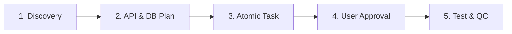

# 📋 Plan & Task Engineering Workflow (`/plan-and-task`) - Backend API

Workflow chuẩn 5 giai đoạn bắt buộc khi lập Kế hoạch Triển khai (**Implementation Plan**) và Phân rã Công việc (**Task Breakdown**) cho mọi tính năng mới, refactoring, database migration hoặc bugfix trong **`erp-api`**.

---

## 🎯 Nguyên Tắc Cốt Lõi (Core Principles)



1. **Plan-First (Zero-Assumption)**: Không sửa code khi chưa có Plan được duyệt. Luôn đối chiếu code thực tế.
2. **Strict Sequence**: `Database (Schema/Migration)` ➔ `API (DTO/Service/Controller/RBAC)` ➔ `QC & Jest Tests`.
3. **Atomic Task & Concrete DoD**: Mỗi task (1–2 files), có mã lệnh kiểm thử (**Verification Command**) chạy ngay.
4. **Brain Artifacts**: Lưu trữ qua `implementation_plan.md` (kế hoạch) và `walkthrough.md` (nghiệm thu).

---

## 🧭 Quy Trình 5 Giai Đoạn Chuẩn (5-Phase SOP)

### 🔹 GIAI ĐOẠN 1: Discovery & Deep Research (Khảo Sát & Ranh Giới)
- **Codebase Scan**: Dùng `grep_search`, `view_file` rà soát Entities, Services, DTOs liên quan và đọc module SKILL (`.agents/skills/modules/...`).
- **Scope**: Phân định rõ **In-Scope** vs **Out-of-Scope**.
- **Threat Model**: Đánh giá RBAC permissions, SQL injection, khóa bi quan (pessimistic lock khi trừ kho/sổ quỹ), và rủi ro cross-module.

### 🔹 GIAI ĐOẠN 2: Architecture & Contract Design (Thiết Kế Kỹ Thuật)
Soạn thảo `implementation_plan.md`:
- **Architecture Flow**: Sơ đồ Mermaid luồng Controller ➔ Service ➔ QueryRunner Transaction ➔ PostgreSQL.
- **Database Contract**: Table schema, indexes composite, foreign keys, TypeORM migration.
- **API Contract**: REST endpoints, Request DTO (validation decorators), Response DTO, RBAC permission guards.
- **Rollback Strategy**: Phương án hoàn tác migration và code nếu có lỗi.

### 🔹 GIAI ĐOẠN 3: Atomic Task Breakdown & DoD (Phân Rã Task)
Phân chia task theo thứ tự: `Phase 1: DB & Migration` ➔ `Phase 2: API & Logic` ➔ `Phase 3: QC & Unit Tests`:
- **Cấu trúc mỗi Task**:
  ```markdown
  - [ ] **Task [ID]: [Tên Task]**
    - **Phân hệ**: `Backend API` | **Ưu tiên**: `[P0 / P1 / P2]`
    - **Files**: `[NEW]` / `[MODIFY]` / `[DELETE]` [path/to/file](file:///absolute/path/to/file)
    - **DoD**: Code sạch TypeScript, validation chặt chẽ, unit test pass 100%.
    - **Verification**: `bunx jest src/modules/.../service.spec.ts` hoặc `bun run check:ci`.
  ```
- **Trạng thái**: `[ ] Pending` ➔ `[/] In Progress` ➔ `[x] Completed & Verified` ➔ `[-] Skipped`.

### 🔹 GIAI ĐOẠN 4: Review & User Approval Gate (Duyệt Kế Hoạch)
- Nêu rõ **Open Questions** & phương án trade-off (Phương án A vs B).
- Đặt cờ `RequestFeedback: true` trên `implementation_plan.md`.
- **DỪNG LẠI** chờ User phê duyệt trước khi viết code.

### 🔹 GIAI ĐOẠN 5: Execution, Test-First & Walkthrough (Thực Thi & Nghiệm Thu)
- Thực thi tuần tự, chuyển `[/]`, chạy Verification Command đạt 100% trước khi tick `[x]`.
- Chạy Pre-commit check (`bun run check:ci && bun run test`).
- Tạo báo cáo nghiệm thu `walkthrough.md` đính kèm test logs.

---

## 📑 MẪU IMPLEMENTATION PLAN CHUẨN (`implementation_plan.md`)

```markdown
# [Tên Feature / Refactor / Migration]: Kế Hoạch Kỹ Thuật (erp-api)

## ⚠️ User Review Required
> [!IMPORTANT]
> - **Quyết định nghiệp vụ**: [Nội dung cần User xác nhận]

## ❓ Open Questions
- [ ] **Câu hỏi 1**: [Phương án kỹ thuật A vs B?]

---

## 🏛️ Kiến Trúc & Hợp Đồng Dữ Liệu

### 1. Database Schema
- **Bảng**: `erp_[table_name]` | **Cột mới**: `column_name` (`type`, constraint) | **Index**: `CREATE INDEX ...`

### 2. API Contract
- `POST /api/v1/[module]/[action]`
  - **Body DTO**: `{ "field": "string", "amount": 1000 }`
  - **Response 200**: `{ "success": true, "data": { "id": "uuid" } }`

---

## 📋 Task Breakdown & Definition of Done (DoD)

### Phase 1: Database & Migrations
- [ ] **Task 1.1: Tạo Migration & Entity**
  - **Files**: `[NEW]` `src/database/migrations/xxx.ts`, `[MODIFY]` `src/modules/.../entity.ts`
  - **DoD**: Migration chạy mượt, schema khớp DB. | **Verification**: `bun run typeorm migration:run`

### Phase 2: Backend API & Logic
- [ ] **Task 2.1: DTOs & Validation** | **Files**: `[NEW]` `src/modules/.../dto.ts` | **DoD**: Chặn payload rác.
- [ ] **Task 2.2: Service Logic & Unit Test**
  - **Files**: `[MODIFY]` `src/modules/.../service.ts`
  - **DoD**: Unit test pass 100%. | **Verification**: `bunx jest src/modules/.../service.spec.ts`
- [ ] **Task 2.3: Controller Endpoints & RBAC Guards**
  - **Files**: `[MODIFY]` `src/modules/.../controller.ts`

### Phase 3: QC & Test Verification
- [ ] **Task 3.1: Full Check CI & Tests** | **Verification**: `bun run check:ci && bun run test`
```
