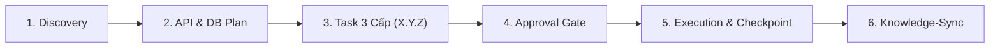

# 📋 Plan & Task Engineering Workflow (`/plan-and-task`) - Backend API

Workflow chuẩn 5 giai đoạn bắt buộc khi lập Kế hoạch Triển khai (**Implementation Plan**) và Phân rã Công việc (**Task Breakdown**) cho mọi tính năng mới, refactoring, database migration hoặc bugfix trong **`erp-api`**.

---

## 🎯 6 Nguyên Tắc Cốt Lõi (Core Principles)


```mermaid
graph LR
    A["1. Discovery"] --> B["2. API & DB Plan"]
    B --> C["3. Task 3 Cấp (X.Y.Z)"]
    C --> D["4. Approval Gate"]
    D --> E["5. Execution & Checkpoint"]
    E --> F["6. Knowledge-Sync"]
```

1. **Plan-First (Strict Read-Only Discovery & Zero Execution)**: Không sửa code và **TUYỆT ĐỐI KHÔNG CHẠY TEST RUNNER** (`jest`, `bun run test`, `bun run check:ci`, build script) khi chưa có Plan được duyệt. Toàn bộ Phase 1 đến Phase 4 hoạt động ở **CHẾ ĐỘ READ-ONLY 100%**. Luôn đọc mã nguồn thực tế, kiểm tra đúng repo đích (`erp-api`), branch đích (`erp-master`) và cấu hình runtime thực tế (`.env`, DB PostgreSQL dedicated tại `db-dev.liouni.com:5433` hoặc local; dừng kiểm tra `.env.local` và không dùng Cloud/Neon).
2. **Delivery Sequence Bắt Buộc**: `Database (Phase 1)` ➔ `API Backend (Phase 2)` ➔ `QC & Security (Phase 3)`.
3. **Task Breakdown 3 Cấp (`X.Y.Z`) & Scoped DoD Verification**: Đánh số `Phase.Group.Task` (ví dụ `1.1.1`, `2.2.1`, `3.1.2`). Mỗi task nhỏ gọn (1–2 files), bắt buộc có **Definition of Done (DoD)** và **Verification Command thu hẹp (Scoped Test < 10s)**:
   - *Quy tắc Lập Plan (Zero Execution)*: Mã lệnh trong mục `Verification` chỉ là **ĐẶC TẢ VĂN BẢN (Text Specification)** để cam kết tiêu chí hoàn thành, **TUYỆT ĐỐI KHÔNG ĐƯỢC CHẠY** trong lúc lập Plan. Lệnh này CHỈ ĐƯỢC CHẠY ở Phase 5 sau khi User đã duyệt Plan.
   - *Test Runner Duy Nhất*: Trong `erp-api`, test runner duy nhất là **`jest`** (`bunx jest <spec>`, `bunx jest --findRelatedTests <file>`) hoặc `bunx tsc --noEmit`. **TUYỆT ĐỐI CẤM GÕ LỆNH `vitest` TRONG `erp-api`**.
   - *Atomic Task (`Z`)*: BẮT BUỘC dùng Scoped Test nhanh (< 5–10s). **TUYỆT ĐỐI CẤM** chạy full test suite (`bunx jest`, `bun run test`, `bun run check:ci`) ở từng task nhỏ để tránh nghẽn CPU.
   - *Final Gate (Phase 3)*: Chỉ chạy full test suite và `bun run check:ci` DUY NHẤT một lần ở Task 3.1.1 trước khi nghiệm thu.
4. **Real-time Tracking & Test-First Tick**: Tại mỗi thời điểm **chỉ có duy nhất 1 task** ở trạng thái `[/] In Progress`. Tuyệt đối không tick `[x]` nếu lệnh kiểm thử chưa PASS 100%. Cập nhật tiến độ vào file `implementation_plan.md` ngay sau mỗi task.
5. **Session Checkpoint Protocol (Pause & Resume)**: Hỗ trợ tạm dừng và tiếp tục mượt mà. Khi tạm dừng, bắt buộc ghi log vào mục `## ⏸️ Session Checkpoint`. Khi tiếp tục, Agent đọc lại Checkpoint để xác định chính xác task đang dang dở và bắt đầu làm tiếp ngay mà không phải hỏi lại từ đầu.
6. **Knowledge-Sync Guard (Cập nhật Tri thức / Skill Liền Tay)**: Ngay sau khi hoàn thành task hoặc feature có thay đổi về Database schema, API contracts hoặc business logic cốt lõi, Agent **BẮT BUỘC cập nhật lại Module Skill** tương ứng (tại `.agents/skills/modules/<module>/SKILL.md`) hoặc chạy skill `/scan-module-knowledge` để tạo mới/đồng bộ tri thức. Tuyệt đối không để tri thức trong skill bị lỗi thời.

---

## 🧭 Quy Trình 5 Giai Đoạn Chuẩn (5-Phase SOP)

### 🔹 GIAI ĐOẠN 1: Discovery & Deep Research (Khảo Sát & Ranh Giới)
- **Runtime Truth Verification**: Đọc trực tiếp `.env` để kiểm tra kết nối DB (PostgreSQL dedicated tại `db-dev.liouni.com:5433` hoặc local). Tuyệt đối dừng kiểm tra `.env.local` và không dùng thông tin cũ/Neon.
- **Scan Codebase & Tri thức (READ-ONLY)**: Dùng `grep_search`, `view_file` rà soát Entities, Services, DTOs liên quan và đọc module SKILL (`.agents/skills/modules/...`). Tuyệt đối KHÔNG chạy test runner ở bước này.
- **Scope Boundaries**: Định rõ **In-Scope** (làm gì) và **Out-of-Scope** (không làm gì) để triệt tiêu Scope Creep.
- **Threat Model**: Đánh giá RBAC permissions, SQL injection, khóa bi quan (pessimistic lock khi trừ kho/sổ quỹ), và rủi ro cross-module.

---

### 🔹 GIAI ĐOẠN 2: Technical Architecture & Contract Design (Thiết Kế Kỹ Thuật)
Soạn thảo `implementation_plan.md`:
- **Architecture Flow**: Sơ đồ Mermaid luồng Controller ➔ Service ➔ QueryRunner Transaction ➔ PostgreSQL.
- **Database Contract**: Table schema, composite indexes, foreign keys, TypeORM migrations (có cả `up()` và `down()`).
- **API Contract**: REST endpoints, Request DTO (validation decorators), Response DTO, RBAC permission guards.
- **Security & Concurrency Checklist**:
  - [ ] `@RequirePermissions(...)` đã gắn với constants chuẩn?
  - [ ] Transaction số dư / tồn kho có bọc `setLock("pessimistic_write")`?
  - [ ] Audit trail ghi nhận vào `erp_audit_logs`?
- **Rollback Strategy**: Phương án hoàn tác DB migration và code an toàn khi có sự cố.

---

### 🔹 GIAI ĐOẠN 3: 3-Level Task Breakdown & Concrete DoD (Phân Rã Task 3 Cấp)
Phân chia toàn bộ công việc theo hệ thống đánh số 3 cấp **`X.Y.Z`**:
* **`X` - Phase (Tầng hệ thống)**:
  - `1`: Database & Migrations
  - `2`: API Backend (DTO, Service, Controller, RBAC)
  - `3`: QC, CI, Security Verification & Knowledge Sync
* **`Y` - Component Group (Nhóm chức năng)**:
  - `1.1`: Entities & Table Schemas | `1.2`: TypeORM Migrations & Seeders
  - `2.1`: DTOs & Validation Contracts | `2.2`: Service Core & Business Logic | `2.3`: Controller & RBAC
  - `3.1`: Unit Tests & Full CI Check | `3.2`: Module Skill & Knowledge Sync
* **`Z` - Atomic Task (Đơn vị thực thi nguyên tử & Scoped Verification)**:
  - Mỗi task giới hạn tác động trong 1–2 files.
  - Phải có mã lệnh **Verification** chạy độc lập thu hẹp (**Scoped Verification** < 10 giây). **NGHIÊM CẤM** chạy full test suite (`bunx jest`, `bun run check:ci`) ở từng task nhỏ.
  - ⚠️ **LƯU Ý QUAN TRỌNG**: Mã lệnh trong `Verification` ở đây chỉ là **đặc tả văn bản (Text Specification)**. **TUYỆT ĐỐI KHÔNG CHẠY LỆNH NÀY KHI ĐANG LẬP KẾ HOẠCH!**

#### ⚡ Chuẩn Lệnh Verification Cho `erp-api`:
| Loại Task | Verification Command Chuẩn (Nhanh < 5s) | Ghi chú quan trọng |
| :--- | :--- | :--- |
| **Entity / Schema / DTO** | `bunx tsc --noEmit` | Kiểm tra type nhanh |
| **TypeORM Migration** | `bun run migration:run` | Chỉ chạy ở Phase 5 sau khi được duyệt |
| **Service Logic / Spec** | `bunx jest src/modules/<path>/<file>.spec.ts` | **CẤM gõ `vitest`** |
| **File mã nguồn thay đổi** | `bunx jest --findRelatedTests src/modules/<path>/<file>.ts` | **CẤM gõ `vitest`** |
| **Controller & RBAC** | `bunx jest src/modules/<path>/<file>.controller.spec.ts` | **CẤM gõ `vitest`** |
| **Final Gate (Task 3.1.1)** | `bun run check:ci && bunx jest --forceExit` | Chạy DUY NHẤT ở Phase 3 trước nghiệm thu |

#### Cấu trúc một Task chuẩn:
```markdown
- [ ] **Task X.Y.Z: [Tên Task súc tích, rõ hành động]**
  - **Phân hệ**: `Backend API` | **Ưu tiên**: `[P0 / P1 / P2]`
  - **Files**: `[NEW]` / `[MODIFY]` / `[DELETE]` [path/to/file](file:///absolute/path/to/file)
  - **DoD**: Tiêu chí hoàn thành cụ thể (TypeScript pass, validation chặt chẽ, spec pass 100%).
  - **Verification**: `[Lệnh kiểm thử scoped cụ thể: bunx jest <spec> hoặc bunx tsc --noEmit]`
```

---

### 🔹 GIAI ĐOẠN 4: Review, Alignment & Approval Gate (Duyệt Kế Hoạch)
- Nêu rõ **Breaking Changes** và các **Open Questions** (Phương án A vs B).
- Đặt cờ `RequestFeedback: true` trên `implementation_plan.md`.
- **DỪNG LẠI (STOP) HOÀN TOÀN**: Khoanh tay chờ User phê duyệt (`OK` / `Confirm`). **TUYỆT ĐỐI KHÔNG tự ý thực thi task đầu tiên, KHÔNG chạy test runner, KHÔNG sửa file trước khi có xác nhận rõ ràng từ User.**

---

### 🔹 GIAI ĐOẠN 5: Real-time Execution, Pause/Resume & Walkthrough

#### 1. Quy tắc Thực thi & Tick Done Thời Gian Thực (Real-time Tracking)
- **Single Active Task**: Khi bắt đầu làm một task, đổi ngay `[ ]` thành `[/]`. Tại một thời điểm **chỉ có 1 task duy nhất** ở trạng thái `[/]`.
- **Test-Before-Tick Guard**: 
  - Chỉ được đổi `[/]` thành `[x]` khi và chỉ khi lệnh trong mục `Verification` trả về kết quả **PASS 100%**.
  - Nếu test fail hoặc type error: giữ nguyên `[/]`, tiếp tục sửa code cho đến khi test pass.
- **Live Sync**: Ngay khi hoàn tất một task, ghi nhận trạng thái vào `implementation_plan.md` ngay lập tức, không để dồn đến cuối mới tick.

#### 2. Giao thức Tạm dừng (Pause Protocol)
Khi người dùng yêu cầu tạm dừng, đổi context hoặc phiên làm việc bị ngắt quãng:
Agent **bắt buộc cập nhật** section `## ⏸️ Session Checkpoint` ở cuối file `implementation_plan.md`:
```markdown
## ⏸️ Session Checkpoint (Tạm dừng lúc: YYYY-MM-DD HH:mm)
- **Active Task**: `Task X.Y.Z: [Tên Task]` (`[/] In Progress`)
- **Tiến độ chi tiết**: Đã hoàn thành các phần nào, đang dừng tại dòng/hàm nào.
- **Việc chưa xong**: Cụ thể điều kiện biên hoặc test case nào đang xử lý dở.
- **Git Status**: Danh sách file đã sửa nhưng chưa commit.
- **Hành động tiếp theo khi Resume**: Lệnh hoặc bước cụ thể cần làm ngay khi bật lại session.
```

#### 3. Giao thức Tiếp tục (Resume Protocol)
Khi bắt đầu lại phiên làm việc (User gõ `tiếp tục`, `continue`, hoặc gửi prompt mới):
1. **Đọc Checkpoint**: Agent đọc `implementation_plan.md` và kiểm tra mục `## ⏸️ Session Checkpoint`.
2. **Xác định Task Active**: Tìm task có trạng thái `[/]` (nếu có) hoặc task `[ ]` đầu tiên theo thứ tự từ trên xuống.
3. **Báo cáo User**: Thông báo ngắn gọn vị trí đang tiếp tục:
   > *"Phiên làm việc trước đang tạm dừng tại **Task X.Y.Z: [Tên Task]** ([Mô tả tiến độ dở]). Em sẽ tiếp tục hoàn thiện task này ngay bây giờ."*
4. **Thực thi liền mạch**: Bắt tay làm tiếp ngay từ đúng bước trong checkpoint mà không làm lại từ đầu.

#### 4. Nghiệm thu, Cập nhật Tri thức & Báo cáo (Walkthrough & Knowledge Sync)
- **Nghiệm thu cuối cùng (Final Gate)**: Chạy full check DUY NHẤT một lần ở cuối toàn bộ kế hoạch: `bun run check:ci && bunx jest --forceExit`.
- **Knowledge & Skill Sync (Bắt buộc kiểm tra & cập nhật liền sau khi xong task)**:
  - Nếu có thay đổi Schema, DTOs, endpoints, relations: cập nhật vào Module Skill (`.agents/skills/modules/<module-name>/SKILL.md`) hoặc chạy `/scan-module-knowledge`.
  - Nếu là module hoàn toàn mới: tạo file skill mới tại `.agents/skills/modules/<module-name>/SKILL.md` và gắn link vào `liouni-erp-api-current-truth`.
  - Tuyệt đối không để tri thức chỉ nằm trong commit hoặc đầu óc mà không ghi vào skill.
- **Tạo Báo cáo Nghiệm thu**: Tạo file `walkthrough.md` đính kèm bằng chứng test logs và trạng thái đồng bộ skill.

---

## 📑 MẪU IMPLEMENTATION PLAN CHUẨN (`implementation_plan.md`)

```markdown
# [Tên Feature / Refactor / Migration]: Kế Hoạch Kỹ Thuật (erp-api)

Tóm tắt mục tiêu bài toán và giá trị mang lại.

## ⚠️ User Review Required
> [!IMPORTANT]
> - **Quyết định nghiệp vụ**: [Nội dung cần User xác nhận]
> - **Breaking changes**: [Cảnh báo nếu có thay đổi hợp đồng API hoặc schema]

## ❓ Open Questions
- [ ] **Câu hỏi 1**: [Phương án kỹ thuật A vs B?]

---

## 🏛️ Kiến Trúc & Hợp Đồng Dữ Liệu

### 1. Database Schema
- **Bảng**: `erp_[table_name]` | **Cột mới**: `column_name` (`type`, constraint) | **Index**: `CREATE INDEX ...`

### 2. API Contract
- `POST /api/v1/[module]/[action]`
  - **Body DTO**: `{ "field": "string", "amount": 1000 }`
  - **Response 200**: `{ "success": true, "data": { "id": "uuid" } }`

### 3. Security & Concurrency Checklist
- [ ] `@RequirePermissions(...)` đã được gắn trên toàn bộ endpoint mới.
- [ ] Giao dịch tài chính / kho bọc trong transaction với `pessimistic_write`.
- [ ] Log thao tác người dùng vào `erp_audit_logs`.

---

## 📋 Task Breakdown 3 Cấp & Definition of Done (DoD)

### Phase 1: Database & Migrations
#### 1.1 Entities & Table Schema
- [ ] **Task 1.1.1: Tạo Entity & Enum cho bảng mới**
  - **Phân hệ**: `DB` | **Ưu tiên**: `P0`
  - **Files**: `[NEW]` [src/database/entities/custom.entity.ts](file:///home/dev/repos/erp/erp-api/src/database/entities/custom.entity.ts)
  - **DoD**: Khai báo đủ decorator TypeORM, relations và indexes.
  - **Verification**: `bunx tsc --noEmit`

#### 1.2 Migrations
- [ ] **Task 1.2.1: Tạo file Migration TypeORM**
  - **Phân hệ**: `DB` | **Ưu tiên**: `P0`
  - **Files**: `[NEW]` [src/migrations/1780000000000-CreateCustomTable.ts](file:///home/dev/repos/erp/erp-api/src/migrations/1780000000000-CreateCustomTable.ts)
  - **DoD**: Có cả `up()` và `down()`.
  - **Verification**: `bun run typeorm migration:run`

### Phase 2: Backend API
#### 2.1 DTOs & Validation
- [ ] **Task 2.1.1: Tạo Create & Update DTOs**
  - **Phân hệ**: `API` | **Ưu tiên**: `P0`
  - **Files**: `[NEW]` `src/modules/.../dto/create-item.dto.ts`
  - **DoD**: Đầy đủ `class-validator` decorators.
  - **Verification**: `bunx jest src/modules/.../dto.spec.ts`

#### 2.2 Service & Business Logic
- [ ] **Task 2.2.1: Implement Service Method với Transaction Lock**
  - **Phân hệ**: `API` | **Ưu tiên**: `P0`
  - **Files**: `[MODIFY]` `src/modules/.../custom.service.ts`
  - **DoD**: Xử lý logic đúng, khóa bi quan chống race condition.
  - **Verification**: `bunx jest src/modules/.../custom.service.spec.ts -t "processTransaction"`

#### 2.3 Controller & RBAC Guard
- [ ] **Task 2.3.1: Expose Endpoints & Gắn Guard**
  - **Phân hệ**: `API` | **Ưu tiên**: `P0`
  - **Files**: `[MODIFY]` `src/modules/.../custom.controller.ts`
  - **DoD**: Gắn `@RequirePermissions`, OpenAPI decorators.
  - **Verification**: `bunx jest src/modules/.../custom.controller.spec.ts`

### Phase 3: QC & Knowledge Sync
#### 3.1 Automated Tests & CI Check
- [ ] **Task 3.1.1: Chạy Full Unit Test Suite & Pre-commit Check**
  - **Phân hệ**: `QC` | **Ưu tiên**: `P0`
  - **DoD**: 100% test suites pass, không có lỗi ESLint, Prettier và TypeScript.
  - **Verification**: `bun run check:ci && bunx jest --forceExit`

#### 3.2 Knowledge & Skill Sync
- [ ] **Task 3.2.1: Cập nhật Module Skill & Current-Truth**
  - **Phân hệ**: `Docs/Skill` | **Ưu tiên**: `P1`
  - **Files**: `[MODIFY]` / `[NEW]` [path/to/SKILL.md](file:///absolute/path/to/SKILL.md) (hoặc chạy `/scan-module-knowledge`)
  - **DoD**: Bổ sung chính xác schema, API contracts mới vào Module Skill.
  - **Verification**: `view_file` kiểm tra nội dung skill chuẩn xác, không còn thông tin cũ/sai lệch.

---

## ⏸️ Session Checkpoint
*(Mục này sẽ được cập nhật khi phiên làm việc cần tạm dừng hoặc đổi ngữ cảnh)*
- **Active Task**: `None`
- **Tiến độ chi tiết**: Chưa bắt đầu
- **Git Status**: Clean
- **Hành động tiếp theo khi Resume**: Bắt đầu Task 1.1.1
```

---

## 📦 MẪU BÁO CÁO NGHIỆM THU (`walkthrough.md`)

```markdown
# 🚀 Walkthrough & Verification Report: [Tên Tính Năng]

## 📝 Tóm Tắt Thay Đổi
| Phân hệ | File | Loại | Mô tả |
| :--- | :--- | :---: | :--- |
| **DB**  | `src/migrations/...` | `NEW` | Migration mới |
| **API** | `src/modules/.../service.ts` | `MODIFY` | Logic nghiệp vụ & Transaction |

## 🧪 Bằng Chứng Xác Thực (Test Evidence)
- **Unit Tests**: `bunx jest` ➔ `PASS (100% test suites)`
- **CI Check**: `bun run check:ci` ➔ `PASS (0 errors)`

## 🧠 Tri Thức & Skill Đồng Bộ (Knowledge Sync)
- **Module Skill**: Đã cập nhật `[path/to/SKILL.md]` (hoặc: *Không có thay đổi schema/contract*).
- **Current Truth**: Đã liên kết vào `liouni-erp-api-current-truth`.
```
